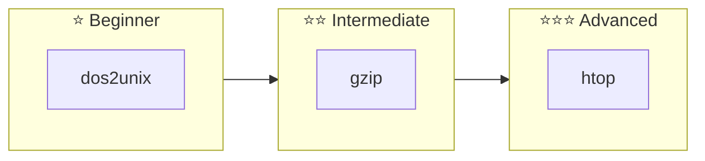

# Build-Your-Own-Tools

[](https://github.com/LessUp/build-your-own-tools/actions/workflows/ci.yml)
[](https://lessup.github.io/build-your-own-tools/)
[](LICENSE)
[](https://www.rust-lang.org/)
[](https://golang.org/)

**English** | [简体中文](README.zh-CN.md)

A learning-focused repository for re-implementing common CLI tools from scratch in **Rust** and **Go**. Perfect for understanding low-level system programming, CLI design patterns, and cross-language implementation comparisons.

[📖 Documentation](https://lessup.github.io/build-your-own-tools/) | [🚀 Quick Start](docs/en/GETTING-STARTED.md) | [📋 Architecture](docs/en/ARCHITECTURE.md) | [🔍 Comparison](docs/en/COMPARISON.md)

---

## 🚀 Quick Start

```bash
# Clone the repository
git clone https://github.com/LessUp/build-your-own-tools.git
cd build-your-own-tools

# Build all Rust projects
make build-rust

# Build all Go projects
make build-go

# Run all tests
make test-all

# Run a tool
echo "Hello World" | ./target/release/dos2unix-rust
```

---

## 📦 Projects

| Project | Languages | Description | Status | Version |
|---------|-----------|-------------|--------|---------|
| [dos2unix](./dos2unix/) | Rust | CRLF → LF line ending converter | ✅ Stable | v0.2.1 |
| [gzip](./gzip/) | Rust, Go | Gzip compression/decompression CLI | ✅ Stable | v0.3.0 |
| [htop](./htop/) | Rust, Go | Cross-platform TUI system monitor | ✅ Stable | v0.1.5 |

### Project Overview



---

## 🎯 Features

- **Multi-Language Implementation** — Same tool in Rust and Go for side-by-side comparison
- **Cross-Platform** — Linux, macOS, Windows support
- **Production-Ready** — Unit tests, CI/CD, automated releases
- **Well-Documented** — Architecture docs, API references, comparison guides
- **Learning Path** — Progressive difficulty from simple to advanced

---

## 🏗️ Project Structure

```
build-your-own-tools/
├── 📁 docs/                      # Documentation
│   ├── en/                      # English docs
│   ├── zh-CN/                   # Chinese docs
│   └── changelogs/              # Changelog index
│
├── 📁 dos2unix/                  # CRLF to LF converter
│   ├── src/main.rs
│   └── changelog/CHANGELOG.md
│
├── 📁 gzip/
│   ├── go/                      # Go implementation
│   └── rust/                    # Rust implementation
│
├── 📁 htop/
│   ├── shared/                  # Shared library
│   ├── unix/rust/               # Unix implementation
│   └── win/                     # Windows implementations
│
├── Cargo.toml                   # Rust workspace
├── go.work                      # Go workspace
└── Makefile                     # Build automation
```

---

## 🛠️ Development

### Prerequisites

| Tool | Version | Install |
|------|---------|---------|
| Rust | 1.70+ | [rustup.rs](https://rustup.rs/) |
| Go | 1.21+ | [golang.org](https://golang.org/dl/) |
| make | any | pre-installed |

### Build Commands

```bash
# Build everything
make build-all

# Build specific projects
make build-dos2unix
make build-gzip-rust
make build-gzip-go
make build-htop-unix-rust
make build-htop-win-rust

# Run tests
make test-all
make test-rust
make test-go

# Lint code
make lint-all

# Format code
make fmt-all
```

### Development Workflow

```bash
# 1. Format code
make fmt-all

# 2. Run linter
make lint-all

# 3. Run tests
make test-all

# 4. Build release
make build-all
```

---

## 📖 Documentation

| Document | Description |
|----------|-------------|
| [Getting Started](docs/en/GETTING-STARTED.md) | Environment setup and first build |
| [Architecture Guide](docs/en/ARCHITECTURE.md) | System design and patterns |
| [Rust vs Go Comparison](docs/en/COMPARISON.md) | Language trade-offs and benchmarks |
| [API Reference](docs/en/API.md) | Library function documentation |
| [Changelog](CHANGELOG.md) | Version history and changes |
| [Migration Guide](docs/changelogs/MIGRATION.md) | Version upgrade instructions |

---

## 🧪 Testing

```bash
# Run all tests with verbose output
cargo test --all -- --nocapture
go test -v ./...

# Run specific test
cargo test -p dos2unix-rust test_stream_large_data
go test -C gzip/go -run TestGzipStream

# With coverage
cargo tarpaulin --all
go test -cover ./...
```

---

## 📊 Learning Goals

Each sub-project teaches specific concepts:

| Topic | dos2unix | gzip | htop |
|-------|----------|------|------|
| File I/O | ✅ Streaming | ✅ Streaming | - |
| CLI Design | ✅ Manual args | ✅ clap/pflag | ✅ Interactive |
| Error Handling | ✅ anyhow | ✅ anyhow | ✅ anyhow |
| Compression | - | ✅ DEFLATE | - |
| System APIs | - | - | ✅ Process info |
| TUI | - | - | ✅ ratatui/tview |
| Concurrency | - | ✅ goroutines | ✅ Async refresh |

---

## 🤝 Contributing

We welcome contributions! See [CONTRIBUTING.md](CONTRIBUTING.md) for guidelines.

1. Fork the repository
2. Create a feature branch (`git checkout -b feature/amazing-feature`)
3. Commit changes (`git commit -m 'feat: add amazing feature'`)
4. Push to branch (`git push origin feature/amazing-feature`)
5. Open a Pull Request

---

## 📋 Roadmap

### 2026 Q2

- [ ] New tool: `cat` implementation
- [ ] New tool: `wc` (word count)
- [ ] Enhanced documentation with tutorials

### 2026 Q3

- [ ] Network monitoring in htop
- [ ] Disk I/O monitoring
- [ ] Plugin system exploration

### Future

- [ ] Container-aware process grouping
- [ ] Remote system monitoring
- [ ] Additional language implementations (Zig?)

---

## 📄 License

Licensed under either of

- Apache License, Version 2.0 ([LICENSE](LICENSE) or http://www.apache.org/licenses/LICENSE-2.0)
- MIT License ([LICENSE](LICENSE) or http://opensource.org/licenses/MIT)

at your option.

---

## 🙏 Acknowledgments

- [ratatui](https://github.com/ratatui-org/ratatui) — Rust TUI framework
- [tview](https://github.com/rivo/tview) — Go TUI framework
- [sysinfo](https://github.com/GuillaumeGomez/sysinfo) — Rust system info
- [gopsutil](https://github.com/shirou/gopsutil) — Go system info
- [flate2](https://github.com/rust-lang/flate2-rs) — Rust DEFLATE compression
- [clap](https://github.com/clap-rs/clap) — Rust CLI parser

---

**Last Updated**: 2026-04-16  
**Version**: v0.2.0+
