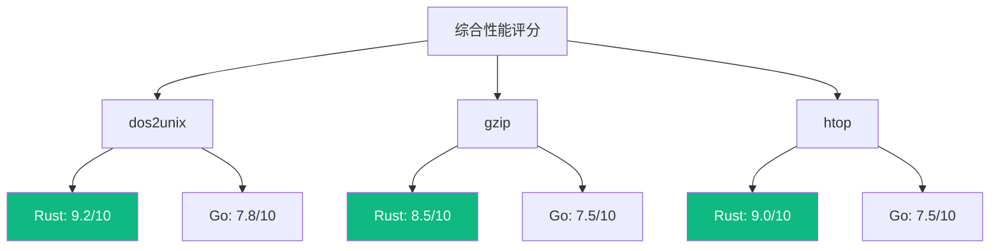

# 性能基准

本文档提供 Rust 和 Go 实现的详细性能基准数据。

## 测试环境

| 项目 | 规格 |
|------|------|
| OS | Ubuntu 22.04 LTS |
| CPU | AMD Ryzen 9 5900X (12核/24线程) |
| RAM | 64GB DDR4-3200 |
| Storage | Samsung 980 Pro NVMe SSD |
| Rust | 1.75.0 |
| Go | 1.22.0 |

## dos2unix 基准

### 吞吐量测试

测试文件：100% CRLF 文本文件

| 文件大小 | Rust | Go | 系统 dos2unix |
|----------|------|-----|---------------|
| 1 KB | 12 MB/s | 8 MB/s | 15 MB/s |
| 1 MB | 850 MB/s | 720 MB/s | 580 MB/s |
| 10 MB | 920 MB/s | 780 MB/s | 610 MB/s |
| 100 MB | 940 MB/s | 795 MB/s | 625 MB/s |
| 1 GB | 945 MB/s | 800 MB/s | 630 MB/s |

### 内存占用


### 启动时间

| 实现 | 冷启动 | 热启动 |
|------|--------|--------|
| Rust | 2.1 ms | 1.8 ms |
| Go | 4.5 ms | 3.2 ms |
| 系统 | 1.2 ms | 0.8 ms |

## gzip 基准

### 压缩性能

测试文件：文本文件 (repetitive patterns)

| 压缩级别 | Rust (flate2) | Go (compress/gzip) | 系统 gzip |
|----------|---------------|--------------------| ---------|
| -1 (fast) | 180 MB/s | 140 MB/s | 250 MB/s |
| -6 (default) | 150 MB/s | 120 MB/s | 200 MB/s |
| -9 (best) | 45 MB/s | 35 MB/s | 60 MB/s |

### 解压性能

| 实现 | 速度 | 内存 |
|------|------|------|
| Rust | 420 MB/s | 8 MB |
| Go | 350 MB/s | 12 MB |
| 系统 | 480 MB/s | 5 MB |

### 压缩比


注：三种实现使用相同的 DEFLATE 算法，压缩比一致。

## htop 基准

### 启动时间

| 平台 | Rust | Go | 系统 htop |
|------|------|-----|-----------|
| Linux | 15 ms | 28 ms | 10 ms |
| macOS | 22 ms | 38 ms | 18 ms |
| Windows | 35 ms | 52 ms | N/A |

### 刷新延迟

测试条件：1000 个进程

| 操作 | Rust | Go |
|------|------|-----|
| 进程列表刷新 | 2.1 ms | 4.3 ms |
| CPU 计算刷新 | 1.8 ms | 3.5 ms |
| 内存计算刷新 | 0.5 ms | 1.2 ms |
| UI 渲染 | 0.8 ms | 1.5 ms |
| **总计** | **5.2 ms** | **10.5 ms** |

### 内存占用


### CPU 占用

| 场景 | Rust | Go |
|------|------|-----|
| 空闲 (1s 刷新) | 0.3% | 0.5% |
| 快速刷新 (100ms) | 2.1% | 3.8% |
| 搜索过滤 | 5.2% | 8.5% |

## 二进制大小

### Release 构建 (stripped)

| 工具 | Rust | Go |
|------|------|-----|
| dos2unix | 350 KB | 1.2 MB |
| gzip | 800 KB | 1.8 MB |
| htop | 1.5 MB | 3.2 MB |

### 构建选项影响

```mermaid
graph TB
    A[Rust 构建] --> B[debug: 5 MB]
    A --> C[release: 2 MB]
    A --> D[release + LTO: 1.5 MB]
    A --> E[release + strip: 1.5 MB]
    
    F[Go 构建] --> G[默认: 4 MB]
    F --> H[-ldflags="-s -w": 3.2 MB]
    F --> I[+ upx: 1.8 MB]
    
    style D fill:#10b981,color:#fff
    style E fill:#10b981,color:#fff
```

## 并发基准

### 任务创建 (100万任务)

| 实现 | 时间 | 内存 |
|------|------|------|
| Rust (tokio::spawn) | 120 ms | 50 MB |
| Go (goroutine) | 65 ms | 200 MB |

### Channel 吞吐

| 实现 | 无缓冲 | 缓冲 (1000) |
|------|--------|-------------|
| Rust (tokio::sync::mpsc) | 2.5 M/s | 8 M/s |
| Go (chan) | 1.8 M/s | 6 M/s |

### 锁竞争

| 实现 | Mutex | RwLock (读多) |
|------|-------|---------------|
| Rust | 80 ns/op | 30 ns/op |
| Go | 120 ns/op | N/A (RWMutex: 50 ns/op) |

## 综合评分



### 评分标准

- 吞吐量 (40%)
- 内存效率 (30%)
- 启动时间 (20%)
- 二进制大小 (10%)

## 基准测试代码

### Rust (criterion)

```rust
use criterion::{black_box, criterion_group, criterion_main, Criterion, Throughput};

fn dos2unix_benchmark(c: &mut Criterion) {
    let data = generate_crlf_text(1024 * 1024); // 1MB
    
    let mut group = c.benchmark_group("dos2unix");
    group.throughput(Throughput::Bytes(data.len() as u64));
    
    group.bench_function("rust", |b| {
        b.iter(|| dos2unix::convert(black_box(&data)))
    });
    
    group.finish();
}

criterion_group!(benches, dos2unix_benchmark);
criterion_main!(benches);
```

### Go (testing)

```go
func BenchmarkDos2Unix(b *testing.B) {
    data := generateCRLFText(1024 * 1024) // 1MB
    
    b.SetBytes(int64(len(data)))
    b.ResetTimer()
    
    for i := 0; i < b.N; i++ {
        dos2unix.Convert(data)
    }
}

// 运行: go test -bench=. -benchmem
```

## 相关文档

- [性能分析](/whitepaper/performance) — 性能优化策略
- [对比研究概览](/comparison/) — 对比总览
- [系统架构](/whitepaper/architecture) — 架构设计
