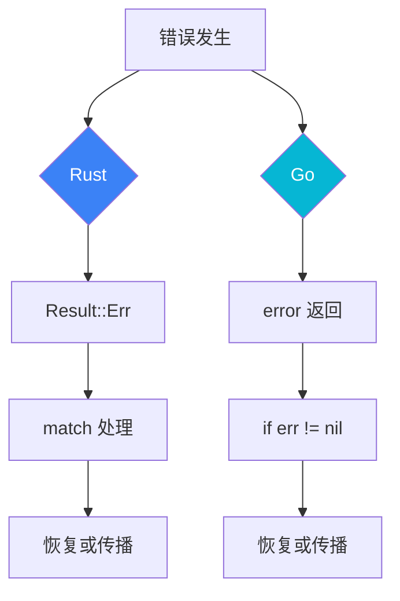

# 错误处理对比

本文档比较 Rust 和 Go 的错误处理哲学和实践。

## 设计理念


## Rust: Result<T, E>

### 基本用法

```rust
use std::fs::File;
use std::io::Read;

fn read_file(path: &str) -> Result<String, std::io::Error> {
    let mut file = File::open(path)?;  // ? 操作符自动传播错误
    let mut content = String::new();
    file.read_to_string(&mut content)?;
    Ok(content)
}

// 使用
match read_file("config.txt") {
    Ok(content) => println!("Content: {}", content),
    Err(e) => eprintln!("Error: {}", e),
}
```

### ? 操作符

```rust
// 自动转换错误类型
fn process() -> Result<Data, AppError> {
    let config = read_config()?;     // io::Error -> AppError
    let data = fetch_data(&config)?; // NetworkError -> AppError
    let result = parse(data)?;       // ParseError -> AppError
    Ok(result)
}

// 在 async 函数中使用
async fn handle_request() -> Result<Response, Error> {
    let body = req.body().await?;
    let data = parse_json(&body)?;
    Ok(process(data)?)
}
```

### 自定义错误类型

```rust
use thiserror::Error;

#[derive(Debug, Error)]
pub enum AppError {
    #[error("IO error: {0}")]
    Io(#[from] std::io::Error),
    
    #[error("Parse error: {0}")]
    Parse(#[from] serde_json::Error),
    
    #[error("Network error: {0}")]
    Network(String),
    
    #[error("Not found: {0}")]
    NotFound(String),
}

// 实现 From 自动转换
impl From<reqwest::Error> for AppError {
    fn from(e: reqwest::Error) -> Self {
        AppError::Network(e.to_string())
    }
}
```

### 错误上下文

```rust
use anyhow::{Context, Result};

fn read_config() -> Result<Config> {
    let content = std::fs::read_to_string("config.toml")
        .context("Failed to read config file")?;
    
    let config: Config = toml::from_str(&content)
        .context("Failed to parse config")?;
    
    Ok(config)
}

// 错误链会显示完整上下文
// Error: Failed to parse config
// Caused by: missing field `database`
```

## Go: error 接口

### 基本用法

```go
import (
    "errors"
    "fmt"
    "os"
)

func readFile(path string) (string, error) {
    data, err := os.ReadFile(path)
    if err != nil {
        return "", err
    }
    return string(data), nil
}

// 使用
content, err := readFile("config.txt")
if err != nil {
    fmt.Fprintf(os.Stderr, "Error: %v\n", err)
    return
}
fmt.Println(content)
```

### 自定义错误

```go
// 简单错误
var ErrNotFound = errors.New("not found")

// 自定义错误类型
type ValidationError struct {
    Field   string
    Message string
}

func (e *ValidationError) Error() string {
    return fmt.Sprintf("validation error: %s - %s", e.Field, e.Message)
}

// 使用
func validate(data Data) error {
    if data.Name == "" {
        return &ValidationError{Field: "name", Message: "required"}
    }
    return nil
}
```

### 错误包装

```go
import "fmt"

// fmt.Errorf 包装
func process() error {
    data, err := readFile("config.txt")
    if err != nil {
        return fmt.Errorf("failed to process: %w", err)
    }
    // ...
    return nil
}

// errors.Is 和 errors.As
import "errors"

var ErrNotFound = errors.New("not found")

func handleError(err error) {
    // 检查特定错误
    if errors.Is(err, ErrNotFound) {
        // 处理 not found
    }
    
    // 检查错误类型
    var validationErr *ValidationError
    if errors.As(err, &validationErr) {
        fmt.Println(validationErr.Field)
    }
}
```

## 对比分析

### 类型安全

| 方面 | Rust | Go |
|------|------|-----|
| 编译期检查 | ✅ 必须处理错误 | ❌ 可能忽略错误 |
| 错误类型 | 强类型 | 接口类型 |
| 错误传播 | ? 操作符 | 显式 return |
| 错误链 | 类型化 | 字符串化 |

### 代码示例对比

```rust
// Rust - 连续操作
fn process_file(path: &str) -> Result<Output, AppError> {
    let content = fs::read_to_string(path)?;  // io::Error -> AppError
    let parsed = parse(&content)?;            // ParseError -> AppError
    let validated = validate(parsed)?;        // ValidationError -> AppError
    let processed = transform(validated)?;    // TransformError -> AppError
    Ok(processed)
}
```

```go
// Go - 连续操作
func processFile(path string) (*Output, error) {
    content, err := os.ReadFile(path)
    if err != nil {
        return nil, fmt.Errorf("read file: %w", err)
    }
    
    parsed, err := parse(content)
    if err != nil {
        return nil, fmt.Errorf("parse: %w", err)
    }
    
    validated, err := validate(parsed)
    if err != nil {
        return nil, fmt.Errorf("validate: %w", err)
    }
    
    processed, err := transform(validated)
    if err != nil {
        return nil, fmt.Errorf("transform: %w", err)
    }
    
    return processed, nil
}
```

### 错误恢复



## 实际案例

### dos2unix 错误处理

```rust
// Rust
#[derive(Debug, Error)]
pub enum Dos2UnixError {
    #[error("File not found: {0}")]
    FileNotFound(PathBuf),
    
    #[error("Permission denied: {0}")]
    PermissionDenied(PathBuf),
    
    #[error("Invalid encoding: {0}")]
    InvalidEncoding(String),
}

pub fn convert(input: &Path, output: Option<&Path>) -> Result<(), Dos2UnixError> {
    let mut reader = File::open(input)
        .map_err(|e| match e.kind() {
            std::io::ErrorKind::NotFound => Dos2UnixError::FileNotFound(input.to_owned()),
            std::io::ErrorKind::PermissionDenied => Dos2UnixError::PermissionDenied(input.to_owned()),
            _ => Dos2UnixError::from(e),
        })?;
    
    // 处理...
    Ok(())
}
```

```go
// Go
type Dos2UnixError struct {
    Op   string
    Path string
    Err  error
}

func (e *Dos2UnixError) Error() string {
    return fmt.Sprintf("dos2unix %s %s: %v", e.Op, e.Path, e.Err)
}

func (e *Dos2UnixError) Unwrap() error {
    return e.Err
}

func convert(input, output string) error {
    file, err := os.Open(input)
    if err != nil {
        if os.IsNotExist(err) {
            return &Dos2UnixError{Op: "open", Path: input, Err: err}
        }
        if os.IsPermission(err) {
            return &Dos2UnixError{Op: "open", Path: input, Err: err}
        }
        return err
    }
    defer file.Close()
    
    // 处理...
    return nil
}
```

## 最佳实践

### Rust

```rust
// 1. 使用 thiserror 定义错误
#[derive(Debug, Error)]
pub enum Error {
    #[error("Configuration error: {0}")]
    Config(String),
    
    #[error(transparent)]
    Io(#[from] std::io::Error),
}

// 2. 使用 anyhow 快速原型
use anyhow::Result;

fn quick_prototype() -> Result<()> {
    // ...
}

// 3. 提供上下文
.context(format!("Processing file {}", path))?
```

### Go

```go
// 1. 使用 errors.New 创建哨兵错误
var (
    ErrNotFound   = errors.New("not found")
    ErrPermission = errors.New("permission denied")
)

// 2. 使用 %w 包装错误
return fmt.Errorf("process %s: %w", filename, err)

// 3. 自定义错误类型实现 Unwrap
func (e *CustomError) Unwrap() error {
    return e.Cause
}
```

## 相关文档

- [对比研究概览](/comparison/) — 对比总览
- [内存模型对比](/comparison/memory) — 内存管理
- [并发模型对比](/comparison/concurrency) — 并发编程
