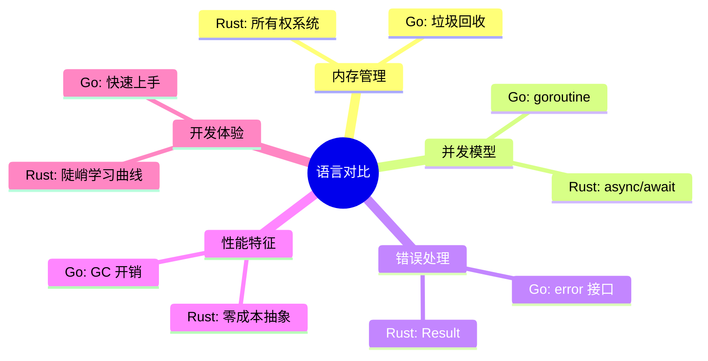
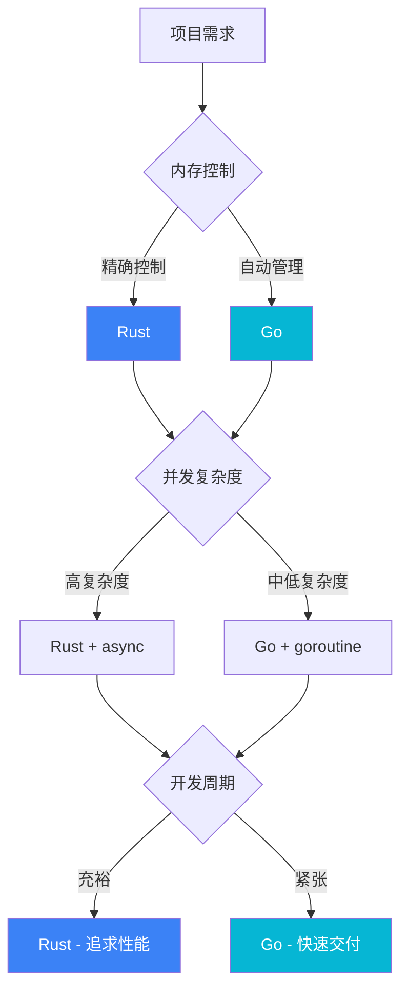

# Rust vs Go 对比研究

本章节深入分析 Rust 和 Go 两种语言在系统编程中的差异。

## 对比维度



## 核心差异概览

| 特性 | Rust | Go |
|------|------|-----|
| 内存管理 | 编译期所有权检查 | 运行时 GC |
| 并发原语 | async/await + Tokio | goroutine + channel |
| 错误处理 | Result<T, E> 枚举 | error 接口 |
| 泛型 | 完整泛型系统 | 类型参数 (1.18+) |
| 包管理 | Cargo | go mod |
| 编译速度 | 较慢 | 极快 |
| 二进制大小 | 较小 | 较大 |
| 学习曲线 | 陡峭 | 平缓 |

## 详细对比

### [内存模型](/comparison/memory)

深入比较两种语言的内存管理策略：

- Rust 的所有权系统
- Go 的垃圾回收机制
- 内存安全保证
- 性能影响

### [并发模型](/comparison/concurrency)

对比两种语言的并发编程范式：

- Rust 的 async/await
- Go 的 goroutine + channel
- 数据竞争处理
- 并发模式示例

### [错误处理](/comparison/errors)

分析两种语言的错误处理哲学：

- Rust 的 Result 类型
- Go 的 error 接口
- 错误传播机制
- 最佳实践

### [性能基准](/comparison/benchmarks)

查看详细的性能测试数据：

- 启动时间
- 内存占用
- 吞吐量
- 二进制大小

## 选择建议



### 选择 Rust 的场景

- 需要精确内存控制
- 性能是首要目标
- 嵌入式或资源受限环境
- 长期运行的服务（无 GC 暂停）

### 选择 Go 的场景

- 快速迭代开发
- 团队经验有限
- 网络服务开发
- DevOps 工具开发

## 代码对比示例

### Hello World

```rust
// Rust
fn main() {
    println!("Hello, World!");
}
```

```go
// Go
package main

import "fmt"

func main() {
    fmt.Println("Hello, World!")
}
```

### 错误处理

```rust
// Rust
fn read_file(path: &str) -> Result<String, std::io::Error> {
    std::fs::read_to_string(path)
}

// 使用
match read_file("config.txt") {
    Ok(content) => println!("{}", content),
    Err(e) => eprintln!("Error: {}", e),
}
```

```go
// Go
func readFile(path string) (string, error) {
    return os.ReadFile(path)
}

// 使用
content, err := readFile("config.txt")
if err != nil {
    fmt.Fprintf(os.Stderr, "Error: %v\n", err)
    return
}
fmt.Println(string(content))
```

### 并发

```rust
// Rust - async
use tokio;

#[tokio::main]
async fn main() {
    let handle = tokio::spawn(async {
        println!("Hello from async task");
    });
    handle.await.unwrap();
}
```

```go
// Go - goroutine
func main() {
    go func() {
        fmt.Println("Hello from goroutine")
    }()
    time.Sleep(time.Second)
}
```

## 本项目应用

在 Build Your Own Tools 项目中：

| 工具 | Rust 实现 | Go 实现 | 理由 |
|------|-----------|---------|------|
| dos2unix | ✅ | ❌ | 单语言示例足够 |
| gzip | ✅ | ✅ | 对比压缩性能 |
| htop | ✅ | ✅ | 对比 TUI 和并发 |

## 下一步

- 🧠 阅读 [内存模型对比](/comparison/memory) 理解内存管理差异
- ⚡ 阅读 [并发模型对比](/comparison/concurrency) 学习并发编程
- 🔧 阅读 [错误处理对比](/comparison/errors) 掌握错误处理模式
- 📊 阅读 [性能基准](/comparison/benchmarks) 查看实测数据
