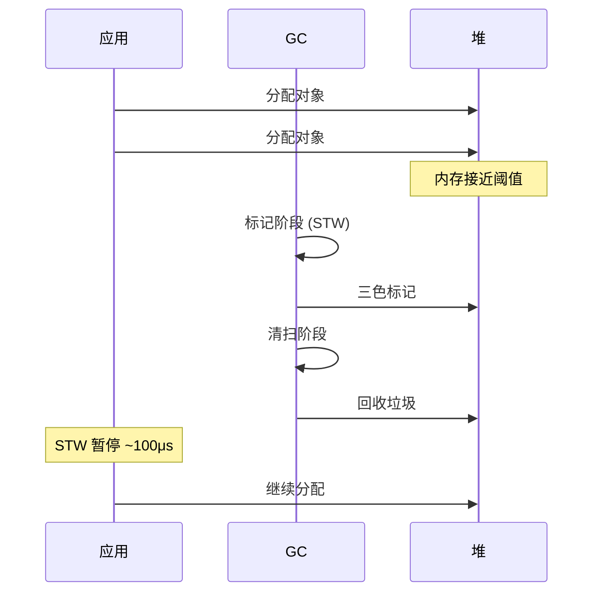
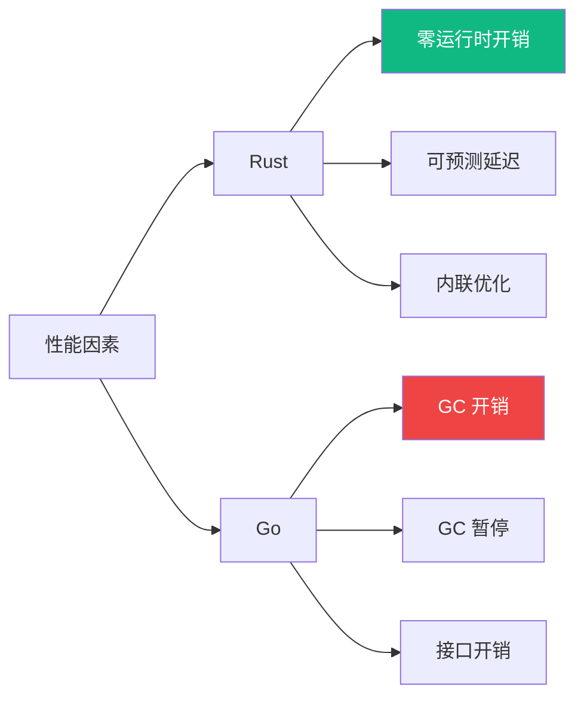

# 内存模型对比

本文档深入比较 Rust 和 Go 的内存管理策略。

## 核心差异


## Rust: 所有权系统

### 所有权规则

1. 每个值有且只有一个所有者
2. 值在所有者离开作用域时被丢弃
3. 值可以被移动或借用

```rust
// 所有权转移
let s1 = String::from("hello");
let s2 = s1;  // s1 不再有效
// println!("{}", s1);  // 编译错误

// 借用
let s3 = String::from("world");
let len = calculate_length(&s3);  // 借用，不转移所有权
println!("{}", s3);  // 仍然有效

fn calculate_length(s: &String) -> usize {
    s.len()
}  // s 离开作用域，但不会丢弃 String，因为只是借用
```

### 借用规则

```rust
// 规则：要么一个可变引用，要么任意数量不可变引用
let mut s = String::from("hello");

// OK: 一个可变引用
let r1 = &mut s;

// 编译错误：不能同时有可变和不可变引用
// let r2 = &s;  // 错误
// let r3 = &mut s;  // 错误

// OK: 引用作用域结束后
let r1 = &s;  // 不可变借用
let r2 = &s;  // 不可变借用
println!("{} {}", r1, r2);
// r1 和 r2 在此之后不再使用

let r3 = &mut s;  // 可变借用
r3.push_str(" world");
```

### 生命周期

```rust
// 显式生命周期标注
fn longest<'a>(x: &'a str, y: &'a str) -> &'a str {
    if x.len() > y.len() { x } else { y }
}

// 结构体生命周期
struct Holder<'a> {
    value: &'a str,
}

impl<'a> Holder<'a> {
    fn get(&self) -> &'a str {
        self.value
    }
}
```

## Go: 垃圾回收

### 内存分配

```go
// 栈分配（逃逸分析）
func stackAlloc() int {
    x := 42  // 可能在栈上
    return x
}

// 堆分配（逃逸）
func heapAlloc() *int {
    x := 42  // 逃逸到堆上
    return &x
}

// 切片分配
func sliceAlloc() []int {
    // 底层数组在堆上
    s := make([]int, 1000)
    return s
}
```

### GC 工作原理



### 逃逸分析

```bash
# 查看逃逸分析
go build -gcflags="-m" main.go

# 输出示例
./main.go:10:6: moved to heap: x
./main.go:15:6: does not escape
```

## 对比分析

### 内存安全

| 方面 | Rust | Go |
|------|------|-----|
| 空指针 | 编译期防止 | 运行时 panic |
| 数据竞争 | 编译期防止 | 运行时检测 |
| 悬垂指针 | 编译期防止 | GC 防止 |
| 缓冲区溢出 | 编译期检查 | 运行时检查 |

### 性能影响



### 内存占用

| 场景 | Rust | Go |
|------|------|-----|
| 空程序 | ~300 KB | ~2 MB |
| HTTP 服务 | ~5 MB | ~15 MB |
| 长期运行 | 稳定 | 随 GC 波动 |

## 实际案例

### dos2unix 内存使用

```rust
// Rust - 固定缓冲区
let mut buf = [0u8; 8192];  // 栈分配
loop {
    let n = reader.read(&mut buf)?;
    if n == 0 { break; }
    // 处理 buf
}
```

```go
// Go - 动态分配
buf := make([]byte, 8192)  // 堆分配
for {
    n, err := reader.Read(buf)
    if err == io.EOF {
        break
    }
    // 处理 buf
}
```

### htop 进程列表

```rust
// Rust - 避免分配
struct ProcessInfo<'a> {
    pid: u32,
    name: &'a str,  // 借用，不拷贝
}

fn get_processes() -> Vec<ProcessInfo<'static>> {
    // ...
}
```

```go
// Go - 依赖 GC
type ProcessInfo struct {
    PID  uint32
    Name string  // 拷贝
}

func getProcesses() []ProcessInfo {
    // ...
}
```

## 最佳实践

### Rust

```rust
// 1. 优先使用借用
fn process(data: &str) -> usize {
    data.len()
}

// 2. 使用 Cow 避免不必要的拷贝
use std::borrow::Cow;
fn transform(input: &str) -> Cow<str> {
    if input.contains("special") {
        Cow::Owned(input.replace("special", "normal"))
    } else {
        Cow::Borrowed(input)
    }
}

// 3. 使用 Arc 共享所有权
use std::sync::Arc;
let shared = Arc::new(large_data);
let cloned = Arc::clone(&shared);
```

### Go

```go
// 1. 减少逃逸
func process(data string) int {
    return len(data)  // 不逃逸
}

// 2. 对象池
var bufPool = sync.Pool{
    New: func() interface{} {
        return make([]byte, 1024)
    },
}

func useBuffer() {
    buf := bufPool.Get().([]byte)
    defer bufPool.Put(buf)
    // 使用 buf
}

// 3. 预分配
func preallocate() {
    // 已知大小，预分配
    items := make([]Item, 0, expectedSize)
    // ...
}
```

## 相关文档

- [对比研究概览](/comparison/) — 对比总览
- [并发模型对比](/comparison/concurrency) — 并发差异
- [性能基准](/comparison/benchmarks) — 实测数据
