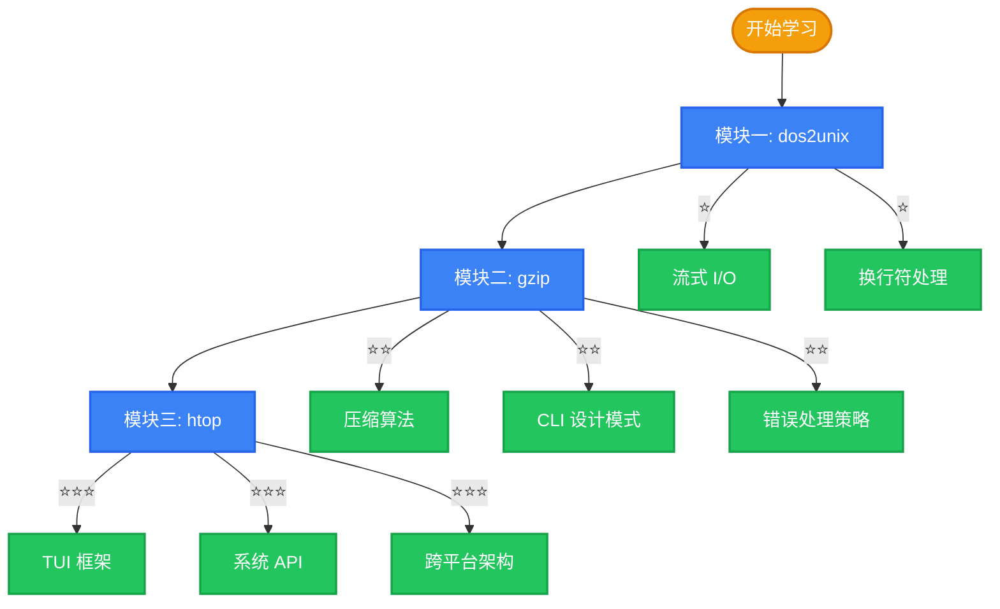

# Build Your Own Tools 学院

欢迎来到 **BYOT 学院** —— 一个通过重新实现真实 CLI 工具来掌握系统编程的渐进式学习路径。

## 学习理念

我们相信**从实践中学习**是最好的方式。本学院选取了三个具有代表性的命令行工具，从简单到复杂，逐步引导你理解系统编程的核心概念。

更重要的是，每个工具都提供了 **Rust 和 Go 的双语言实现**，让你能够直观对比两种语言在处理同一问题时的设计哲学差异。

## 学习路径

## 模块概览

| 模块 | 工具 | 核心知识点 | 复杂度 | Rust | Go |
|------|------|-----------|--------|------|-----|
| 一 | dos2unix | 流式 I/O、换行符处理、简单错误处理 | ⭐ | ✅ | — |
| 二 | gzip | DEFLATE 算法、CLI 设计、双语言对比 | ⭐⭐ | ✅ | ✅ |
| 三 | htop | TUI 开发、系统 API、跨平台架构 | ⭐⭐⭐ | ✅ | ✅ |

## 前置知识

- **必备**：至少一门编程语言的基础知识
- **推荐**：命令行基本操作经验
- **加分**：Rust 或 Go 的基础语法了解

## 学习建议

1. **按顺序学习**：模块之间的难度递增，建议按顺序完成
2. **对比阅读**：重点关注 Rust 和 Go 实现的差异，理解各自的设计哲学
3. **动手实践**：阅读源码后，尝试自己实现或修改功能
4. **参考规范**：结合 [技术规范](/zh/specs/) 理解需求如何驱动实现

## 推荐阅读

- [白皮书：系统架构](/zh/whitepaper/architecture) — 理解整体架构设计
- [对比研究：内存模型](/zh/comparison/memory) — Rust vs Go 内存管理差异
- [参考文献](/zh/reference/) — 深入了解相关论文和项目
