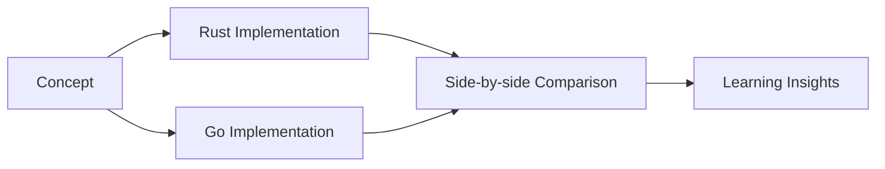
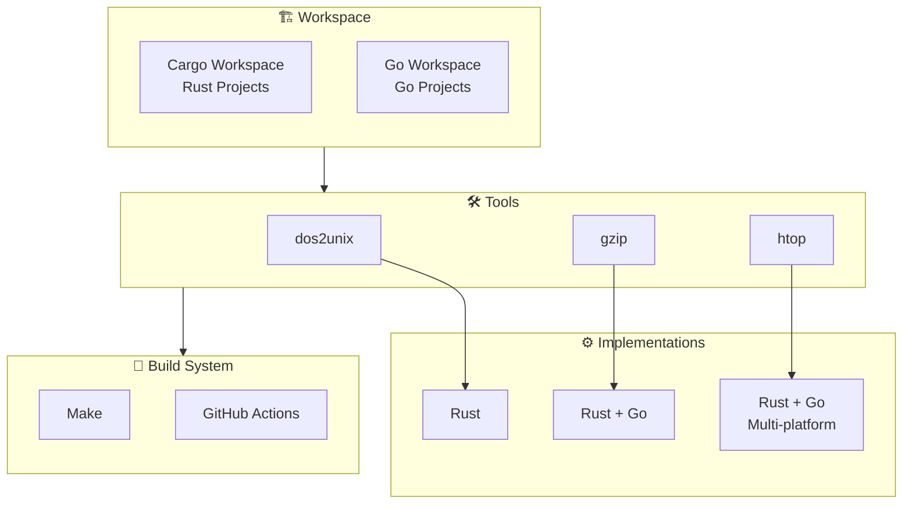
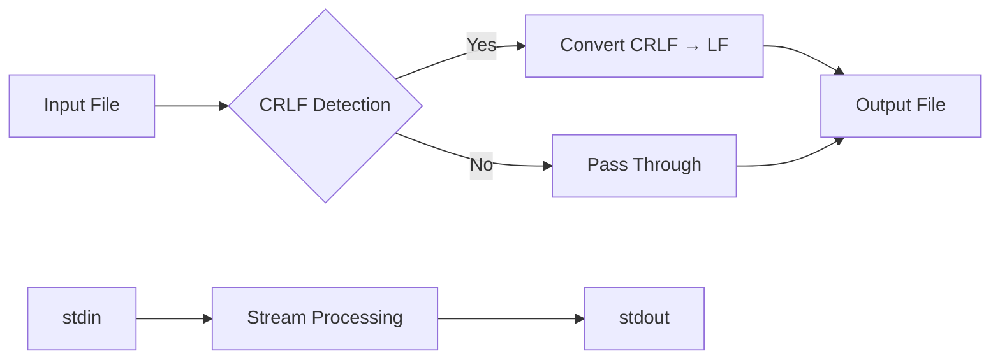
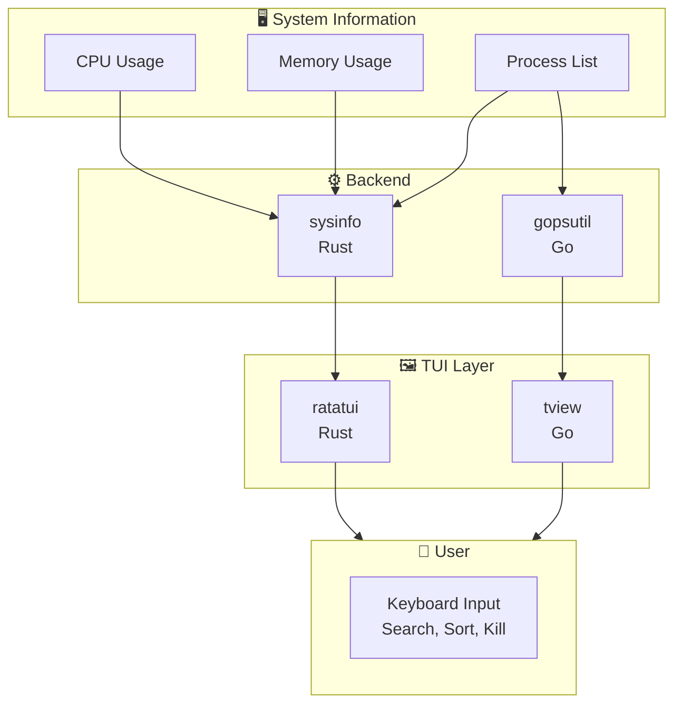
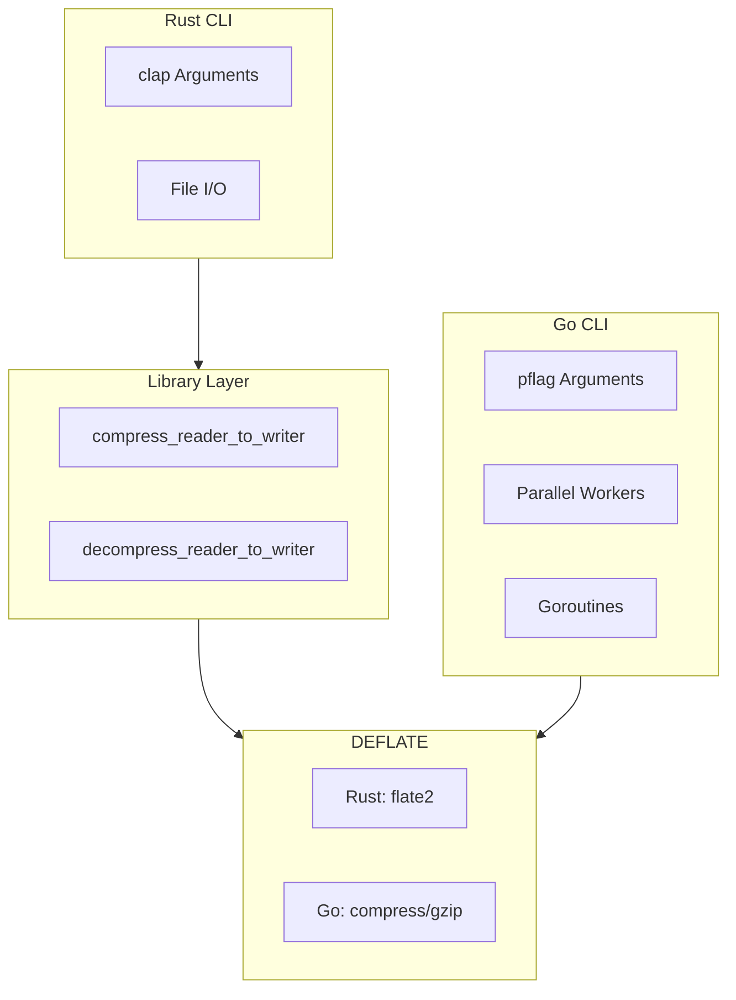
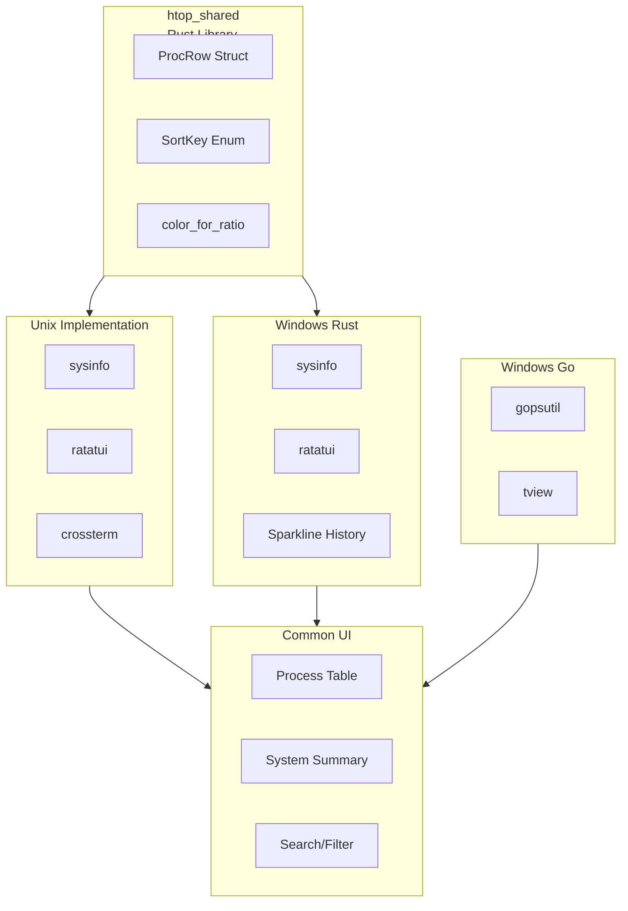
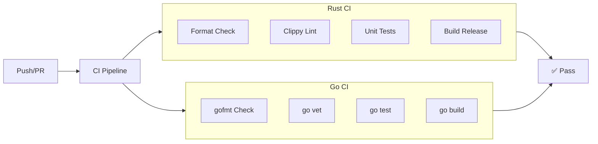
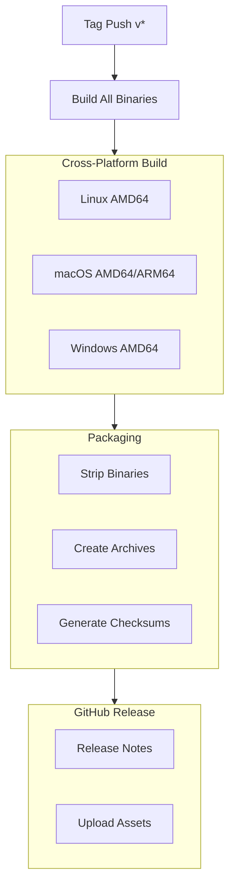

# Architecture Guide

> System design, patterns, and implementation details for build-your-own-tools

**English** | [简体中文](../zh-CN/ARCHITECTURE.md)

---

## Table of Contents

- [Overview](#overview)
- [Design Philosophy](#design-philosophy)
- [Project Structure](#project-structure)
- [Architecture Diagrams](#architecture-diagrams)
- [Sub-Project Details](#sub-project-details)
- [Build System](#build-system)
- [CI/CD Pipeline](#cicd-pipeline)
- [Cross-Platform Strategy](#cross-platform-strategy)
- [Extension Guide](#extension-guide)
- [Troubleshooting](#troubleshooting)
- [References](#references)

---

## Overview

**build-your-own-tools** is a learning-focused repository for re-implementing common CLI tools from scratch in **Rust** and **Go**. The project demonstrates:

- Low-level system programming concepts
- CLI design patterns and best practices
- Cross-language implementation comparisons
- Cross-platform development techniques

### Key Statistics

| Metric | Value |
|--------|-------|
| Languages | Rust, Go |
| Projects | 3 (dos2unix, gzip, htop) |
| Platforms | Linux, macOS, Windows |
| Implementations | 6 total |
| Test Coverage | Unit + Integration tests |

---

## Design Philosophy

### 1. Learning First

- **Readable code** over micro-optimizations
- **Comprehensive comments** explaining the "why"
- **Minimal dependencies** to understand core concepts
- **Progressive complexity** from simple to advanced tools

### 2. Multi-Language Implementation



### 3. Production-Ready Quality

- Comprehensive test coverage
- CI/CD automation
- Cross-platform compatibility
- Proper error handling

### 4. Modular Design

Each tool is self-contained with:
- Dedicated directory
- Independent build configuration
- Separate documentation
- Individual versioning

---

## Project Structure

```
build-your-own-tools/
├── 📁 docs/                      # Documentation
│   ├── en/                      # English docs
│   ├── zh-CN/                   # Chinese docs
│   └── changelogs/              # Changelog index
│
├── 📁 dos2unix/                  # CRLF → LF converter
│   ├── src/main.rs             # Rust implementation
│   ├── Cargo.toml              # Rust manifest
│   ├── README.md               # Project docs
│   └── changelog/              # Version history
│
├── 📁 gzip/                      # File compression tool
│   ├── go/                     # Go implementation
│   │   ├── cmd/gzip-go/        # CLI entry point
│   │   └── changelog/          # Version history
│   └── rust/                   # Rust implementation
│       ├── src/lib.rs          # Library crate
│       ├── src/main.rs         # CLI entry point
│       └── changelog/          # Version history
│
├── 📁 htop/                      # System monitor TUI
│   ├── shared/                 # Shared Rust library
│   ├── unix/rust/              # Unix implementation
│   ├── win/rust/               # Windows Rust impl
│   └── win/go/                 # Windows Go impl
│
├── 📁 .github/                   # GitHub configuration
│   ├── workflows/              # CI/CD pipelines
│   └── ISSUE_TEMPLATE/         # Issue templates
│
├── Cargo.toml                  # Rust workspace
├── go.work                     # Go workspace
├── Makefile                    # Build automation
└── README.md                   # Project overview
```

---

## Architecture Diagrams

### High-Level System Architecture



### Data Flow - dos2unix



### Data Flow - gzip

```mermaid
flowchart LR
    A[Input File(s)] --> B{Compress?}
    B -->|Yes| C[DEFLATE Compression]
    B -->|No| D[DEFLATE Decompression]
    C --> E[.gz Output]
    D --> F[Original File]
    
    G[Directory] --> H[Recursive Scan]
    H --> I[Parallel Processing]
```

### Data Flow - htop



---

## Sub-Project Details

### dos2unix

**Purpose**: Text file line ending converter  
**Complexity**: ⭐ (Beginner)  
**Key Concepts**: File I/O, Streaming, Buffer Management

#### Architecture

```mermaid
flowchart LR
    subgraph Core["Core Module"]
        CONV[convert_crlf_to_lf]
        STREAM[convert_crlf_to_lf_stream]
    end
    
    subgraph CLI["CLI Layer"]
        ARGS[Argument Parsing]
        MODE[Mode Selection<br/>in-place | stdout | check]
    end
    
    subgraph IO["I/O Layer"]
        FILE[File Operations]
        STD[stdin/stdout]
    end
    
    CLI --> Core
    Core --> IO
```

**Key Features**:
| Feature | Implementation |
|---------|---------------|
| Streaming | Buffered reads (8KB chunks) |
| Cross-buffer CRLF | State tracking (`prev_was_cr`) |
| Check mode | Detect only, no modification |
| stdin/stdout | Pipe-friendly design |

**Dependencies**:
- `anyhow` - Error handling

---

### gzip

**Purpose**: File compression/decompression  
**Complexity**: ⭐⭐ (Intermediate)  
**Key Concepts**: DEFLATE Algorithm, Streaming, Concurrency

#### Architecture



**Feature Comparison**:

| Feature | Rust (rgzip) | Go (gzip-go) |
|---------|-------------|--------------|
| Library crate | ✅ | ❌ |
| Parallel processing | ❌ (use rayon) | ✅ goroutines |
| Recursive directory | ❌ | ✅ -r flag |
| Compression levels | 0-9 | 0-9 |
| stdin/stdout | ✅ | ✅ |
| Keep source | ✅ -k | ✅ default |

**Dependencies**:
- Rust: `flate2`, `clap`
- Go: Standard library only

---

### htop

**Purpose**: Interactive system monitor  
**Complexity**: ⭐⭐⭐ (Advanced)  
**Key Concepts**: TUI, System APIs, Real-time Updates, Async

#### Architecture



**Key Features**:

| Feature | Unix/Rust | Win/Rust | Win/Go |
|---------|-----------|----------|--------|
| Process list | ✅ | ✅ | ✅ |
| CPU monitoring | ✅ | ✅ | ✅ |
| Memory monitoring | ✅ | ✅ | ✅ |
| Process kill | ✅ (SIGTERM→SIGKILL) | ✅ | ✅ |
| Search/filter | ✅ | ✅ | ✅ |
| Sort by column | ✅ | ✅ | ✅ |
| Sparkline history | ❌ | ✅ | ❌ |
| Refresh interval | ✅ | ✅ | ✅ |

**Dependencies**:
- Rust: `ratatui`, `crossterm`, `sysinfo`
- Go: `tview`, `gopsutil`

---

## Build System

### Cargo Workspace (Rust)

```toml
[workspace]
resolver = "2"
members = [
    "dos2unix",
    "gzip/rust",
    "htop/shared",
    "htop/unix/rust",
    "htop/win/rust",
]

[workspace.dependencies]
crossterm = "0.29"
ratatui = { version = "0.29", ... }
sysinfo = "0.29"
clap = { version = "4.5", ... }
flate2 = "1.0"
anyhow = "1.0"
```

**Benefits**:
- Shared dependency resolution
- Unified build commands
- Cross-crate optimization

### Go Workspace

```go
go 1.23

use (
    ./gzip/go
    ./htop/win/go
)
```

**Benefits**:
- Module dependency graph
- Unified versioning
- Simplified imports

### Makefile Targets

```bash
# Build commands
make build-all          # Build all projects
make build-rust         # Build Rust projects
make build-go           # Build Go projects

# Quality commands
make test-all           # Run all tests
make lint-all           # Lint all code
make fmt-all            # Format all code

# Specific projects
make build-dos2unix
make build-gzip-rust
make build-gzip-go
make build-htop-unix-rust
```

---

## CI/CD Pipeline

### Continuous Integration



**Matrix Strategy**:
| OS | Rust Targets | Go Platforms |
|----|-------------|--------------|
| Ubuntu | x86_64-linux | linux/amd64 |
| macOS | x86_64-darwin, aarch64-darwin | darwin/amd64, darwin/arm64 |
| Windows | x86_64-windows | windows/amd64 |

### Release Pipeline



---

## Cross-Platform Strategy

### Conditional Compilation

**Rust**:
```rust
#[cfg(target_os = "windows")]
fn windows_specific() { }

#[cfg(target_os = "unix")]
fn unix_specific() { }

#[cfg(not(target_os = "windows"))]
fn non_windows() { }
```

**Go**:
```go
//go:build windows
// +build windows

package main

func windowsSpecific() { }
```

### Platform Abstractions

| Feature | Linux | macOS | Windows |
|---------|-------|-------|---------|
| Process info | /proc | sysctl/libproc | WMI/NT API |
| Terminal | ANSI | ANSI | Windows API |
| Path separator | / | / | \\ |
| Line endings | LF | LF | CRLF |

---

## Extension Guide

### Adding a New Tool

1. **Create directory structure**:
   ```bash
   mkdir mytool/
   cd mytool/
   cargo init  # or go mod init
   mkdir changelog
   touch README.md
   ```

2. **Add to workspace**:
   - Rust: Add to root `Cargo.toml` workspace members
   - Go: Add to `go.work`

3. **Create changelog**:
   ```bash
   touch changelog/CHANGELOG.md
   ```

4. **Update documentation**:
   - Add to root README.md project table
   - Add to docs/en/API.md
   - Add CI workflow if needed

5. **Add Makefile targets**:
   ```makefile
   build-mytool:
       cd mytool && cargo build --release
   ```

### Adding a Language Implementation

1. Create language subdirectory
2. Implement same CLI interface
3. Add feature parity tests
4. Update comparison documentation

---

## Troubleshooting

### Common Build Issues

| Issue | Solution |
|-------|----------|
| `cargo: not found` | Install Rust: `curl --proto '=https' --tlsv1.2 -sSf https://sh.rustup.rs \| sh` |
| `go: not found` | Install Go: https://golang.org/dl/ |
| Missing dependencies | Run `cargo build` to auto-fetch |
| Line ending issues | Check `.gitattributes` settings |

### Platform-Specific Issues

**Windows**:
- Use Git Bash or PowerShell
- Enable Developer Mode for symlinks
- Install Visual Studio Build Tools

**macOS**:
- Install Xcode Command Line Tools: `xcode-select --install`
- May need to allow terminal in Security settings

**Linux**:
- Install build-essential: `sudo apt install build-essential`

### Debug Tips

```bash
# Verbose build output
cargo build --release -vv

# Run with backtrace
RUST_BACKTRACE=1 cargo run

# Check formatting only
cargo fmt -- --check

# Fix linting issues automatically
cargo clippy --fix
```

---

## References

### Official Documentation

- [Rust Book](https://doc.rust-lang.org/book/)
- [Go Documentation](https://golang.org/doc/)
- [Cargo Book](https://doc.rust-lang.org/cargo/)
- [Go Modules](https://golang.org/ref/mod)

### Libraries & Frameworks

- [ratatui](https://github.com/ratatui-org/ratatui) - Rust TUI framework
- [tview](https://github.com/rivo/tview) - Go TUI framework
- [sysinfo](https://github.com/GuillaumeGomez/sysinfo) - Rust system info
- [gopsutil](https://github.com/shirou/gopsutil) - Go system info
- [flate2](https://github.com/rust-lang/flate2-rs) - Rust DEFLATE compression
- [clap](https://github.com/clap-rs/clap) - Rust CLI parser

### Standards

- [Keep a Changelog](https://keepachangelog.com/)
- [Semantic Versioning](https://semver.org/)
- [Conventional Commits](https://www.conventionalcommits.org/)

---

**Last Updated**: 2026-04-16  
**Version**: 2.0
