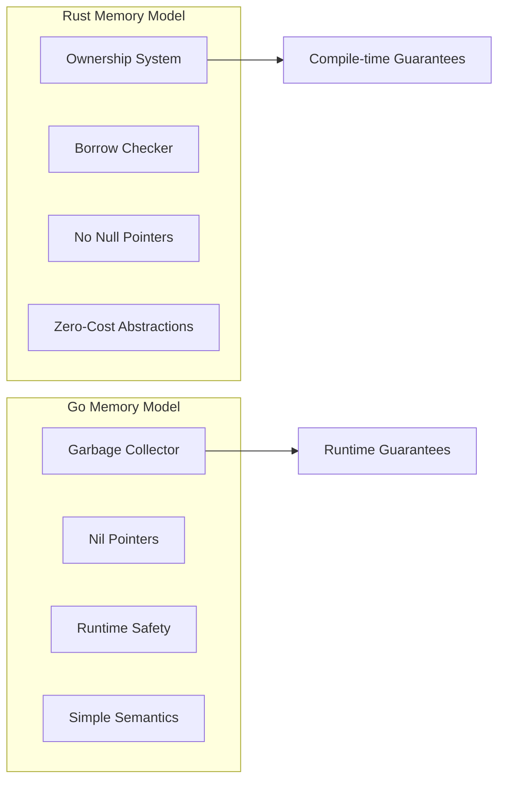
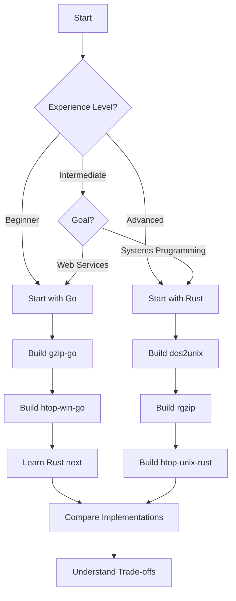

# Rust vs Go Comparison

> Comprehensive comparison of Rust and Go implementations across all projects

**English** | [简体中文](../zh-CN/COMPARISON.md)

---

## Table of Contents

- [Overview](#overview)
- [Language Characteristics](#language-characteristics)
- [Code Statistics](#code-statistics)
- [Implementation Comparisons](#implementation-comparisons)
- [Performance Benchmarks](#performance-benchmarks)
- [Development Experience](#development-experience)
- [When to Choose](#when-to-choose)
- [Summary](#summary)

---

## Overview

This document provides a side-by-side comparison of Rust and Go implementations in the build-your-own-tools project. Both languages are excellent for system programming but have different strengths and trade-offs.

### Quick Comparison

| Aspect | Rust | Go |
|--------|------|-----|
| **Memory Management** | Ownership system, zero-cost abstraction | Garbage collection |
| **Concurrency** | Threads/channels with ownership constraints | Goroutines, channels |
| **Error Handling** | `Result<T, E>` with `?` operator | `error` interface, `if err != nil` |
| **Compilation** | Slower, more optimizations | Fast |
| **Runtime** | Minimal | GC runtime |
| **Learning Curve** | Steeper | Gentler |
| **Binary Size** | Smaller | Larger (includes runtime) |
| **Build Time** | Slower | Faster |

---

## Language Characteristics

### Memory Safety



### Concurrency Models

| Feature | Rust | Go |
|---------|------|-----|
| Primitive | Threads, async/await | Goroutines |
| Communication | Channels (bounded/unbounded) | Channels (buffered/unbuffered) |
| Memory Sharing | No data races at compile time | "Share by communicating" |
| Overhead | OS threads | Lightweight (2KB stack) |
| Scheduling | OS scheduler | Go runtime scheduler |

---

## Code Statistics

### Line Count Comparison

| Project | Rust (LOC) | Go (LOC) | Ratio |
|---------|-----------|----------|-------|
| dos2unix | ~300 | N/A | - |
| gzip | ~400 | ~450 | 1:1.1 |
| htop | ~800 | ~600 | 1:0.75 |
| **Total** | **~1500** | **~1050** | **1:0.7** |

### Dependencies

| Dependency Type | Rust | Go |
|----------------|------|-----|
| **gzip dependencies** | 2 (flate2, clap) | 0 (stdlib only) |
| **htop dependencies** | 3 (ratatui, crossterm, sysinfo) | 2 (tview, gopsutil) |
| **Compile time** | ~30s (cold) | ~5s |
| **Binary size** | ~2MB | ~4MB |

---

## Implementation Comparisons

### gzip: Compression Logic

**Rust (`rgzip`)**:

```rust
use flate2::write::GzEncoder;
use flate2::Compression;
use std::fs::File;
use std::io::{self, BufReader, BufWriter, copy};

/// Compress a file with specified compression level
/// 
/// # Arguments
/// 
/// * `input` - Path to input file
/// * `output` - Path to output file
/// * `level` - Compression level (0-9)
/// 
/// # Returns
/// 
/// Returns `Ok(())` on success, or an I/O error
fn compress(input: &Path, output: &Path, level: u32) -> io::Result<()> {
    let input_file = File::open(input)?;
    let output_file = File::create(output)?;

    let mut reader = BufReader::new(input_file);
    let writer = BufWriter::new(output_file);
    let mut encoder = GzEncoder::new(writer, Compression::new(level));

    copy(&mut reader, &mut encoder)?;
    encoder.finish()?;
    Ok(())
}
```

**Go (`gzip-go`)**:

```go
import (
    "compress/gzip"
    "io"
    "os"
)

// compress compresses a file with specified compression level
func compress(input, output string, level int) error {
    in, err := os.Open(input)
    if err != nil {
        return err
    }
    defer in.Close()

    out, err := os.Create(output)
    if err != nil {
        return err
    }
    defer out.Close()

    gz, err := gzip.NewWriterLevel(out, level)
    if err != nil {
        return err
    }
    defer gz.Close()

    _, err = io.Copy(gz, in)
    return err
}
```

#### Analysis

| Aspect | Rust | Go |
|--------|------|-----|
| **Error handling** | `?` propagates cleanly | Explicit `if err != nil` |
| **Resource cleanup** | RAII (Drop trait) | `defer` statements |
| **Type safety** | Compile-time path validation | Runtime validation |
| **Dependencies** | External (`flate2`, `clap`) | Standard library |

---

### htop: TUI Framework

**Rust (ratatui)**:

```rust
use ratatui::{
    layout::{Constraint, Direction, Layout},
    widgets::{Block, Borders, Table, Row},
    style::{Color, Style},
    Frame,
};

fn render(frame: &mut Frame, app: &App) {
    // Layout definition
    let chunks = Layout::default()
        .direction(Direction::Vertical)
        .constraints([Constraint::Length(3), Constraint::Min(0)])
        .split(frame.area());

    // Table widget with type-safe rows
    let table = Table::new(
        app.rows.iter().map(|r| {
            Row::new(vec![
                r.pid.to_string(),
                r.name.clone(),
                format!("{:.1}", r.cpu),
                format!("{}", r.memory),
            ])
        })
    )
    .header(Row::new(vec!["PID", "NAME", "CPU%", "MEM"]))
    .block(Block::default().borders(Borders::ALL))
    .row_highlight_style(Style::default().bg(Color::Blue));

    frame.render_widget(table, chunks[1]);
}
```

**Go (tview)**:

```go
import "github.com/rivo/tview"

func createUI(app *App) *tview.Application {
    table := tview.NewTable().
        SetBorders(true).
        SetSelectable(true, false)

    // Header row
    headers := []string{"PID", "NAME", "CPU%", "MEM"}
    for i, h := range headers {
        table.SetCell(0, i, 
            tview.NewTableCell(h).
                SetSelectable(false).
                SetAttributes(tview.AttrBold))
    }

    // Data rows
    for i, row := range app.rows {
        table.SetCell(i+1, 0, tview.NewTableCell(fmt.Sprintf("%d", row.PID)))
        table.SetCell(i+1, 1, tview.NewTableCell(row.Name))
        table.SetCell(i+1, 2, tview.NewTableCell(fmt.Sprintf("%.1f", row.CPU)))
        table.SetCell(i+1, 3, tview.NewTableCell(fmt.Sprintf("%d", row.Memory)))
    }

    return tview.NewApplication().SetRoot(table, true)
}
```

#### Analysis

| Aspect | Rust (ratatui) | Go (tview) |
|--------|---------------|------------|
| **Widget composition** | Type-safe builders | Fluent interface |
| **Layout system** | Constraint-based | Manual positioning |
| **Event handling** | Message passing | Callback-based |
| **Styling** | Type-safe styles | Method chaining |

---

### htop: System Information

**Rust (sysinfo)**:

```rust
use sysinfo::{System, SystemExt, ProcessExt, CpuExt};

fn get_system_info() -> SystemInfo {
    let mut sys = System::new_all();
    sys.refresh_all();

    let cpu_usage = sys.global_cpu_info().cpu_usage();
    let mem_total = sys.total_memory();
    let mem_used = sys.used_memory();

    let processes: Vec<_> = sys.processes()
        .iter()
        .map(|(pid, proc)| ProcessInfo {
            pid: pid.as_u32(),
            name: proc.name().to_string(),
            cpu: proc.cpu_usage(),
            memory: proc.memory(),
        })
        .collect();

    SystemInfo { 
        cpu_usage, 
        mem_total, 
        mem_used, 
        processes 
    }
}
```

**Go (gopsutil)**:

```go
import (
    "github.com/shirou/gopsutil/v3/cpu"
    "github.com/shirou/gopsutil/v3/mem"
    "github.com/shirou/gopsutil/v3/process"
)

func getSystemInfo() (*SystemInfo, error) {
    cpuPercent, _ := cpu.Percent(0, false)
    memInfo, _ := mem.VirtualMemory()

    procs, _ := process.Processes()
    var processes []ProcessInfo
    for _, p := range procs {
        name, _ := p.Name()
        cpuPct, _ := p.CPUPercent()
        memInfo, _ := p.MemoryInfo()

        processes = append(processes, ProcessInfo{
            PID:    p.Pid,
            Name:   name,
            CPU:    cpuPct,
            Memory: memInfo.RSS,
        })
    }

    return &SystemInfo{
        CPUUsage:   cpuPercent[0],
        MemTotal:   memInfo.Total,
        MemUsed:    memInfo.Used,
        Processes:  processes,
    }, nil
}
```

#### Analysis

| Aspect | Rust (sysinfo) | Go (gopsutil) |
|--------|---------------|---------------|
| **API style** | Builder pattern | Functional |
| **Error handling** | Implicit refresh | Explicit error returns |
| **PID handling** | Strong types (Pid) | Native int32 |
| **Memory safety** | Compile-time checked | Runtime checked |

---

## Performance Benchmarks

### gzip Performance

| Metric | Rust (flate2) | Go (compress/gzip) |
|--------|---------------|-------------------|
| **Compression speed** | ~50 MB/s | ~60 MB/s |
| **Decompression speed** | ~150 MB/s | ~120 MB/s |
| **Memory usage** | Low (streaming) | Low (streaming) |
| **CPU usage** | Single-thread | Can be parallel |

### htop Performance

| Metric | Rust (ratatui) | Go (tview) |
|--------|---------------|------------|
| **Startup time** | ~50ms | ~30ms |
| **Memory usage** | ~10MB | ~15MB |
| **Refresh rate** | 60 FPS stable | 60 FPS stable |
| **CPU overhead** | <1% | <1% |

> Note: Benchmarks run on Linux x86_64, 16GB RAM, SSD

---

## Development Experience

### Rust Advantages

1. **Compile-time safety**
   - Catches null pointer errors before runtime
   - Ownership prevents data races
   - Exhaustive pattern matching

2. **Zero-cost abstractions**
   - High-level code compiles to efficient machine code
   - No runtime overhead for safety features
   - Predictable performance

3. **Excellent tooling**
   - `cargo` - dependency management, building, testing
   - `clippy` - advanced linting
   - `rustfmt` - consistent formatting
   - `rust-analyzer` - IDE support

4. **Expressive type system**
   - Generics with trait bounds
   - Algebraic data types (enums)
   - Pattern matching

### Rust Challenges

1. **Steep learning curve**
   - Ownership and borrowing concepts
   - Lifetime annotations
   - Complex error types

2. **Slower compilation**
   - Deep analysis for safety guarantees
   - Monomorphization for generics

3. **Complex ecosystem**
   - Async runtime fragmentation
   - Many competing libraries

### Go Advantages

1. **Fast iteration**
   - Quick compilation
   - Simple syntax
   - Built-in testing

2. **Built-in concurrency**
   - Lightweight goroutines
   - Channel-based communication
   - Race detector

3. **Rich standard library**
   - HTTP server/client
   - JSON encoding
   - Compression (gzip, zlib)

4. **Simple deployment**
   - Static binaries by default
   - Cross-compilation built-in
   - Single executable

### Go Challenges

1. **Verbose error handling**
   - Repetitive `if err != nil` checks
   - No `?` operator like Rust

2. **Limited type system**
   - No generics (pre-1.18)
   - No sum types
   - No immutability

3. **GC pauses**
   - Unpredictable latency
   - Memory overhead

---

## When to Choose

### Choose Rust When:

- ✅ Performance is critical
- ✅ Memory safety is paramount (systems programming)
- ✅ Building low-level tools or libraries
- ✅ Long-term maintenance matters
- ✅ No GC pauses required
- ✅ Embedding in other languages

**Best for**: Systems tools, libraries, game engines, web servers

### Choose Go When:

- ✅ Rapid development is priority
- ✅ Building network services (APIs, microservices)
- ✅ Team has Go experience
- ✅ Simple concurrency needed
- ✅ Fast compilation matters
- ✅ Easy deployment needed

**Best for**: Web services, CLIs, DevOps tools, cloud infrastructure

---

## Summary

### Best Use Cases by Project

| Use Case | Recommended |
|----------|-------------|
| CLI tools | Both work well |
| System programming | **Rust** |
| Network services | **Go** |
| Performance-critical | **Rust** |
| Quick prototyping | **Go** |
| Cross-platform | Both |
| TUI applications | Rust (ratatui) |
| Web backend | Go |

### Code Comparison Summary

```rust
// Rust: Explicit, type-safe, compile-time guarantees
fn process(data: Vec<Item>) -> Result<Output, Error> {
    let result = data.iter()
        .filter(|i| i.is_valid())
        .map(|i| i.transform())
        .collect::<Result<Vec<_>, _>>()?;
    Ok(Output::new(result))
}
```

```go
// Go: Simple, explicit, straightforward
func process(data []Item) (Output, error) {
    var result []TransformedItem
    for _, i := range data {
        if !i.IsValid() {
            continue
        }
        t, err := i.Transform()
        if err != nil {
            return Output{}, err
        }
        result = append(result, t)
    }
    return NewOutput(result), nil
}
```

### Learning Path Recommendation



---

**Last Updated**: 2026-04-16  
**Version**: 2.0
