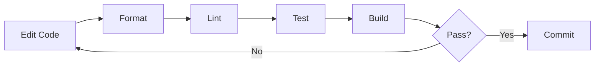
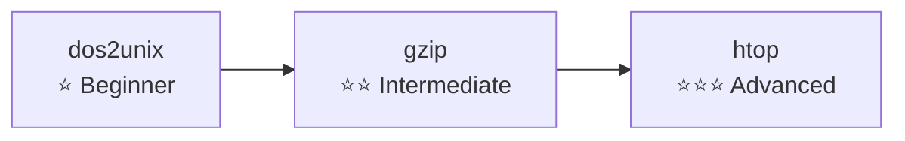

# Getting Started

> Quick start guide for building and contributing to build-your-own-tools

**English** | [简体中文](../zh-CN/GETTING-STARTED.md)

---

## Table of Contents

- [Prerequisites](#prerequisites)
- [Installation](#installation)
- [First Build](#first-build)
- [Development Workflow](#development-workflow)
- [Understanding the Code](#understanding-the-code)
- [Running Tests](#running-tests)
- [Debugging](#debugging)
- [Troubleshooting](#troubleshooting)
- [Next Steps](#next-steps)

---

## Prerequisites

### Required Tools

| Tool | Version | Purpose | Install Link |
|------|---------|---------|--------------|
| Rust | 1.70+ | Rust compilation | [rustup.rs](https://rustup.rs/) |
| Go | 1.21+ | Go compilation | [golang.org](https://golang.org/dl/) |
| make | any | Build automation | Usually pre-installed |
| git | 2.0+ | Version control | [git-scm.com](https://git-scm.com/) |

### Verifying Installations

```bash
# Check Rust
rustc --version
# Output: rustc 1.80.0 (051478957 2024-07-21)

cargo --version
# Output: cargo 1.80.0 (376290515 2024-07-16)

# Check Go
go version
# Output: go version go1.23.0 linux/amd64

# Check make
make --version
# Output: GNU Make 4.3
```

### Optional Tools

| Tool | Purpose | Install |
|------|---------|---------|
| `gh` | GitHub CLI for releases | `brew install gh` or [cli.github.com](https://cli.github.com/) |
| `jq` | JSON processing | `brew install jq` or `apt install jq` |
| `hyperfine` | Benchmarking | `cargo install hyperfine` |

---

## Installation

### 1. Clone the Repository

```bash
# HTTPS
git clone https://github.com/LessUp/build-your-own-tools.git

# or SSH
git clone git@github.com:LessUp/build-your-own-tools.git

cd build-your-own-tools
```

### 2. Verify Project Structure

```bash
ls -la
```

Expected output:
```
build-your-own-tools/
├── dos2unix/          # CRLF converter
├── gzip/              # Compression tool
├── htop/              # System monitor
├── docs/              # Documentation
├── .github/           # CI/CD workflows
├── Cargo.toml         # Rust workspace
├── go.work            # Go workspace
├── Makefile           # Build automation
└── README.md          # Project overview
```

### 3. Initialize Workspaces

```bash
# Rust workspace (auto-fetches dependencies)
cargo fetch

# Go workspace
go work sync
```

---

## First Build

### Build Everything

```bash
make build-all
```

This will:
1. Build all Rust projects (release mode)
2. Build all Go projects
3. Place binaries in respective directories

### Build Individual Projects

**dos2unix (Rust)**:
```bash
cargo build --release -p dos2unix-rust

# Binary location: target/release/dos2unix-rust
```

**gzip - Rust**:
```bash
cargo build --release -p rgzip

# Binary location: target/release/rgzip
```

**gzip - Go**:
```bash
cd gzip/go
make build

# Binary location: gzip/go/bin/gzip-go
```

**htop - Unix Rust**:
```bash
cargo build --release -p htop-rust

# Binary location: target/release/htop-unix-rust
```

**htop - Windows Rust**:
```bash
cargo build --release -p htop-win-rust

# Binary location: target/release/htop-win-rust
```

**htop - Windows Go**:
```bash
cd htop/win/go
go build -o bin/htop-win-go ./cmd/htop-win-go

# Binary location: htop/win/go/bin/htop-win-go
```

### Test Your Build

```bash
# Run dos2unix
echo "Hello" | ./target/release/dos2unix-rust

# Run gzip (create a test file first)
echo "Test content" > /tmp/test.txt
./target/release/rgzip /tmp/test.txt
ls -la /tmp/test.txt.gz

# Run htop (if on Unix)
./target/release/htop-unix-rust
```

---

## Development Workflow

### Typical Development Cycle



### Step-by-Step Workflow

```bash
# 1. Make your changes to source files
# ...

# 2. Format code
make fmt-all

# 3. Run linters
make lint-all

# 4. Run tests
make test-all

# 5. Build release
make build-all
```

### Using Make Targets

```bash
# Build commands
make build-all          # Build everything
make build-rust         # Build only Rust projects
make build-go           # Build only Go projects
make build-dos2unix     # Build specific project

# Quality commands
make test-all           # Run all tests
make test-rust          # Run Rust tests only
make test-go            # Run Go tests only

make lint-all           # Run all linters
make lint-rust          # Run Rust clippy
make lint-go            # Run go vet

make fmt-all            # Format all code
make fmt-rust           # Format Rust only
make fmt-go             # Format Go only

# Clean build artifacts
make clean              # Remove build directories
```

---

## Understanding the Code

### Project Complexity Progression



### Recommended Learning Path

1. **Start with dos2unix** (Simplest)
   - Learn file I/O basics
   - Understand streaming
   - Practice error handling

2. **Move to gzip** (Intermediate)
   - Learn compression algorithms
   - Practice library design
   - Compare Rust vs Go

3. **Finish with htop** (Advanced)
   - Learn TUI development
   - Practice system APIs
   - Understand async/concurrency

### Code Exploration Tips

**Navigating Rust Code**:
```bash
# Find all public functions
grep -r "^pub fn" dos2unix/src/

# Find main entry points
grep -r "fn main" --include="*.rs"

# List all tests
grep -r "#\[test\]" --include="*.rs"
```

**Navigating Go Code**:
```bash
# Find all functions
grep -r "^func " gzip/go/cmd/

# Find main packages
grep -r "package main" --include="*.go"

# List all tests
grep -r "^func Test" --include="*.go"
```

---

## Running Tests

### All Tests

```bash
make test-all
```

### Rust Tests

```bash
# All Rust tests
cargo test --all

# With output
cargo test --all -- --nocapture

# Specific package
cargo test -p dos2unix-rust
cargo test -p rgzip

# Specific test
cargo test test_stream_large_data -- --nocapture

# With coverage (requires cargo-tarpaulin)
cargo tarpaulin --all
```

### Go Tests

```bash
# All Go tests
go test ./...

# With verbose output
go test -v ./...

# Specific package
cd gzip/go && go test -v ./...
cd htop/win/go && go test -v ./...

# Specific test
go test -run TestGzipStream -v ./...

# With coverage
go test -cover ./...
go test -coverprofile=coverage.out ./...
go tool cover -html=coverage.out
```

### Test-Driven Development

```bash
# 1. Write a failing test
# 2. Run tests to confirm failure
cargo test --lib test_new_feature

# 3. Implement the feature
# 4. Run tests to confirm success
cargo test --lib test_new_feature

# 5. Refactor and repeat
```

---

## Debugging

### Rust Debugging

**Using println! (Quick & Dirty)**:
```rust
fn process_data(data: &[u8]) {
    println!("DEBUG: Processing {} bytes", data.len());
    println!("DEBUG: First byte: {:02x?}", data.first());
    // ...
}
```

**Using dbg! macro**:
```rust
fn complex_function(x: i32, y: i32) -> i32 {
    let sum = dbg!(x + y);  // Prints file:line and value
    sum * 2
}
```

**Using GDB/LLDB**:
```bash
# Build with debug symbols
cargo build

# Run with debugger
gdb ./target/debug/dos2unix-rust
lldb ./target/debug/dos2unix-rust

# Or use IDE debugger (VS Code with CodeLLDB)
```

**Environment Variables**:
```bash
# Full backtrace on panic
RUST_BACKTRACE=1 cargo run
RUST_BACKTRACE=full cargo run

# Log level (if using tracing)
RUST_LOG=debug cargo run
```

### Go Debugging

**Using fmt.Println (Quick & Dirty)**:
```go
func processData(data []byte) {
    fmt.Printf("DEBUG: Processing %d bytes\n", len(data))
    fmt.Printf("DEBUG: Data: %x\n", data[:10])
    // ...
}
```

**Using Delve Debugger**:
```bash
# Install delve
go install github.com/go-delve/delve/cmd/dlv@latest

# Debug
dlv debug ./cmd/gzip-go
dlv test ./...

# Common commands inside debugger:
# (dlv) break main.main
# (dlv) continue
# (dlv) print variable
# (dlv) locals
# (dlv) step
# (dlv) quit
```

**Environment Variables**:
```bash
# Verbose test output
GO111MODULE=on go test -v ./...

# Race detector
go run -race ./...
go test -race ./...

# Memory profiling
go test -memprofile=mem.prof ./...
go tool pprof mem.prof
```

---

## Troubleshooting

### Common Build Issues

#### Rust: "linker 'cc' not found"

**Linux (Ubuntu/Debian)**:
```bash
sudo apt update
sudo apt install build-essential
```

**macOS**:
```bash
xcode-select --install
```

**Linux (Fedora/RHEL)**:
```bash
sudo dnf install gcc gcc-c++ make
```

#### Rust: "cannot find -lpq" (or similar)

Missing system libraries. Install development packages:
```bash
# Ubuntu/Debian
sudo apt install libpq-dev

# macOS with Homebrew
brew install libpq
```

#### Go: "cannot find main module"

```bash
# Ensure you're in the right directory
cd gzip/go

# Verify go.mod exists
ls go.mod

# If missing, recreate
go mod init github.com/LessUp/build-your-own-tools/gzip/go
```

#### Make: "command not found"

```bash
# Windows (Git Bash)
# Make is included with Git for Windows

# Windows (PowerShell)
# Install via chocolatey
choco install make

# Or use mingw
# Download from https://www.mingw-w64.org/
```

### Common Runtime Issues

#### "Permission denied" when running binaries

```bash
# Make executable
chmod +x ./target/release/dos2unix-rust

# Or move to PATH
sudo cp ./target/release/dos2unix-rust /usr/local/bin/
```

#### htop: "terminal not supported"

```bash
# Set TERM variable
export TERM=xterm-256color

# Or try different terminal
TERM=screen-256color ./target/release/htop-unix-rust
```

#### gzip: "invalid gzip header"

Input file is not valid gzip format:
```bash
# Check file type
file corrupted.gz

# Verify with gunzip
gunzip -t corrupted.gz
```

### Performance Issues

#### Slow Rust Compilation

```bash
# Use faster linker (add to .cargo/config.toml)
[target.x86_64-unknown-linux-gnu]
linker = "clang"
rustflags = ["-C", "link-arg=-fuse-ld=lld"]

# Or use mold linker
cargo install mold
```

#### Slow Go Build

```bash
# Enable build cache
export GOCACHE=$HOME/.cache/go-build

# Use -p flag for parallel builds
go build -p 4 ./...
```

### Getting Help

1. **Check the logs**:
   ```bash
   cargo build 2>&1 | tee build.log
   ```

2. **Search issues**:
   ```bash
   # GitHub CLI
   gh issue list --search "your error"
   ```

3. **Ask in discussions**:
   - GitHub Discussions
   - Rust Discord/Reddit
   - Go Slack/Forum

---

## Next Steps

### Learn More

- 📖 [Architecture Guide](ARCHITECTURE.md) - System design and patterns
- 📊 [Comparison Guide](COMPARISON.md) - Rust vs Go analysis
- 📚 [API Reference](API.md) - Library documentation

### Contribute

1. Read [CONTRIBUTING.md](../../CONTRIBUTING.md)
2. Pick an issue or suggest a feature
3. Follow the [development workflow](#development-workflow)
4. Submit a Pull Request

### Explore Related Projects

| Project | Language | Description |
|---------|----------|-------------|
| [redis](https://github.com/antirez/redis) | C | In-memory database |
| [rclone](https://github.com/rclone/rclone) | Go | Cloud storage sync |
| [ripgrep](https://github.com/BurntSushi/ripgrep) | Rust | Fast text search |
| [fzf](https://github.com/junegunn/fzf) | Go | Fuzzy finder |

### Build Your Own

Try implementing these tools:
- `cat` - File concatenation
- `wc` - Word count
- `sort` - Line sorting
- `uniq` - Duplicate filtering
- `head`/`tail` - Line extraction

---

**Last Updated**: 2026-04-16  
**Version**: 1.0
