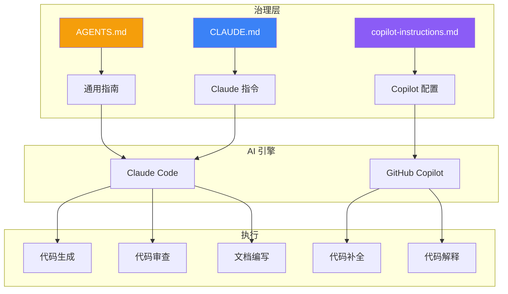
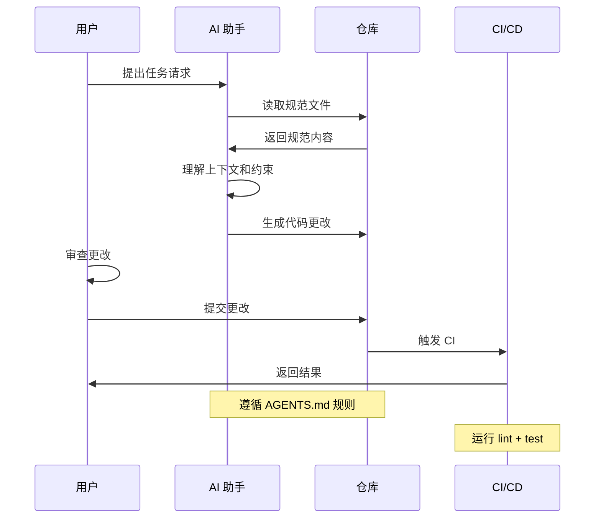

# AI 协作指南

本文档介绍如何在 Build Your Own Tools 项目中与 AI 助手高效协作。

## 治理层设计



## AGENTS.md

通用 AI 协作指南，定义项目的基本规则。

### 结构示例

```markdown
# AGENTS.md

## 工作原则

1. **先读规范** - 开始工作前阅读 OpenSpec 相关规范
2. **保持一致** - 遵循现有代码风格和模式
3. **增量变更** - 小步提交，原子更改
4. **测试先行** - 新功能必须有测试覆盖

## 代码规范

- Rust: 遵循 rustfmt 和 clippy 建议
- Go: 遵循 gofmt 和 golangci-lint 建议

## 提交规范

使用 Conventional Commits:
- feat: 新功能
- fix: 修复 bug
- docs: 文档更新
- refactor: 重构
```

### 关键内容

| 章节 | 内容 |
|------|------|
| 工作原则 | AI 应遵循的基本规则 |
| 代码规范 | 语言特定的编码风格 |
| 提交规范 | Git 提交消息格式 |
| 禁止事项 | AI 不应做的事情 |

## CLAUDE.md

Claude 特定的指令，放在项目根目录。

### 项目定位

```markdown
# CLAUDE.md

## 项目定位

本仓库是**学习仓库**，目标是：
- 教授系统编程概念
- 对比 Rust 和 Go 语言
- 展示工程化最佳实践

## 当前阶段

项目处于 **归档阶段**，优先级：
1. 稳定性 > 新功能
2. 文档完善 > 代码添加
3. 清理技术债务

## 工作方式

1. 首先运行 `openspec list` 检查活跃阶段
2. 阅读相关规范文件
3. 在阶段范围内工作
4. 运行验证命令确认更改有效
```

### 有效指令模式

```markdown
## 有效指令模式

### 开始工作
1. 检查 `openspec/changes/active/` 中的当前阶段
2. 阅读 `proposal.md`, `design.md`, `tasks.md`
3. 在阶段范围内执行任务

### 代码更改
- 只修改必要的文件
- 保持与现有代码风格一致
- 添加必要的测试

### 验证
运行以下命令验证更改：
\`\`\`bash
make lint-all
make test-all
npm run docs:build
\`\`\`
```

## GitHub Copilot

`.github/copilot-instructions.md` 配置 Copilot 行为。

### 示例配置

```markdown
# GitHub Copilot Instructions

## 项目概述

这是一个系统编程学习仓库，包含三个 CLI 工具的 Rust 和 Go 实现。

## 代码风格

### Rust
- 使用 `thiserror` 定义错误类型
- 优先使用 `Result<T, E>` 而非 panic
- 添加文档注释 (`///`)

### Go
- 使用标准库的 `error` 接口
- 遵循 Go 的惯用错误处理模式
- 添加包级注释

## 禁止事项

- 不要修改 OpenSpec 规范文件
- 不要添加新的依赖（除非必要）
- 不要修改 CI 配置文件
```

## 最佳实践

### 1. 明确上下文

```markdown
<!-- 好的指令 -->
在 dos2unix 工具中添加 UTF-16 BOM 检测功能。
参考 openspec/specs/dos2unix/spec.md 中的规范。
确保添加相应的单元测试。

<!-- 不好的指令 -->
添加 BOM 检测。
```

### 2. 指定验证

```markdown
<!-- 好的指令 -->
实现 gzip 的流式解压功能。
完成后运行 `cargo test --all` 和 `go test ./...` 验证。

<!-- 不好的指令 -->
实现解压功能。
```

### 3. 限制范围

```markdown
<!-- 好的指令 -->
只修改 src/lib.rs 中的 compress 函数，
不要修改其他文件。

<!-- 不好的指令 -->
随意修改需要的文件。
```

## 工作流程



## 调试 AI 输出

当 AI 输出不符合预期时：

1. **检查上下文** - 确保 AI 读取了正确的规范文件
2. **明确约束** - 在指令中添加更多约束
3. **分步执行** - 将大任务分解为小步骤
4. **提供示例** - 给出期望输出的示例

## 相关文档

- [OpenSpec 工作流](/specs/openspec-workflow) — 变更管理
- [CI/CD 设计](/engineering/cicd) — 自动化验证
- [文档策略](/engineering/documentation) — 文档维护
