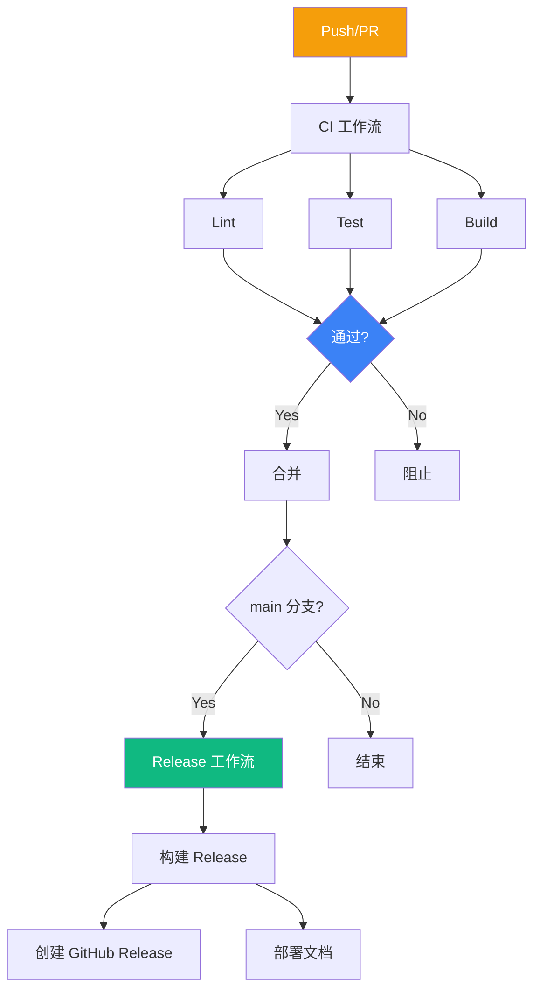
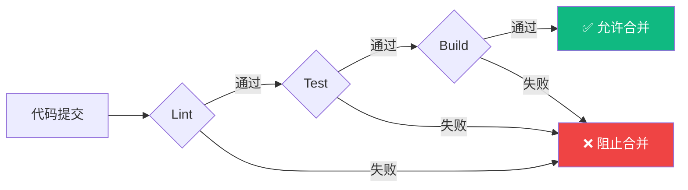

# CI/CD 设计

本文档描述 Build Your Own Tools 项目的持续集成和部署流程。

## 工作流概览



## 工作流文件

### 主要工作流

| 文件 | 触发条件 | 功能 |
|------|----------|------|
| `ci.yml` | Push/PR | 代码质量检查 |
| `release.yml` | Tag push | 发布 Release |
| `pages.yml` | main push | 部署文档站 |

### CI 工作流

```yaml
# .github/workflows/ci.yml
name: CI

on:
  push:
    branches: [main]
  pull_request:
    branches: [main]

jobs:
  lint:
    runs-on: ubuntu-latest
    steps:
      - uses: actions/checkout@v4
      
      - name: Setup Rust
        uses: dtolnay/rust-toolchain@stable
        with:
          components: clippy, rustfmt
      
      - name: Setup Go
        uses: actions/setup-go@v5
        with:
          go-version: '1.22'
      
      - name: Run Rust lint
        run: cargo clippy -- -D warnings
      
      - name: Run Rust fmt check
        run: cargo fmt -- --check
      
      - name: Run Go lint
        uses: golangci/golangci-lint-action@v4

  test:
    needs: lint
    strategy:
      matrix:
        os: [ubuntu-latest, macos-latest, windows-latest]
    runs-on: ${{ matrix.os }}
    steps:
      - uses: actions/checkout@v4
      
      - name: Setup Rust
        uses: dtolnay/rust-toolchain@stable
      
      - name: Setup Go
        uses: actions/setup-go@v5
        with:
          go-version: '1.22'
      
      - name: Run Rust tests
        run: cargo test --all
      
      - name: Run Go tests
        run: go test ./...

  build:
    needs: test
    strategy:
      matrix:
        include:
          - os: ubuntu-latest
            target: x86_64-unknown-linux-gnu
          - os: macos-latest
            target: x86_64-apple-darwin
          - os: windows-latest
            target: x86_64-pc-windows-msvc
    runs-on: ${{ matrix.os }}
    steps:
      - uses: actions/checkout@v4
      
      - name: Build Release
        run: cargo build --release
```

### Release 工作流

```yaml
# .github/workflows/release.yml
name: Release

on:
  push:
    tags:
      - 'v*'

permissions:
  contents: write

jobs:
  build-release:
    strategy:
      matrix:
        include:
          - target: x86_64-unknown-linux-gnu
            os: ubuntu-latest
            archive: tar.gz
          - target: x86_64-apple-darwin
            os: macos-latest
            archive: tar.gz
          - target: x86_64-pc-windows-msvc
            os: windows-latest
            archive: zip
    
    runs-on: ${{ matrix.os }}
    steps:
      - uses: actions/checkout@v4
      
      - name: Build
        run: cargo build --release
      
      - name: Package
        run: |
          # 创建归档
          if [ "${{ matrix.archive }}" = "zip" ]; then
            7z a release.zip target/release/*.exe
          else
            tar -czvf release.tar.gz -C target/release dos2unix gzip htop
          fi
      
      - name: Upload Release
        uses: softprops/action-gh-release@v1
        with:
          files: |
            release.${{ matrix.archive }}

  deploy-docs:
    needs: build-release
    runs-on: ubuntu-latest
    steps:
      - uses: actions/checkout@v4
      
      - name: Setup Node
        uses: actions/setup-node@v4
        with:
          node-version: '20'
          cache: 'npm'
      
      - name: Install dependencies
        run: npm ci
      
      - name: Build docs
        run: npm run docs:build
      
      - name: Deploy to GitHub Pages
        uses: peaceiris/actions-gh-pages@v3
        with:
          github_token: ${{ secrets.GITHUB_TOKEN }}
          publish_dir: ./.vitepress/dist
```

### Pages 工作流

```yaml
# .github/workflows/pages.yml
name: GitHub Pages

on:
  push:
    branches: [main]
  workflow_dispatch:

permissions:
  contents: read
  pages: write
  id-token: write

concurrency:
  group: pages
  cancel-in-progress: true

jobs:
  build:
    runs-on: ubuntu-latest
    steps:
      - uses: actions/checkout@v4
      
      - name: Setup Node
        uses: actions/setup-node@v4
        with:
          node-version: '20'
          cache: 'npm'
      
      - name: Install dependencies
        run: npm ci
      
      - name: Build
        run: npm run docs:build
      
      - name: Add .nojekyll
        run: touch .vitepress/dist/.nojekyll
      
      - name: Upload artifact
        uses: actions/upload-pages-artifact@v3
        with:
          path: .vitepress/dist

  deploy:
    needs: build
    runs-on: ubuntu-latest
    environment:
      name: github-pages
      url: ${{ steps.deployment.outputs.page_url }}
    steps:
      - name: Deploy to GitHub Pages
        id: deployment
        uses: actions/deploy-pages@v4
```

## 质量门禁



### 门禁要求

| 检查 | 要求 | 失败后果 |
|------|------|----------|
| Clippy | 无警告 | 阻止合并 |
| rustfmt | 格式一致 | 阻止合并 |
| golangci-lint | 无错误 | 阻止合并 |
| Tests | 全部通过 | 阻止合并 |
| Build | 编译成功 | 阻止合并 |

## Makefile 集成

```makefile
# Makefile

.PHONY: lint-all test-all build-all

lint-all: lint-rust lint-go
	@echo "✅ All lints passed"

lint-rust:
	cargo clippy --all-targets --all-features -- -D warnings
	cargo fmt -- --check

lint-go:
	golangci-lint run ./...

test-all: test-rust test-go
	@echo "✅ All tests passed"

test-rust:
	cargo test --all

test-go:
	go test ./...

build-all: build-rust build-go
	@echo "✅ All builds passed"

build-rust:
	cargo build --release

build-go:
	go build ./...
```

## 缓存策略

```yaml
- name: Cache Rust
  uses: Swatinem/rust-cache@v2
  with:
    key: ${{ runner.os }}-cargo-${{ hashFiles('**/Cargo.lock') }}

- name: Cache Go
  uses: actions/cache@v4
  with:
    path: |
      ~/go/pkg/mod
      ~/.cache/go-build
    key: ${{ runner.os }}-go-${{ hashFiles('**/go.sum') }}

- name: Cache npm
  uses: actions/cache@v4
  with:
    path: ~/.npm
    key: ${{ runner.os }}-npm-${{ hashFiles('package-lock.json') }}
```

## 相关文档

- [工程实践概览](/engineering/) — 工程化总览
- [OpenSpec 工作流](/specs/openspec-workflow) — 变更管理
- [文档策略](/engineering/documentation) — 文档部署
