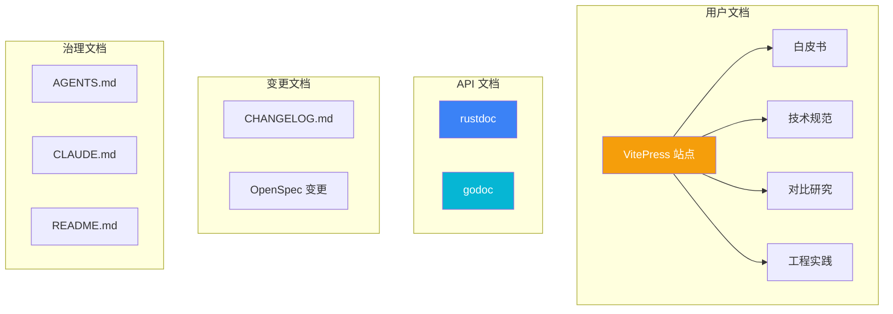
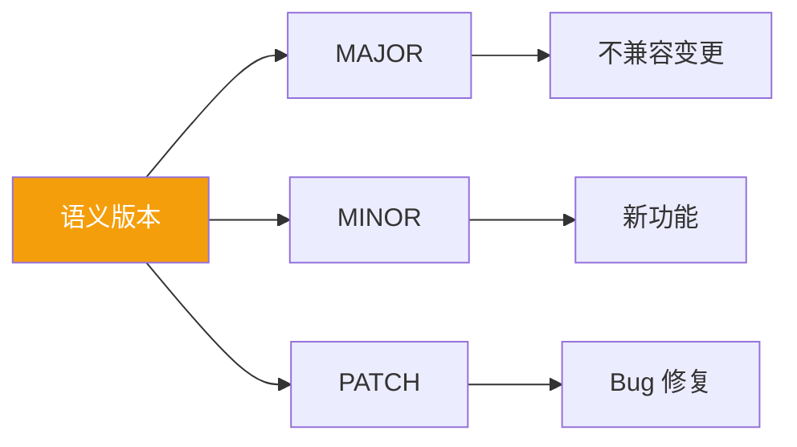
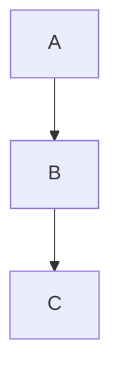

# 文档策略

本文档描述 Build Your Own Tools 项目的文档维护策略。

## 文档架构



## VitePress 站点

### 目录结构

```
docs/
├── index.md              # 首页 (白皮书风格)
├── whitepaper/           # 白皮书章节
│   ├── index.md
│   ├── overview.md
│   ├── architecture.md
│   ├── decisions.md
│   └── performance.md
├── specs/                # 技术规范
│   ├── index.md
│   ├── openspec-workflow.md
│   ├── dos2unix.md
│   ├── gzip.md
│   └── htop.md
├── comparison/           # 对比研究
│   ├── index.md
│   ├── memory.md
│   ├── concurrency.md
│   ├── errors.md
│   └── benchmarks.md
├── engineering/          # 工程实践
│   ├── index.md
│   ├── ai-collaboration.md
│   ├── cicd.md
│   └── documentation.md
└── en/                   # 英文版 (symlink)
    ├── whitepaper -> ../whitepaper
    ├── specs -> ../specs
    └── ...
```

### 配置要点

```typescript
// .vitepress/config.mts
export default defineConfig({
  // Mermaid 图表支持
  markdown: {
    config: (md) => {
      // 自定义 markdown 配置
    }
  },
  
  // 搜索功能
  themeConfig: {
    search: { provider: 'local' }
  },
  
  // LLM 友好输出
  vite: {
    plugins: [llmstxt()]
  }
})
```

## API 文档

### Rust (rustdoc)

```bash
# 生成文档
cargo doc --open --no-deps

# CI 中生成
cargo doc --no-deps --document-private-items
```

文档注释示例：

```rust
/// 换行符转换器
/// 
/// # Examples
/// 
/// ```
/// use dos2unix::Dos2Unix;
/// 
/// let converter = Dos2Unix::new();
/// let result = converter.convert("hello\r\nworld")?;
/// assert_eq!(result, "hello\nworld");
/// ```
pub struct Dos2Unix {
    // ...
}

impl Dos2Unix {
    /// 创建新的转换器
    /// 
    /// # Arguments
    /// 
    /// * `keep_bom` - 是否保留 UTF-8 BOM
    pub fn new() -> Self {
        Self { keep_bom: false }
    }
}
```

### Go (godoc)

```bash
# 本地查看
go doc -all ./...

# 生成 HTML
godoc -http=:6060
```

文档注释示例：

```go
// Package dos2unix provides line ending conversion functionality.
// 
// Example:
//
//	converter := dos2unix.New()
//	result, err := converter.Convert("hello\r\nworld")
package dos2unix

// Converter handles line ending conversions.
type Converter struct {
	keepBOM bool
}

// New creates a new Converter instance.
//
// Example:
//
//	c := dos2unix.New()
func New() *Converter {
	return &Converter{keepBOM: false}
}

// Convert transforms line endings in the input data.
//
// Returns an error if the input contains invalid UTF-8 sequences.
func (c *Converter) Convert(input string) (string, error) {
	// ...
}
```

## 变更日志

### 格式 (Keep a Changelog)

```markdown
# Changelog

All notable changes to this project will be documented in this file.

The format is based on [Keep a Changelog](https://keepachangelog.com/en/1.0.0/),
and this project adheres to [Semantic Versioning](https://semver.org/spec/v2.0.0.html).

## [Unreleased]

### Added
- New feature description

### Changed
- Change description

### Fixed
- Bug fix description

## [0.3.0] - 2025-05-14

### Added
- Add htop Windows Go implementation
- Add Mermaid diagram support to documentation

### Changed
- Upgrade VitePress to 1.5.0

### Fixed
- Fix broken symlink in en/htop/unix/go

## [0.2.0] - 2025-03-01

### Added
- Add gzip Rust implementation
- Add gzip Go implementation

[Unreleased]: https://github.com/LessUp/build-your-own-tools/compare/v0.3.0...HEAD
[0.3.0]: https://github.com/LessUp/build-your-own-tools/compare/v0.2.0...v0.3.0
[0.2.0]: https://github.com/LessUp/build-your-own-tools/compare/v0.1.0...v0.2.0
```

### 自动化生成

```yaml
# .github/workflows/release.yml
- name: Generate Changelog
  uses: orhun/git-cliff-action@v2
  with:
    config: cliff.toml
    args: --verbose
```

## 版本化策略



### 版本分支

| 分支 | 用途 |
|------|------|
| `main` | 稳定发布 |
| `develop` | 开发中的功能 |
| `feature/*` | 功能分支 |
| `hotfix/*` | 紧急修复 |

## 文档同步

### Mermaid 图表

使用 Mermaid 在 Markdown 中嵌入图表：

````markdown

````

### 代码块

使用语言标识符获得语法高亮：

````markdown
```rust
fn main() {
    println!("Hello");
}
```

```go
func main() {
    fmt.Println("Hello")
}
```
````

## 发布检查清单

```markdown
## 发布前检查

- [ ] 运行所有测试通过
- [ ] 更新 CHANGELOG.md
- [ ] 更新版本号 (Cargo.toml, package.json)
- [ ] 生成 API 文档
- [ ] 构建文档站点
- [ ] 创建 Git tag
- [ ] 推送 tag 触发 Release
```

## 相关文档

- [工程实践概览](/engineering/) — 工程化总览
- [CI/CD 设计](/engineering/cicd) — 自动化流程
- [系统架构](/whitepaper/architecture) — 架构设计
