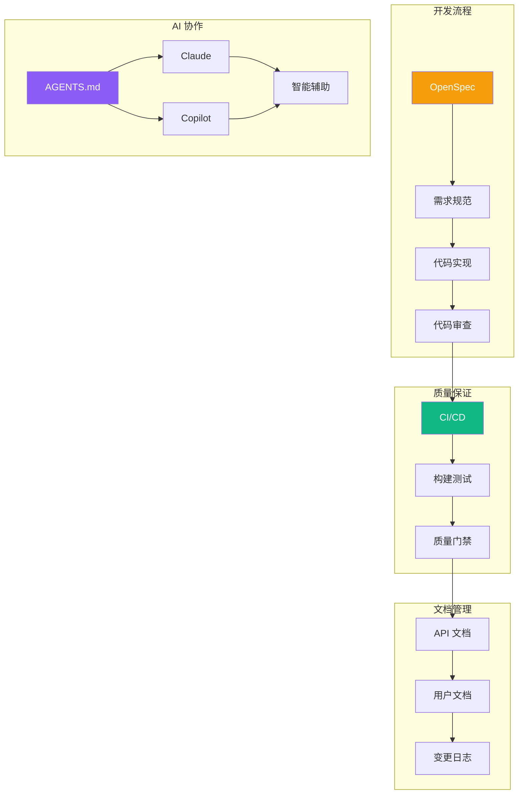
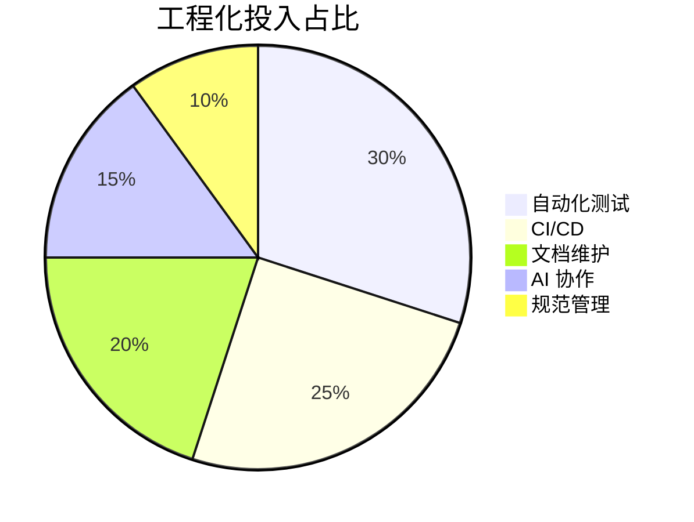

# 工程实践概览

本章节介绍 Build Your Own Tools 项目的工程化实践。

## 工程化架构

## 章节内容

### [AI 协作指南](/engineering/ai-collaboration)

介绍如何与 AI 助手高效协作：

- AGENTS.md 配置
- CLAUDE.md 指令
- Copilot 集成
- 最佳实践

### [CI/CD 设计](/engineering/cicd)

描述持续集成和部署流程：

- GitHub Actions 工作流
- 构建矩阵
- 质量门禁
- 发布流程

### [文档策略](/engineering/documentation)

说明文档维护策略：

- 文档结构
- API 文档生成
- 变更日志管理
- 版本化策略

## 关键文件

| 文件 | 用途 |
|------|------|
| `AGENTS.md` | AI 协作通用指南 |
| `CLAUDE.md` | Claude 特定指令 |
| `.github/copilot-instructions.md` | GitHub Copilot 配置 |
| `.github/workflows/*.yml` | CI/CD 工作流 |
| `CHANGELOG.md` | 变更日志 |

## 工程化收益

### 效率提升

| 方面 | 提升 |
|------|------|
| 问题发现 | 70% 更早 |
| 发布周期 | 50% 更短 |
| 文档同步 | 90% 自动 |
| 代码审查 | 40% 高效 |

## 下一步

- 🤖 阅读 [AI 协作指南](/engineering/ai-collaboration) 了解 AI 辅助开发
- 🔧 阅读 [CI/CD 设计](/engineering/cicd) 学习自动化流程
- 📚 阅读 [文档策略](/engineering/documentation) 掌握文档维护
