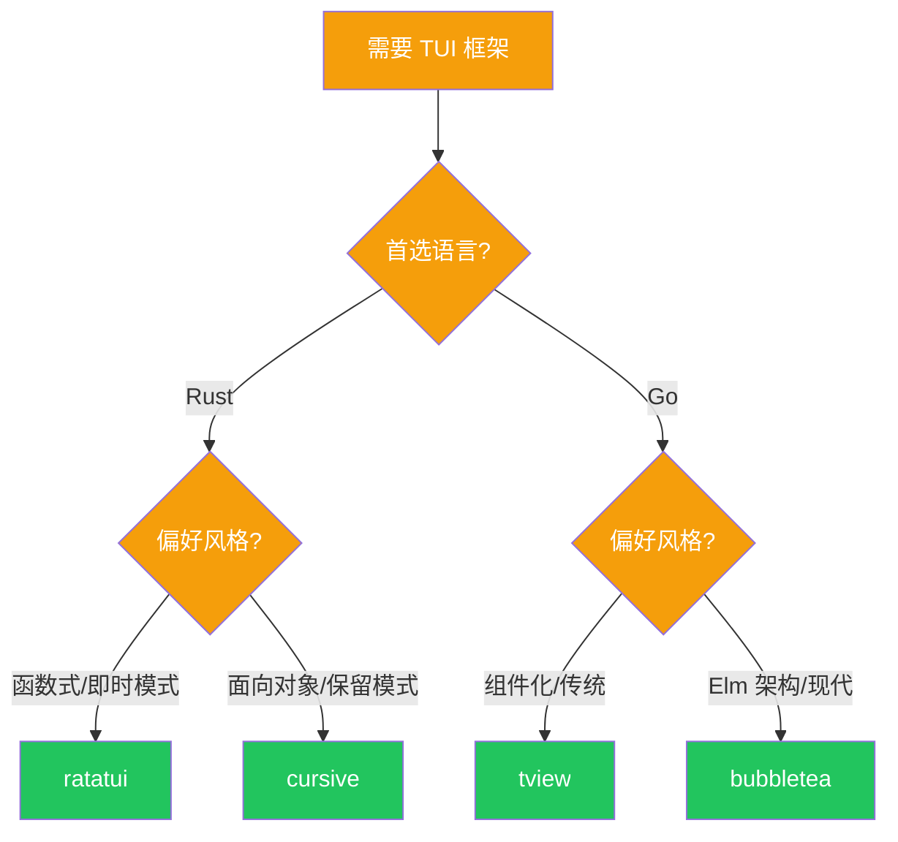

# 相关项目探究

本页面分析与本项目相关的开源项目和实现，帮助你拓展视野。

## 官方工具

### dos2unix

| 项目 | 语言 | 平台 | 特点 |
|------|------|------|------|
| [dos2unix/unix2dos](https://waterlan.home.xs4all.nl/dos2unix.html) | C | 跨平台 | 官方实现，功能完整 |
| [tofrodos](http://www.thrysoee.dk/tofrodos/) | C | Unix | 轻量级替代 |

**学习要点**：
- 官方实现的命令行参数设计
- 文件权限和时间的保留策略
- 符号链接处理方式

### gzip

| 项目 | 语言 | 平台 | 特点 |
|------|------|------|------|
| [GNU gzip](https://www.gnu.org/software/gzip/) | C | 跨平台 | 官方实现，压缩比高 |
| [pigz](https://zlib.net/pigz/) | C | Unix | 并行压缩，多核优化 |
| [zlib](https://zlib.net/) | C | 跨平台 | 底层压缩库 |

**学习要点**：
- 多线程压缩策略（pigz）
- 流式处理的缓冲区管理
- 压缩级别与速度的权衡

### htop

| 项目 | 语言 | 平台 | 特点 |
|------|------|------|------|
| [htop](https://github.com/htop-dev/htop) | C | Unix/Linux | 原版 htop |
| [bottom](https://github.com/ClementTsang/bottom) | Rust | 跨平台 | 现代化替代品 |
| [btop](https://github.com/aristocratos/btop) | C++ | 跨平台 | GPU 监控支持 |

**学习要点**：
- 原版 htop 的架构设计
- bottom 的 Rust 实现技巧
- 跨平台系统信息获取的抽象

## 语言生态

### Rust TUI 生态

| 项目 | 描述 | Stars |
|------|------|-------|
| [ratatui](https://github.com/ratatui-org/ratatui) | 现代 TUI 框架 |  |
| [cursive](https://github.com/gyscos/cursive) | 另一个 TUI 框架 |  |
| [tui-rs](https://github.com/fdehau/tui-rs) | ratatui 的前身（已归档） | - |

### Go TUI 生态

| 项目 | 描述 | Stars |
|------|------|-------|
| [tview](https://github.com/rivo/tview) | Rich TUI 库 |  |
| [bubbletea](https://github.com/charmbracelet/bubbletea) | Elm 风格 TUI 框架 |  |
| [termui](https://github.com/gizak/termui) | Dashboard 组件库 |  |

### 系统信息库

| 项目 | 语言 | 跨平台 | 特点 |
|------|------|--------|------|
| [sysinfo](https://github.com/GuillaumeGomez/sysinfo) | Rust | ✅ | 纯 Rust 实现 |
| [gopsutil](https://github.com/shirou/gopsutil) | Go | ✅ | 跨平台系统信息 |
| [heim](https://github.com/heim-rs/heim) | Rust | ✅ | 异步设计 |

## 相关学习资源

### 项目

1. **[Build Your Own X](https://github.com/danistefanovic/build-your-own-x)** — 学习项目的灵感来源
2. **[The Art of Command Line](https://github.com/jlevy/the-art-of-command-line)** — 命令行最佳实践
3. **[Command Line Interface Guidelines](https://clig.dev/)** — CLI 设计指南

### 教程

1. **[Write a CLI in Rust](https://rust-cli.github.io/book/)** — Rust CLI 开发指南
2. **[Go CLI Tutorial](https://levelup.gitconnected.com/tutorial-create-a-cli-tool-in-go-6e8d02c4b1eb)** — Go CLI 开发入门

## 对比分析

### TUI 框架选择指南

---

> **贡献**：如果你知道其他值得分析的相关项目，欢迎提交 PR 或 Issue。