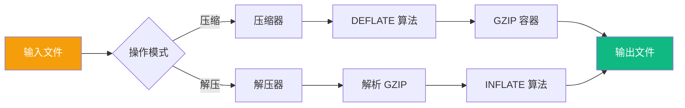
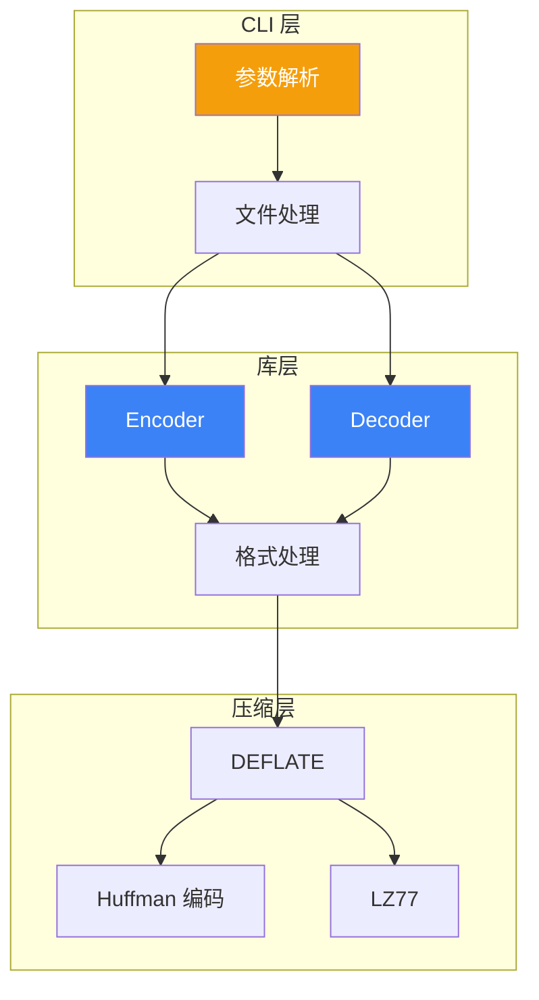
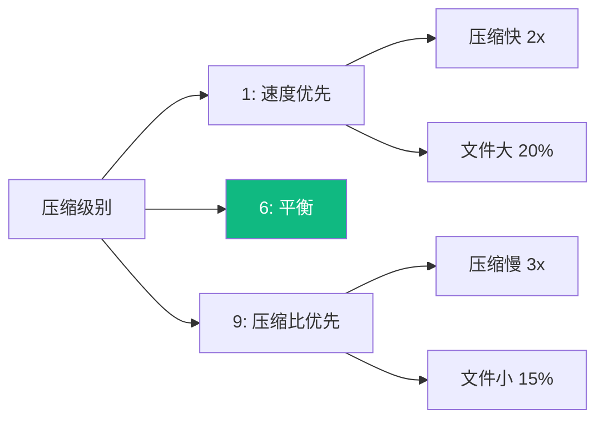

# gzip 技术规范

本文档定义 gzip 压缩工具的功能需求和技术规范。

## 功能概述

gzip 是一个文件压缩工具，支持 gzip 格式的压缩和解压缩。



## 需求规格

### Feature: 文件压缩

```gherkin
Feature: 文件压缩
  As a 用户
  I want to 压缩文件以节省存储空间
  So that 我可以减少磁盘占用和网络传输时间

  Background:
    Given 一个普通文件

  Scenario: 基本压缩
    Given 一个名为 data.txt 的文件
    When 执行 gzip data.txt
    Then 应生成 data.txt.gz 文件
    And 原文件应被删除
    And 压缩文件应小于原文件

  Scenario: 保留原文件
    Given 一个名为 data.txt 的文件
    When 执行 gzip -k data.txt
    Then 应生成 data.txt.gz 文件
    And 原文件应保留

  Scenario: 指定压缩级别
    Given 一个大型文件
    When 执行 gzip -9 large.txt
    Then 应使用最大压缩
    And 压缩比应高于默认级别

  Scenario: 压缩到标准输出
    Given 一个文件
    When 执行 gzip -c data.txt > output.gz
    Then 应输出到标准输出
    And 不应创建 .gz 文件
```

### Feature: 文件解压

```gherkin
Feature: 文件解压
  As a 用户
  I want to 解压 gzip 文件
  So that 我可以访问压缩的内容

  Scenario: 基本解压
    Given 一个名为 data.txt.gz 的 gzip 文件
    When 执行 gunzip data.txt.gz
    Then 应恢复 data.txt 文件
    And 内容应与原文件一致

  Scenario: 解压到标准输出
    Given 一个 gzip 文件
    When 执行 gunzip -c data.txt.gz
    Then 应输出解压内容到标准输出
    And 原压缩文件应保留

  Scenario: 解压损坏文件
    Given 一个损坏的 gzip 文件
    When 执行 gunzip corrupt.gz
    Then 应显示错误消息
    And 退出码应为非零
```

### Feature: 流式处理

```gherkin
Feature: 流式处理
  As a 用户
  I want to 通过管道压缩/解压数据
  So that 我可以集成到数据流水线中

  Scenario: 管道压缩
    Given 标准输入数据
    When 执行 cat data.txt | gzip > data.gz
    Then 应输出压缩数据到标准输出

  Scenario: 管道解压
    Given 压缩数据流
    When 执行 cat data.gz | gunzip
    Then 应输出解压数据到标准输出

  Scenario: 链式处理
    Given 文本数据
    When 执行 cat log.txt | gzip | ssh server "gunzip > log.txt"
    Then 应正确传输并解压
```

## 技术设计

### 架构图



### GZIP 文件格式

```
+---+---+---+---+---+---+---+---+---+---+
|ID1|ID2|CM |FLG|     MTIME     |XFL|OS |
+---+---+---+---+---+---+---+---+---+---+
|        ...compressed blocks...        |
+---+---+---+---+---+---+---+---+
|       CRC32       |     ISIZE     |
+---+---+---+---+---+---+---+---+

ID1, ID2: 魔数 (0x1f, 0x8b)
CM: 压缩方法 (8 = DEFLATE)
FLG: 标志位
MTIME: 修改时间
XFL: 额外标志
OS: 操作系统
```

### 库 API 设计

#### Rust

```rust
/// Gzip 编码器
pub struct Encoder<W: Write> {
    inner: W,
    level: CompressionLevel,
}

impl<W: Write> Encoder<W> {
    /// 创建新编码器
    pub fn new(writer: W) -> Result<Self, Error>;
    
    /// 设置压缩级别
    pub fn with_level(writer: W, level: u8) -> Result<Self, Error>;
    
    /// 写入数据
    pub fn write(&mut self, data: &[u8]) -> Result<(), Error>;
    
    /// 完成压缩
    pub fn finish(self) -> Result<W, Error>;
}

/// Gzip 解码器
pub struct Decoder<R: Read> {
    inner: R,
}

impl<R: Read> Decoder<R> {
    /// 创建新解码器
    pub fn new(reader: R) -> Result<Self, Error>;
    
    /// 读取解压数据
    pub fn read(&mut self, buf: &mut [u8]) -> Result<usize, Error>;
}
```

#### Go

```go
// Encoder 压缩数据
type Encoder struct {
    w     io.Writer
    level int
}

// NewEncoder 创建编码器
func NewEncoder(w io.Writer) (*Encoder, error)

// Write 写入待压缩数据
func (e *Encoder) Write(data []byte) (int, error)

// Close 完成压缩
func (e *Encoder) Close() error

// Decoder 解压数据
type Decoder struct {
    r io.Reader
}

// NewDecoder 创建解码器
func NewDecoder(r io.Reader) (*Decoder, error)

// Read 读取解压数据
func (d *Decoder) Read(buf []byte) (int, error)
```

## 压缩级别

| 级别 | 压缩比 | 速度 | 用途 |
|------|--------|------|------|
| 1 | 低 | 最快 | 实时压缩 |
| 6 | 中 | 中等 | 默认，平衡 |
| 9 | 高 | 最慢 | 归档存储 |



## 性能指标

| 指标 | Rust 目标 | Go 目标 | 系统gzip |
|------|-----------|---------|----------|
| 压缩速度 | 100+ MB/s | 80+ MB/s | 200+ MB/s |
| 解压速度 | 300+ MB/s | 250+ MB/s | 450+ MB/s |
| 内存峰值 | < 10 MB | < 15 MB | < 5 MB |
| 压缩比 | ~65% | ~65% | ~65% |

## 错误处理

### Rust

```rust
#[derive(Debug, thiserror::Error)]
pub enum GzipError {
    #[error("IO error: {0}")]
    Io(#[from] std::io::Error),
    
    #[error("Invalid gzip header")]
    InvalidHeader,
    
    #[error("CRC mismatch: expected {expected}, got {actual}")]
    CrcMismatch { expected: u32, actual: u32 },
    
    #[error("Decompression failed: {0}")]
    Decompress(String),
}
```

### Go

```go
// Error 类型
var (
    ErrInvalidHeader = errors.New("invalid gzip header")
    ErrCrcMismatch   = errors.New("CRC checksum mismatch")
    ErrCorruptData   = errors.New("corrupt compressed data")
)
```

## 测试用例

### 边界测试

```rust
#[test]
fn test_empty_file() {
    let output = compress(b"");
    assert!(is_valid_gzip(&output));
    assert_eq!(decompress(&output), b"");
}

#[test]
fn test_single_byte() {
    let input = b"a";
    let output = compress(input);
    assert_eq!(decompress(&output), input);
}

#[test]
fn test_large_file() {
    let input = vec![b'x'; 100_000_000]; // 100MB
    let output = compress(&input);
    assert!(output.len() < input.len());
    assert_eq!(decompress(&output), input);
}
```

## 相关文档

- [技术规范概览](/specs/) — 规范总览
- [系统架构](/whitepaper/architecture) — 架构设计
- [性能分析](/whitepaper/performance) — 性能详情
