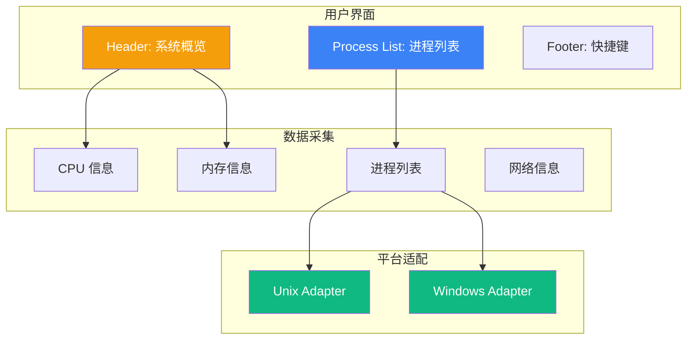
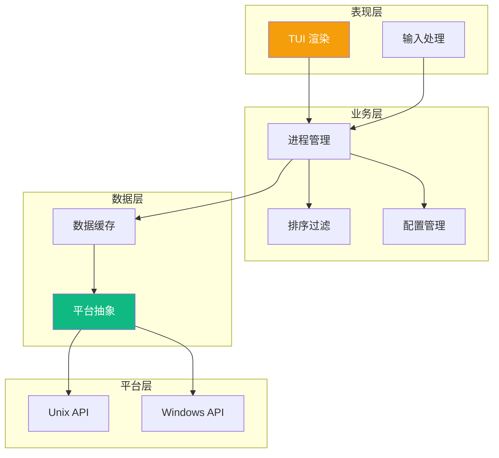
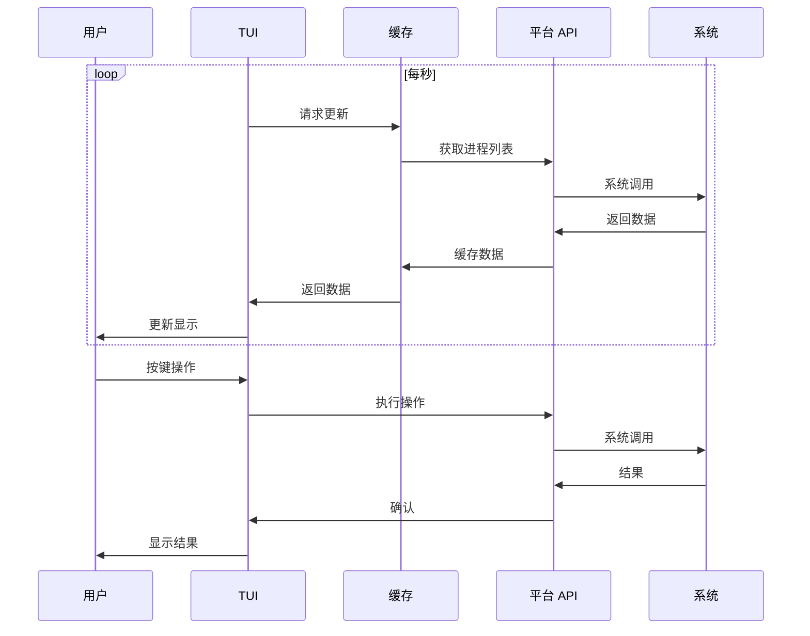

# htop 技术规范

本文档定义 htop 进程监控工具的功能需求和技术规范。

## 功能概述

htop 是一个交互式进程查看器，提供比 top 更友好的用户界面和更多功能。



## 需求规格

### Feature: 系统概览

```gherkin
Feature: 系统概览
  As a 系统管理员
  I want to 快速查看系统资源使用情况
  So that 我可以了解系统整体状态

  Scenario: 显示 CPU 使用率
    Given 系统正在运行
    When 启动 htop
    Then 应显示每个 CPU 核心的使用率
    And 应显示 CPU 使用历史图表

  Scenario: 显示内存信息
    Given 系统正在运行
    When 启动 htop
    Then 应显示总内存
    And 应显示已用内存
    And 应显示缓存内存
    And 应使用进度条可视化

  Scenario: 显示交换空间
    Given 系统配置了交换空间
    When 启动 htop
    Then 应显示交换空间使用情况
```

### Feature: 进程列表

```gherkin
Feature: 进程列表
  As a 用户
  I want to 查看和管理运行中的进程
  So that 我可以监控系统活动和管理资源

  Scenario: 显示进程列表
    Given 系统有运行中的进程
    When 启动 htop
    Then 应显示进程列表
    And 应包含 PID、用户、CPU%、内存%、命令等列

  Scenario: 进程排序
    Given 进程列表已显示
    When 按 F6 选择排序
    Then 应显示排序选项
    And 选择选项后应按该列排序

  Scenario: 进程过滤
    Given 进程列表已显示
    When 按 F3 输入过滤条件
    Then 应只显示匹配的进程

  Scenario: 进程搜索
    Given 进程列表已显示
    When 按 F3 输入搜索词
    Then 应高亮匹配的进程
```

### Feature: 进程管理

```gherkin
Feature: 进程管理
  As a 系统管理员
  I want to 对进程执行操作
  So that 我可以管理系统资源

  Scenario: 终止进程
    Given 选中的进程
    When 按 F9 选择信号
    And 选择 SIGTERM
    Then 应发送信号到进程
    And 进程列表应更新

  Scenario: 改变优先级
    Given 选中的进程
    When 按 F7 或 F8
    Then 应增加或减少 nice 值

  Scenario: 进程树视图
    Given 进程列表已显示
    When 按 F5 切换树视图
    Then 应显示进程父子关系
```

### Feature: 跨平台支持

```gherkin
Feature: 跨平台支持
  As a 用户
  I want to 在不同操作系统上使用相同的界面
  So that 我可以保持一致的工作流

  Scenario: Unix 平台运行
    Given Unix 系统 (Linux/macOS)
    When 启动 htop
    Then 应正常显示进程信息
    And 应支持所有标准功能

  Scenario: Windows 平台运行
    Given Windows 系统
    When 启动 htop
    Then 应正常显示进程信息
    And 应支持基本功能

  Scenario: 平台特定功能
    Given 特定平台
    When 查看功能列表
    Then 平台特定功能应标记或隐藏
```

## 技术设计

### 架构分层



### 平台抽象接口

#### Rust

```rust
/// 进程信息接口
pub trait ProcessInfo {
    /// 进程 ID
    fn pid(&self) -> u32;
    
    /// 父进程 ID
    fn ppid(&self) -> u32;
    
    /// 进程名
    fn name(&self) -> &str;
    
    /// 命令行
    fn command(&self) -> &str;
    
    /// 用户名
    fn user(&self) -> &str;
    
    /// CPU 使用率 (0.0 - 100.0)
    fn cpu_usage(&self) -> f32;
    
    /// 内存使用量 (bytes)
    fn memory(&self) -> u64;
    
    /// 进程状态
    fn state(&self) -> ProcessState;
}

/// 系统信息接口
pub trait SystemInfo {
    /// 获取进程列表
    fn processes(&self) -> Vec<Box<dyn ProcessInfo>>;
    
    /// 获取 CPU 信息
    fn cpu_info(&self) -> CpuInfo;
    
    /// 获取内存信息
    fn memory_info(&self) -> MemoryInfo;
    
    /// 发送信号
    fn send_signal(&self, pid: u32, signal: Signal) -> Result<(), Error>;
}

#[cfg(unix)]
mod unix;
#[cfg(windows)]
mod windows;
```

### 平台差异

| 功能 | Unix (Linux/macOS) | Windows |
|------|-------------------|---------|
| 进程列表 | `/proc` 文件系统 | CreateToolhelp32Snapshot |
| CPU 使用率 | `/proc/stat` | GetSystemTimes |
| 内存信息 | `/proc/meminfo` | GlobalMemoryStatusEx |
| 进程内存 | `/proc/[pid]/statm` | GetProcessMemoryInfo |
| 终端大小 | ioctl TIOCGWINSZ | GetConsoleScreenBufferInfo |
| 信号发送 | kill syscall | TerminateProcess |

### 数据流



### TUI 框架

#### Rust (ratatui)

```rust
use ratatui::{
    layout::{Constraint, Direction, Layout},
    style::{Color, Style},
    widgets::{Block, Borders, Gauge, List, ListItem},
    Frame,
};

fn draw(frame: &mut Frame, app: &App) {
    let chunks = Layout::default()
        .direction(Direction::Vertical)
        .constraints([
            Constraint::Length(4),  // Header
            Constraint::Min(10),    // Process list
            Constraint::Length(2),  // Footer
        ])
        .split(frame.size());
    
    // Draw header
    draw_header(frame, chunks[0], app);
    
    // Draw process list
    draw_processes(frame, chunks[1], app);
    
    // Draw footer
    draw_footer(frame, chunks[2]);
}
```

#### Go (tview)

```go
import "github.com/rivo/tview"

func main() {
    app := tview.NewApplication()
    
    header := tview.NewTextView()
    processList := tview.NewList()
    footer := tview.NewTextView()
    
    flex := tview.NewFlex().
        SetDirection(tview.FlexRow).
        AddItem(header, 4, 0, false).
        AddItem(processList, 0, 1, true).
        AddItem(footer, 2, 0, false)
    
    app.SetRoot(flex, true).Run()
}
```

## 性能指标

| 指标 | 目标 | 说明 |
|------|------|------|
| 启动时间 | < 50ms | 用户可接受范围 |
| 刷新延迟 | < 100ms | 交互响应 |
| 内存占用 | < 20MB | 长时间运行 |
| CPU 占用 | < 1% | 空闲时 |

## 配置文件

```toml
# ~/.config/htop/config.toml

[display]
# 显示列
columns = ["PID", "USER", "CPU%", "MEM%", "COMMAND"]

# 排序方式
sort_by = "CPU%"
sort_order = "descending"

# 更新间隔 (ms)
update_interval = 1000

[colors]
# 颜色主题
cpu_normal = "green"
cpu_high = "red"
memory = "blue"
swap = "yellow"
```

## 快捷键

| 按键 | 功能 |
|------|------|
| F1 | 帮助 |
| F3 | 搜索 |
| F4 | 过滤 |
| F5 | 树视图 |
| F6 | 排序 |
| F7 | 降低优先级 |
| F8 | 提高优先级 |
| F9 | 发送信号 |
| F10 | 退出 |
| q | 退出 |
| h | 帮助 |

## 相关文档

- [技术规范概览](/specs/) — 规范总览
- [系统架构](/whitepaper/architecture) — 跨平台设计
- [设计决策](/whitepaper/decisions) — ADR-005 平台抽象层
