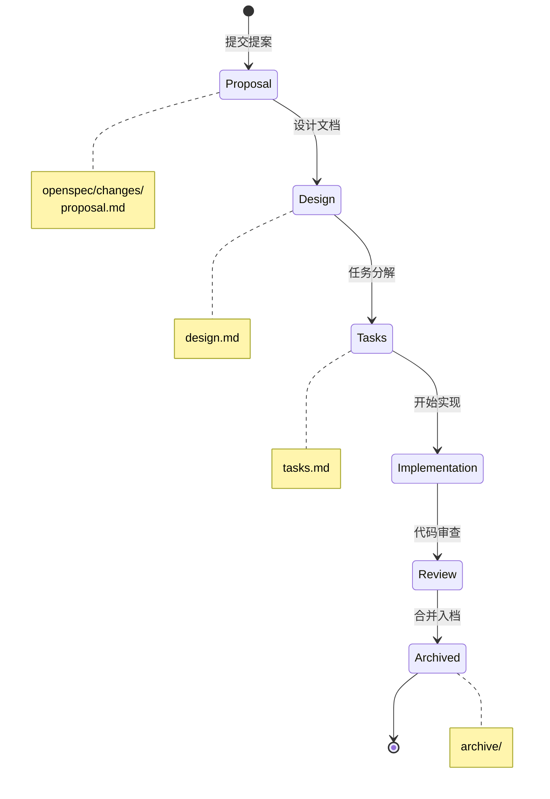

# 技术规范概览

本章节展示 Build Your Own Tools 项目的 **OpenSpec 规范**，采用 Gherkin 风格的需求描述。

## OpenSpec 工作流



## 规范结构

```
openspec/
├── specs/           # 功能规格
│   ├── project/     # 项目级规范
│   │   └── spec.md  # 整体规范
│   ├── dos2unix/    # 工具规范
│   │   └── spec.md
│   ├── gzip/
│   │   └── spec.md
│   └── htop/
│       └── spec.md
├── changes/         # 变更管理
│   ├── archive/     # 已完成变更
│   └── active/      # 当前变更
└── schemas/         # 规范模板
```

## Gherkin 风格

采用行为驱动开发 (BDD) 风格的需求描述：

```gherkin
Feature: 换行符转换
  As a 跨平台开发者
  I want to 转换文件的换行符格式
  So that 我可以在不同操作系统间共享代码

  Background:
    Given 一个文本文件

  Scenario: DOS 到 Unix 转换
    Given 文件包含 CRLF 换行符 (0x0D 0x0A)
    When 执行 dos2unix input.txt output.txt
    Then 输出文件应仅包含 LF 换行符 (0x0A)
    And 文件其他内容保持不变

  Scenario: Unix 到 DOS 转换
    Given 文件包含 LF 换行符 (0x0A)
    When 执行 unix2dos input.txt output.txt
    Then 输出文件应包含 CRLF 换行符 (0x0D 0x0A)
```

## 工具规范

| 工具 | 规范 | 复杂度 | 状态 |
|------|------|--------|------|
| [dos2unix](/specs/dos2unix) | 换行符转换规范 | ⭐ | 完成 |
| [gzip](/specs/gzip) | 压缩工具规范 | ⭐⭐ | 完成 |
| [htop](/specs/htop) | 进程监控规范 | ⭐⭐⭐ | 进行中 |

## 规范优势

### 1. 可测试性

每个 Scenario 都可以直接转化为测试用例：

```rust
#[test]
fn test_dos_to_unix() {
    // Given
    let input = "line1\r\nline2\r\n";
    // When
    let output = dos2unix::convert(input);
    // Then
    assert_eq!(output, "line1\nline2\n");
}
```

### 2. 需求追溯


### 3. AI 友好

Gherkin 格式易于 AI 理解和生成代码：

- 结构化描述
- 明确的输入输出
- 无歧义的语言

## 下一步

- 📋 查看 [OpenSpec 工作流](/specs/openspec-workflow) 了解变更管理
- 🔧 阅读 [dos2unix 规范](/specs/dos2unix) 了解换行符处理
- 📦 阅读 [gzip 规范](/specs/gzip) 了解压缩工具设计
- 📊 阅读 [htop 规范](/specs/htop) 了解进程监控实现
