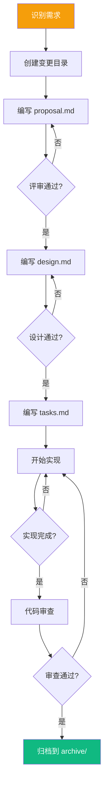
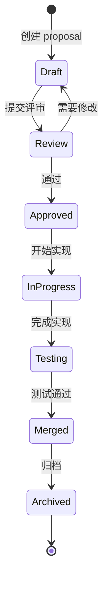
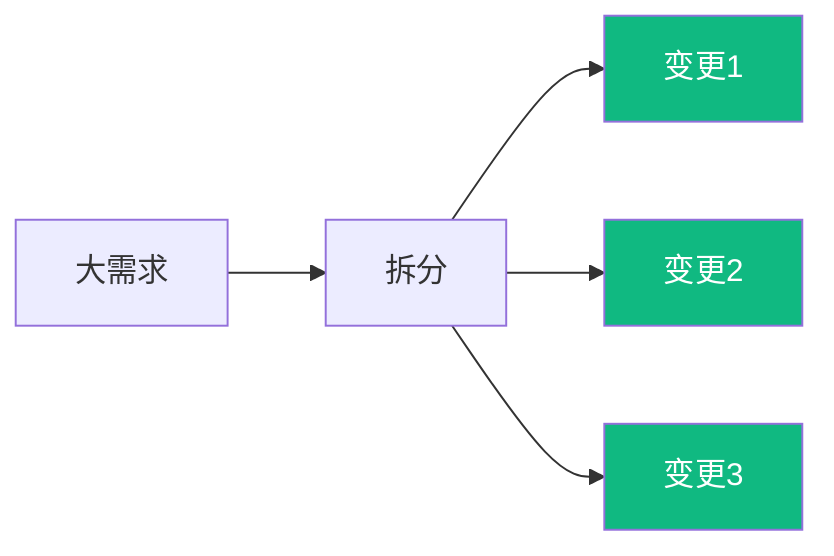

# OpenSpec 工作流

本文档描述 OpenSpec 规范框架的工作流程和最佳实践。

## 工作流概览



## 目录结构

```
openspec/changes/
├── archive/                    # 已完成变更
│   ├── phase-1-init/
│   │   ├── proposal.md
│   │   ├── design.md
│   │   └── tasks.md
│   └── phase-2-features/
│       └── ...
└── active/                     # 当前活跃变更
    └── phase-3-optimization/
        ├── proposal.md
        ├── design.md
        └── tasks.md
```

## 文档模板

### proposal.md

```markdown
# 提案标题

## 背景
描述为什么需要这个变更。

## 目标
- 目标 1
- 目标 2

## 范围
描述变更的边界。

## 非目标
明确不在范围内的事项。

## 影响评估
- 性能影响: ?
- 兼容性影响: ?
- 文档影响: ?
```

### design.md

```markdown
# 设计文档

## 概述
设计方案的总体描述。

## 架构变更
描述对现有架构的影响。

## API 设计
```rust
// 新 API 示例
pub fn new_function() -> Result<(), Error>;
```

## 数据结构
```rust
struct NewStruct {
    field: String,
}
```

## 实现计划
1. 步骤一
2. 步骤二
3. 步骤三
```

### tasks.md

```markdown
# 任务列表

## 必须完成
- [ ] 任务一
- [ ] 任务二

## 可选优化
- [ ] 优化一

## 验收标准
- [ ] 所有测试通过
- [ ] 文档已更新
```

## 变更生命周期



## 最佳实践

### 1. 单一职责

每个变更应该只解决一个问题：



### 2. 原子提交

每次提交应该是一个完整的逻辑单元：

```bash
# 好的提交
git commit -m "feat(dos2unix): add UTF-16 BOM detection"

# 不好的提交
git commit -m "fix some bugs and add features"
```

### 3. 可测试需求

每个需求都应该可验证：

```gherkin
# 好: 可测试
Then 输出文件大小应小于输入文件大小的 50%

# 不好: 不可测试
Then 性能应该提升
```

## 工具支持

### OpenSpec CLI

```bash
# 创建新变更
openspec new phase-4-new-feature

# 检查规范完整性
openspec validate

# 归档完成的变更
openspec archive phase-4-new-feature
```

### Git Hooks

```bash
# pre-commit hook
#!/bin/bash
openspec validate || exit 1
```

## 相关文档

- [技术规范概览](/specs/) — 规范总览
- [CI/CD 设计](/engineering/cicd) — 工作流集成
- [文档策略](/engineering/documentation) — 文档维护
