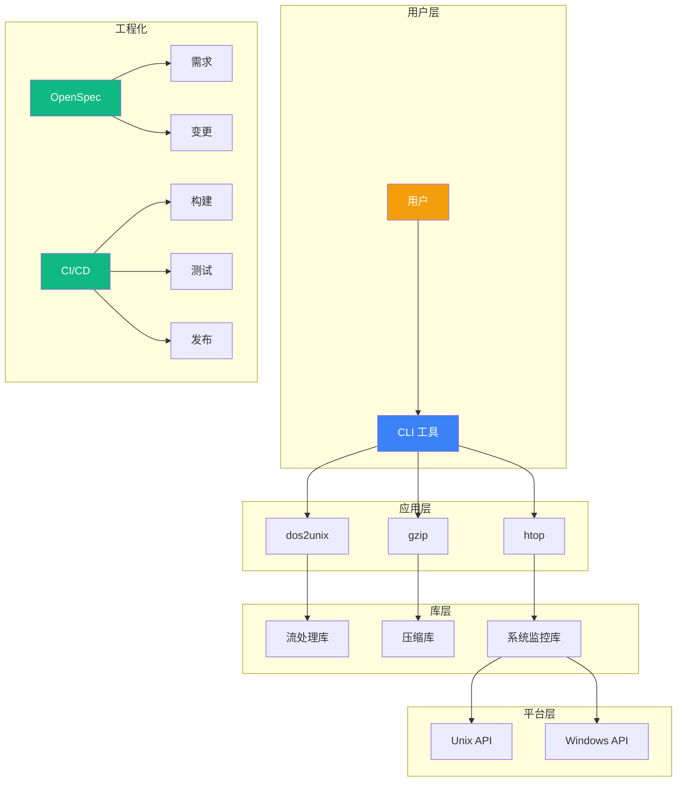
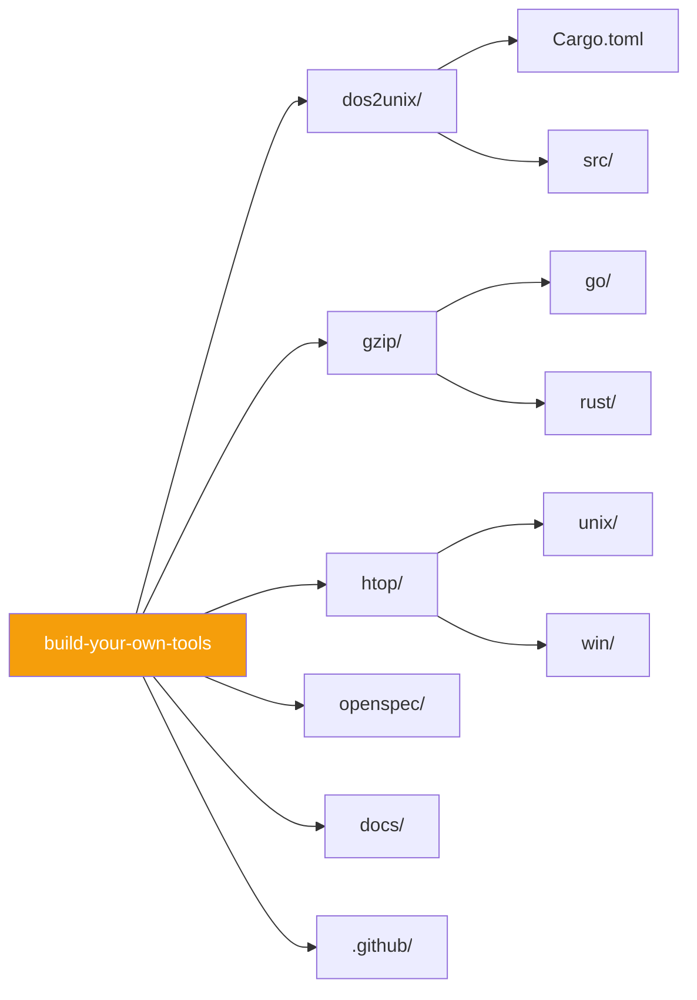
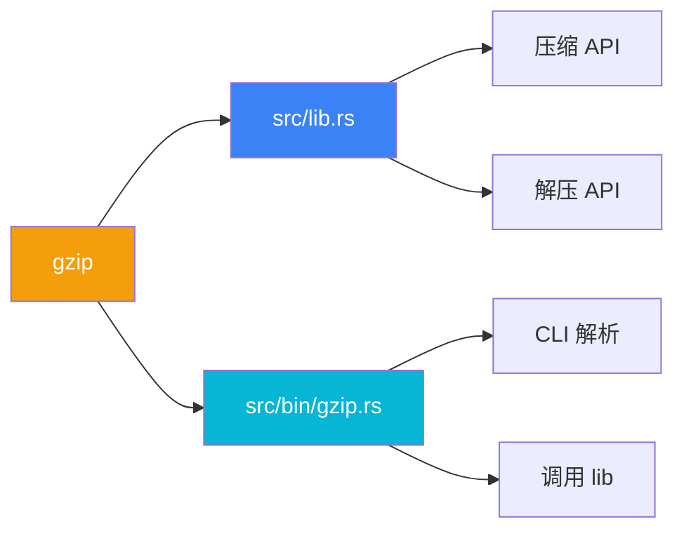
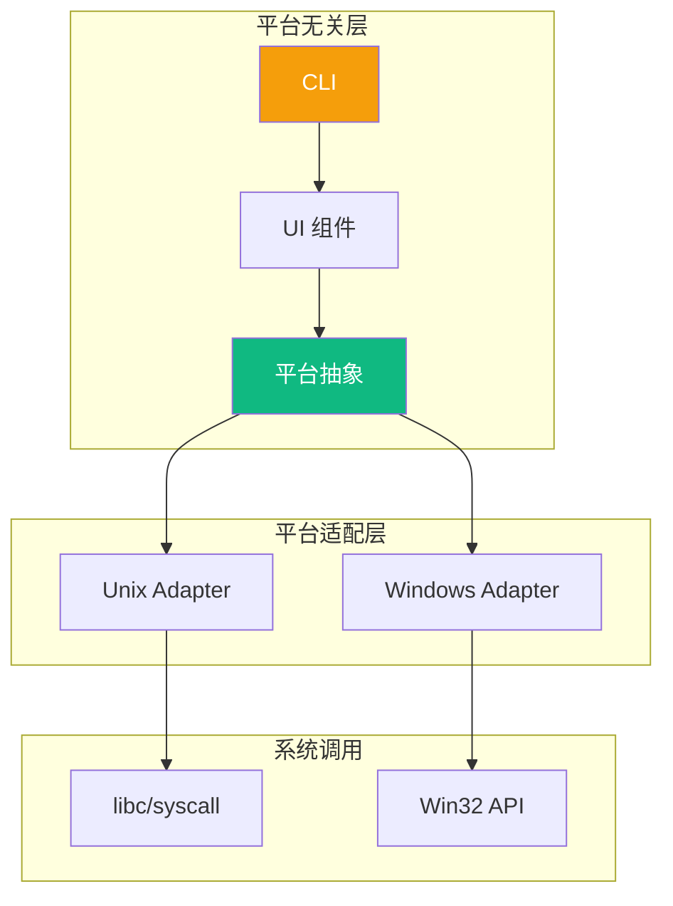
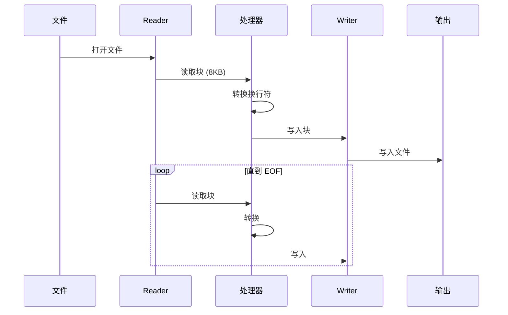
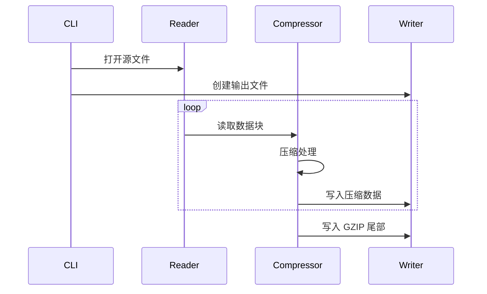
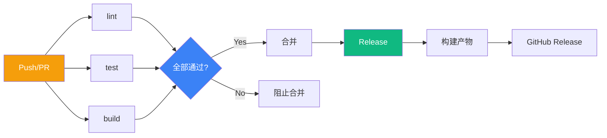
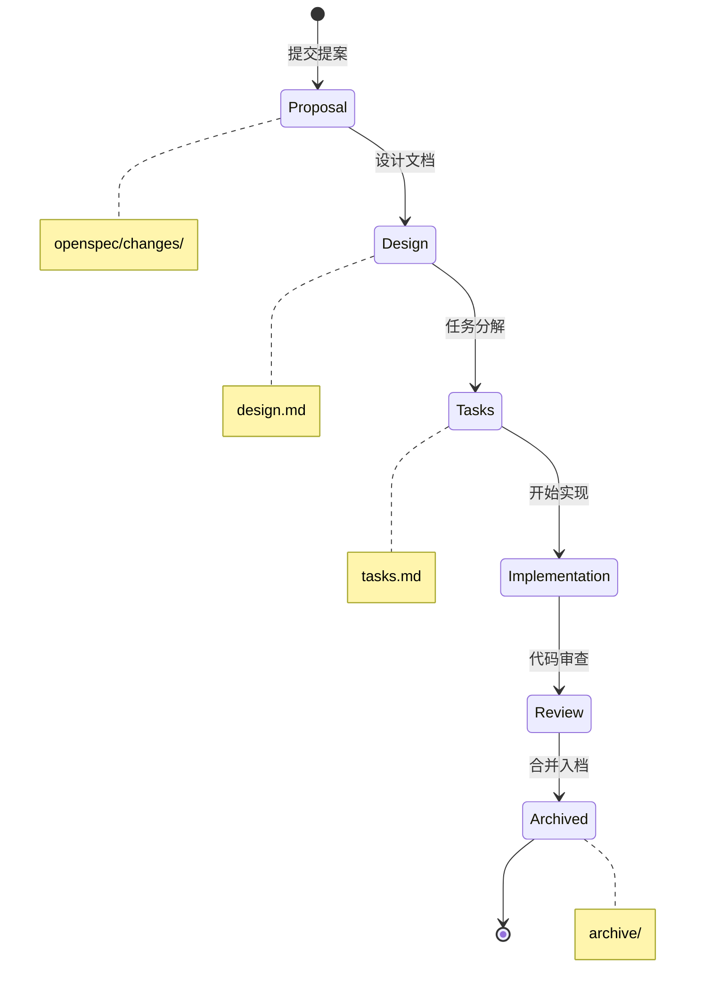

# 系统架构

本文档描述 Build Your Own Tools 项目的整体架构设计。

## 架构全景图



## 仓库结构设计

### Monorepo 架构

项目采用 **Monorepo** 架构，将所有工具放在同一仓库：



**优点**：
- 统一版本管理
- 共享 CI/CD
- 原子提交
- 简化依赖

**缺点**：
- 仓库体积大
- 构建时间长
- 权限粒度粗

### Rust Workspace

`gzip/rust/` 和 `htop/unix/rust/` 使用 Rust workspace：

```toml
# gzip/rust/Cargo.toml
[workspace]
members = ["."]

[package]
name = "gzip"
version = "0.1.0"
```

### Go Workspace

`gzip/go/` 和 `htop/` 使用 Go workspace：

```text
# go.work
go 1.22

use ./gzip/go
use ./htop/unix/go
use ./htop/win/go
```

## 模块设计

### 库 + 二进制模式

以 `gzip/rust/` 为例：



**好处**：
- 库可被其他项目引用
- 二进制专注于 CLI
- 便于测试

### 源码结构

```
gzip/rust/
├── Cargo.toml
├── src/
│   ├── lib.rs          # 库入口
│   ├── compress.rs     # 压缩逻辑
│   ├── decompress.rs   # 解压逻辑
│   └── bin/
│       └── gzip.rs     # CLI 入口
└── tests/
    └── integration.rs
```

## 跨平台策略

### htop 架构

htop 需要支持 Unix 和 Windows 两个平台，采用分层设计：



### 条件编译

Rust 使用 `cfg` 属性：

```rust
#[cfg(unix)]
mod unix;

#[cfg(windows)]
mod windows;
```

Go 使用构建标签：

```go
//go:build unix
package main

//go:build windows
package main
```

### 差异处理

| 功能 | Unix | Windows |
|------|------|---------|
| 进程列表 | `/proc` 文件系统 | CreateToolhelp32Snapshot |
| CPU 使用率 | `/proc/stat` | GetSystemTimes |
| 内存信息 | `/proc/meminfo` | GlobalMemoryStatusEx |
| 终端大小 | ioctl TIOCGWINSZ | GetConsoleScreenBufferInfo |

## 数据流设计

### dos2unix 流处理



### gzip 压缩管线



## 工程化架构

### CI/CD 流水线



### OpenSpec 工作流



## 技术债务

### 已知问题

| 问题 | 影响 | 优先级 |
|------|------|--------|
| htop Windows 版功能不完整 | 功能缺失 | 高 |
| 缺少基准测试覆盖 | 性能不可度量 | 中 |
| 文档国际化不完整 | 用户体验 | 低 |

### 改进方向

1. **性能基准** — 添加 criterion 集成
2. **模糊测试** — 添加 cargo-fuzz 测试
3. **API 文档** — 生成 rustdoc 和 godoc

## 相关文档

- [设计决策](/whitepaper/decisions) — ADR 风格的决策记录
- [性能分析](/whitepaper/performance) — 基准测试和优化
- [CI/CD 设计](/engineering/cicd) — 工作流详情
