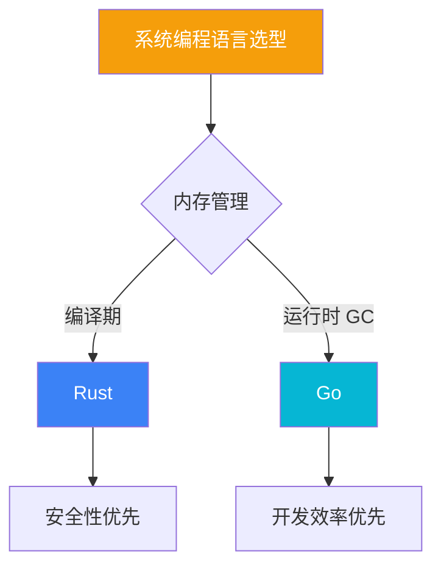
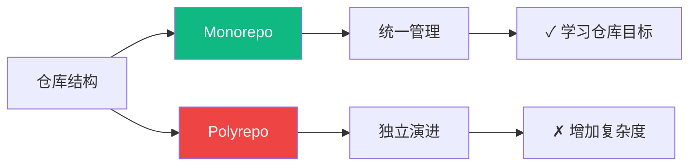
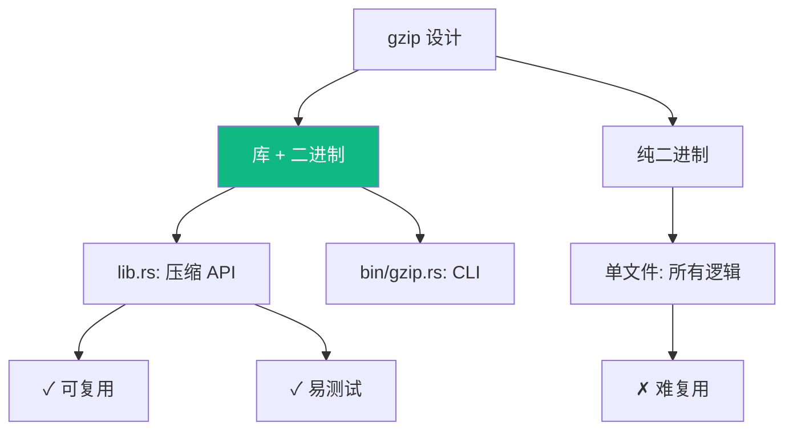
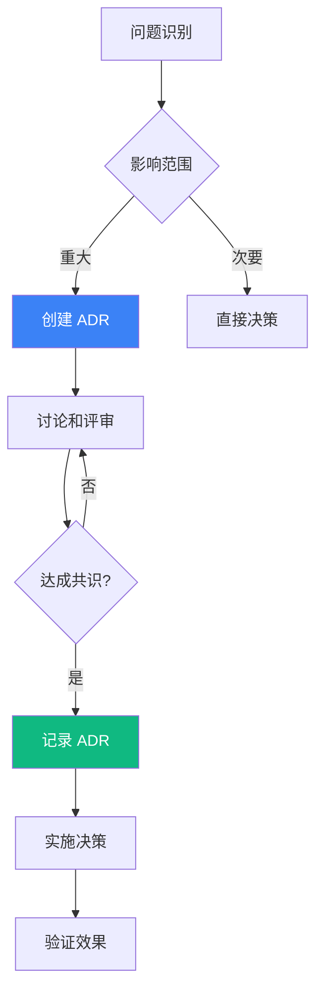

# 设计决策

本文档采用 **Architecture Decision Records (ADR)** 风格记录关键技术决策。

## ADR 索引

| 编号 | 标题 | 状态 | 日期 |
|------|------|------|------|
| ADR-001 | 选择 Rust 和 Go 作为实现语言 | 已采纳 | 2025-01 |
| ADR-002 | 采用 Monorepo 架构 | 已采纳 | 2025-01 |
| ADR-003 | 使用 OpenSpec 进行需求管理 | 已采纳 | 2025-02 |
| ADR-004 | gzip 采用库 + 二进制模式 | 已采纳 | 2025-02 |
| ADR-005 | htop 使用平台抽象层 | 已采纳 | 2025-03 |

---

## ADR-001: 选择 Rust 和 Go 作为实现语言

### 状态

已采纳 (2025-01)

### 背景

本项目需要选择适合系统编程教学的编程语言，要求：
- 能够直接操作系统资源
- 有良好的错误处理机制
- 适合 CLI 工具开发
- 有活跃的社区和丰富的生态

### 决策

选择 **Rust** 和 **Go** 作为实现语言，采用"同一问题双实现"的方式。

### 理由



**Rust 优势**：
- 编译期内存安全，无 GC 暂停
- 零成本抽象，性能可预测
- 强类型系统，减少运行时错误
- 适合系统级编程学习

**Go 优势**：
- 语法简洁，学习曲线平缓
- 内置并发原语 (goroutine, channel)
- 编译速度快，开发迭代快
- 标准库丰富，减少依赖

**为什么不选 C/C++**：
- C: 内存安全问题显著，不适合教学安全实践
- C++: 复杂度过高，学习曲线陡峭

### 后果

- 正面：两种语言对比学习，加深理解
- 正面：覆盖不同开发场景和偏好
- 负面：维护两套代码，工作量翻倍
- 负面：需要同时熟悉两种工具链

---

## ADR-002: 采用 Monorepo 架构

### 状态

已采纳 (2025-01)

### 背景

需要组织三个工具（dos2unix, gzip, htop）的代码仓库结构。

### 决策

采用 **Monorepo** 架构，将所有工具放在同一仓库。

### 理由



**选择 Monorepo 的理由**：
- 学习仓库需要统一视角
- 共享 CI/CD 配置
- 共享文档站点
- 原子提交，便于追踪
- 简化克隆和设置

**放弃 Polyrepo 的理由**：
- 增加管理复杂度
- 工具间依赖不多
- 不适合学习场景

### 后果

- 正面：统一版本和发布
- 正面：简化 CI/CD
- 负面：仓库体积增长
- 负面：权限粒度粗

---

## ADR-003: 使用 OpenSpec 进行需求管理

### 状态

已采纳 (2025-02)

### 背景

需要一种规范化的方式来管理需求和变更，使学习过程更加透明。

### 决策

创建 **OpenSpec** 规范框架，采用 Gherkin 风格的需求描述。

### 理由

**OpenSpec 结构**：

```
openspec/
├── specs/           # 功能规格
│   ├── project/     # 项目级规范
│   ├── dos2unix/    # 工具规范
│   ├── gzip/
│   └── htop/
├── changes/         # 变更管理
│   ├── archive/     # 已完成变更
│   └── active/      # 当前变更
└── schemas/         # 规范模板
```

**Gherkin 风格示例**：

```gherkin
Feature: 换行符转换
  As a 用户
  I want to 转换文件换行符
  So that 我可以在不同系统间共享文件

  Scenario: DOS 到 Unix 转换
    Given 输入文件包含 CRLF 换行符
    When 执行 dos2unix input.txt
    Then 输出文件应仅包含 LF 换行符
    And 文件内容应保持不变
```

**好处**：
- 需求可测试
- 变更可追踪
- 易于 AI 理解
- 文档即代码

### 后果

- 正面：需求清晰可追溯
- 正面：支持自动化测试
- 负面：需要学习 Gherkin 语法
- 负面：维护规范有开销

---

## ADR-004: gzip 采用库 + 二进制模式

### 状态

已采纳 (2025-02)

### 背景

gzip 工具需要决定代码组织方式：纯二进制 vs 库 + 二进制。

### 决策

采用 **库 + 二进制** 模式，将核心逻辑放在库中，CLI 专注于参数解析和调用。

### 理由



**好处**：
- 库可被其他项目引用
- 核心逻辑易于单元测试
- 清晰的关注点分离
- 符合 Rust 社区惯例

### 后果

- 正面：代码结构清晰
- 正面：测试更容易
- 负面：文件数量增加

---

## ADR-005: htop 使用平台抽象层

### 状态

已采纳 (2025-03)

### 背景

htop 需要支持 Unix 和 Windows 两个平台，系统 API 差异很大。

### 决策

采用 **平台抽象层** 模式，通过 trait/interface 定义统一接口，平台特定实现放在单独模块。

### 理由

```mermaid
graph TB
    subgraph "平台无关层"
        A[ProcessInfo Trait]
        B[UI 组件]
    end
    
    subgraph "Unix 实现"
        C[UnixProcessInfo]
        D[/proc 文件系统]
    end
    
    subgraph "Windows 实现"
        E[WindowsProcessInfo]
        F[Win32 API]
    end
    
    A --> C
    A --> E
    C --> D
    E --> F
    B --> A
    
    style A fill:#f59e0b,color:#fff
```

**Rust 实现**：

```rust
// 平台无关 trait
pub trait ProcessInfo {
    fn pid(&self) -> u32;
    fn name(&self) -> &str;
    fn cpu_usage(&self) -> f32;
    fn memory_usage(&self) -> u64;
}

#[cfg(unix)]
mod unix;
#[cfg(windows)]
mod windows;
```

**Go 实现**：

```go
// 平台无关接口
type ProcessInfo interface {
    PID() uint32
    Name() string
    CPUUsage() float32
    MemoryUsage() uint64
}

//go:build unix
package process // Unix 实现

//go:build windows
package process // Windows 实现
```

### 后果

- 正面：核心逻辑统一
- 正面：易于添加新平台
- 负面：需要维护多个实现
- 负面：抽象层有性能开销

---

## 决策流程



## 相关文档

- [系统架构](/whitepaper/architecture) — 架构设计详情
- [OpenSpec 工作流](/specs/openspec-workflow) — 需求管理
- [CI/CD 设计](/engineering/cicd) — 工作流设计
