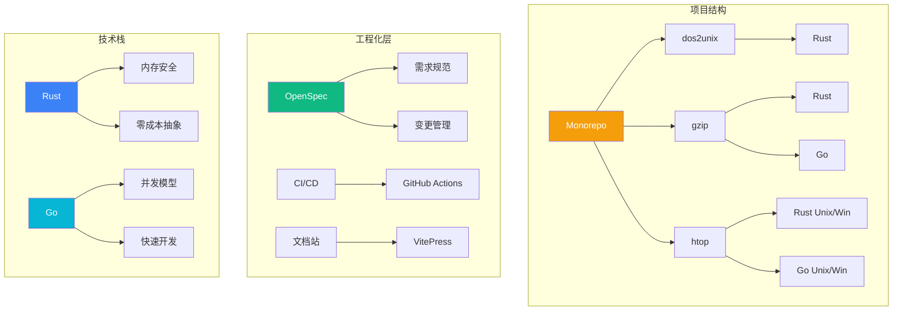

# 白皮书概览

欢迎阅读 **Build Your Own Tools** 技术白皮书。本文档从架构、设计决策和性能三个维度，深入分析这个系统编程学习仓库。

## 架构全景



## 文档结构

| 章节 | 内容 | 适合读者 |
|------|------|----------|
| [项目概览](/whitepaper/overview) | 项目定位、技术选型、学习路径 | 所有人 |
| [系统架构](/whitepaper/architecture) | 仓库结构、跨平台策略、模块设计 | 架构师 |
| [设计决策](/whitepaper/decisions) | ADR 风格的设计决策记录 | 技术决策者 |
| [性能分析](/whitepaper/performance) | 基准测试、性能对比、优化策略 | 性能工程师 |

## 核心价值

### 1. 双语言对比

同一问题用 Rust 和 Go 分别实现，直观展示：

- 内存管理策略差异
- 错误处理哲学对比
- 并发模型选择
- API 设计风格

### 2. 工程化完整

不是玩具项目，而是完整的工程实践：

- OpenSpec 需求规范
- GitHub Actions CI/CD
- 跨平台构建
- 自动化发布

### 3. 渐进式学习

从简单到复杂的学习路径：

```
dos2unix (⭐) → gzip (⭐⭐) → htop (⭐⭐⭐)
    ↓              ↓              ↓
  流处理        压缩管线        TUI + 系统编程
```

## 下一步

- 📖 阅读 [项目概览](/whitepaper/overview) 了解项目定位
- 🏗️ 查看 [系统架构](/whitepaper/architecture) 理解整体设计
- 📋 浏览 [技术规范](/specs/) 了解需求规格
- 🔬 研究 [对比研究](/comparison/) 深入语言差异
