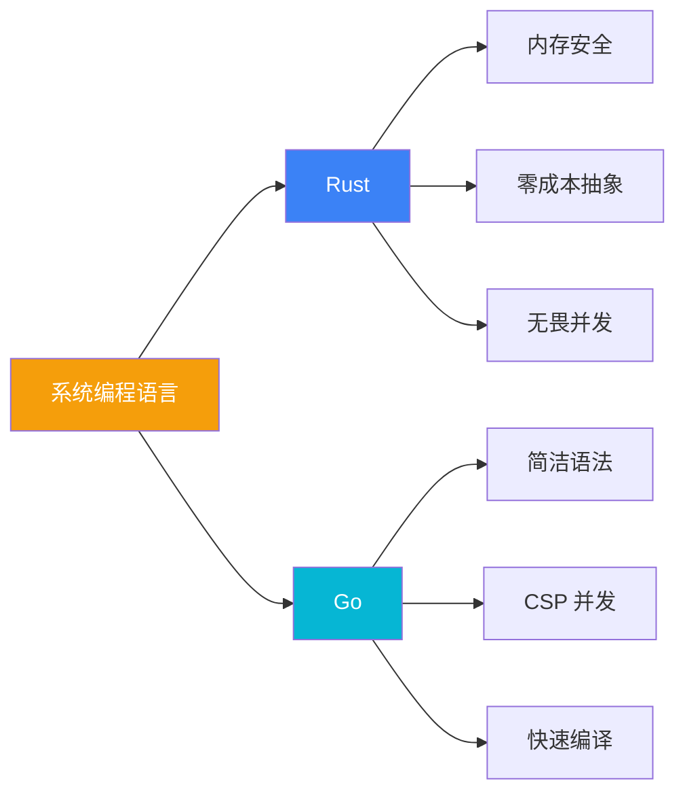

# 项目概览

## 定位

**Build Your Own Tools (BYOT)** 是一个系统编程学习仓库，核心理念是：

> **"One idea, two implementations"** — 同一个问题，两种语言实现，对比学习。

### 不是什么

- ❌ 语法教程 — 不教 Rust/Go 基础语法
- ❌ 玩具项目 — 不是简化版 demo
- ❌ 生产替代 — 不替代真正的 dos2unix/gzip/htop

### 是什么

- ✅ **系统编程案例研究** — 真实 CLI 工具的完整实现
- ✅ **语言对比实验室** — 同一问题的双语言实现
- ✅ **工程化实践** — OpenSpec、CI/CD、跨平台构建

## 技术选型

### 为什么是 Rust 和 Go？



| 特性 | Rust | Go |
|------|------|-----|
| 内存安全 | 编译期所有权检查 | GC 运行时 |
| 错误处理 | Result<T, E> 枚举 | error 接口 |
| 并发模型 | async/await + Tokio | goroutine + channel |
| 泛型 | 完整泛型系统 | 类型参数（1.18+） |
| 学习曲线 | 陡峭 | 平缓 |
| 编译速度 | 较慢 | 极快 |

### 为什么选择这三个工具？

| 工具 | 学习价值 | 复杂度 |
|------|----------|--------|
| **dos2unix** | 流式 I/O、缓冲区边界、换行符处理 | ⭐ |
| **gzip** | 压缩管线、CLI 设计、错误处理模式 | ⭐⭐ |
| **htop** | TUI 架构、进程指标、跨平台系统 API | ⭐⭐⭐ |

## 项目结构

```
build-your-own-tools/
├── dos2unix/           # 换行符转换工具
│   ├── src/           # Rust 源码
│   └── Cargo.toml
│
├── gzip/              # 压缩工具
│   ├── go/            # Go 实现
│   │   ├── cmd/       # CLI 入口
│   │   └── pkg/       # 库代码
│   └── rust/          # Rust 实现
│       ├── src/bin/   # CLI 入口
│       └── src/lib.rs # 库代码
│
├── htop/              # 进程监控工具
│   ├── unix/          # Unix 平台
│   │   ├── go/        # Go 实现
│   │   └── rust/      # Rust 实现
│   └── win/           # Windows 平台
│       ├── go/
│       └── rust/
│
├── openspec/          # 需求规范
│   ├── specs/         # 功能规格
│   └── changes/       # 变更管理
│
├── docs/              # 技术文档
├── .vitepress/        # 文档站点
└── .github/           # CI/CD 工作流
```

## 学习路径建议

### 初学者路径

1. **dos2unix (Rust)** — 理解流处理基础
2. **gzip (Rust)** — 学习管线设计
3. **gzip (Go)** — 对比两种语言的实现方式
4. **htop (Rust)** — 挑战 TUI + 系统编程

### 进阶者路径

1. 直接阅读 **对比研究** 章节
2. 分析 **设计决策** 理解技术选型
3. 研究 **OpenSpec 规范** 学习需求工程
4. 贡献新的工具实现

### 架构师路径

1. 阅读 **系统架构** 理解整体设计
2. 分析 **工程实践** 了解 CI/CD 设计
3. 研究 **跨平台策略** 学习平台适配
4. 评估 **技术债务** 和演进方向

## 核心资产

### OpenSpec 规范

采用 Gherkin 风格的需求规格，示例：

```gherkin
Feature: 换行符转换
  Scenario: DOS 到 Unix 转换
    Given 输入文件包含 CRLF 换行符
    When 执行 dos2unix
    Then 输出文件应仅包含 LF 换行符
```

### 治理层设计

- **AGENTS.md** — AI 协作指南
- **CLAUDE.md** — Claude 特定指令
- **copilot-instructions.md** — GitHub Copilot 配置

这是 AI 辅助开发的最佳实践示例。

## 下一步

- 🏗️ [系统架构](/whitepaper/architecture) — 深入了解设计
- 📋 [技术规范](/specs/) — 查看需求规格
- 🔬 [对比研究](/comparison/) — Rust vs Go 分析
