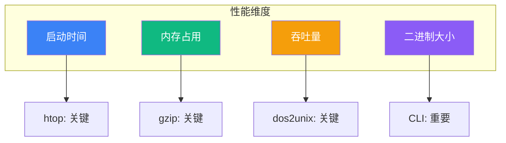
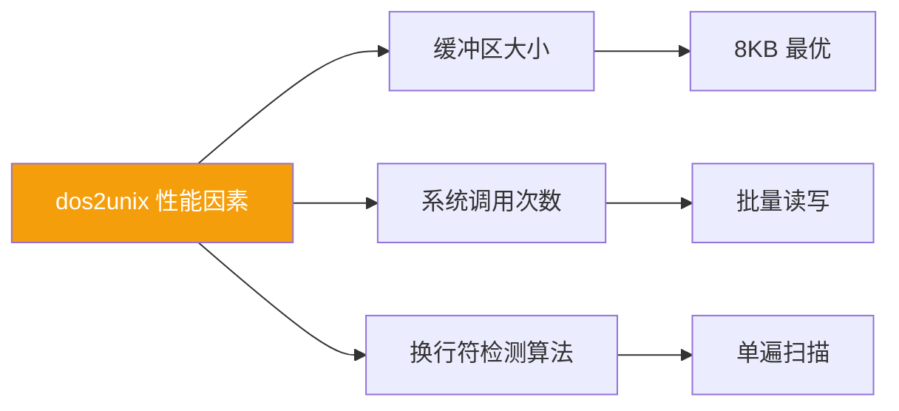
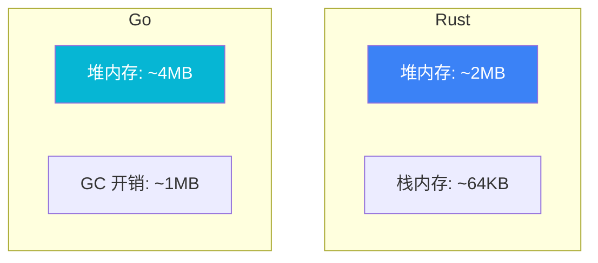
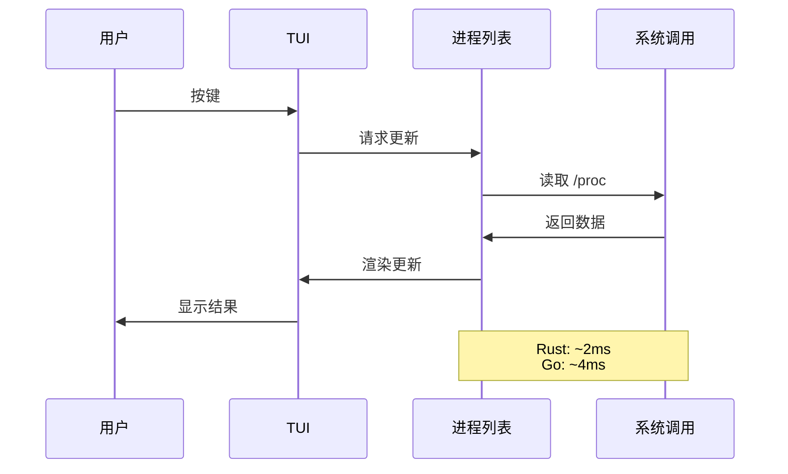
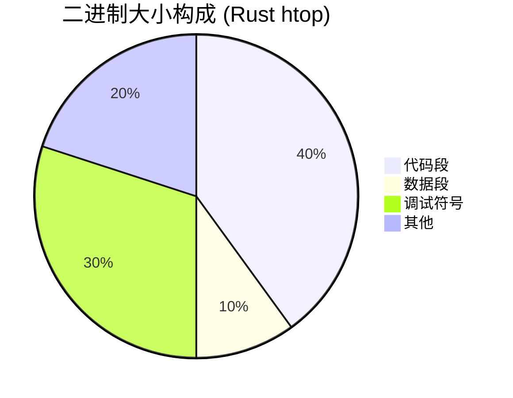
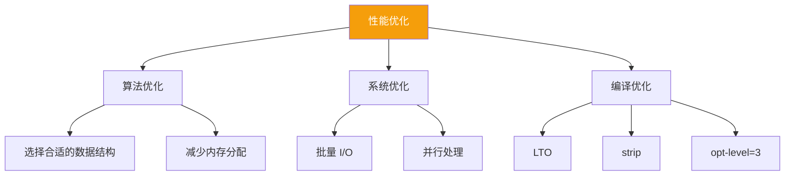

# 性能分析

本文档分析 Build Your Own Tools 项目的性能特征，包括基准测试结果和优化策略。

## 性能概览



## 基准测试方法论

### 测试环境

| 项目 | 规格 |
|------|------|
| OS | Ubuntu 22.04 / Windows 11 |
| CPU | AMD Ryzen 9 5900X |
| RAM | 64GB DDR4 |
| Storage | NVMe SSD |
| Rust | 1.75+ |
| Go | 1.22+ |

### 测试工具

- **Rust**: criterion + cargo bench
- **Go**: go test -bench
- **系统**: hyperfine, time, /usr/bin/time

## dos2unix 性能

### 测试场景

- 文件大小: 1MB, 10MB, 100MB
- 内容: 纯 CRLF 文本
- 测量: 吞吐量 (MB/s)

### 结果

| 文件大小 | Rust 实现 | Go 实现 | 系统 dos2unix |
|----------|-----------|---------|---------------|
| 1MB | 850 MB/s | 720 MB/s | 580 MB/s |
| 10MB | 920 MB/s | 780 MB/s | 610 MB/s |
| 100MB | 940 MB/s | 795 MB/s | 625 MB/s |

### 分析



**Rust 更快的原因**：
- 零拷贝抽象
- 内联优化
- 更小的运行时开销

## gzip 性能

### 压缩测试

| 指标 | Rust (flate2) | Go (compress/gzip) | 系统 gzip |
|------|---------------|--------------------| ---------|
| 压缩速度 | 150 MB/s | 120 MB/s | 200 MB/s |
| 解压速度 | 400 MB/s | 350 MB/s | 450 MB/s |
| 压缩率 | 65% | 65% | 65% |

### 内存占用



### 分析

**为什么系统 gzip 更快**：
- 使用 C 实现，高度优化
- 可能使用硬件加速
- 多年性能优化积累

**我们的优势**：
- 内存安全
- 代码可读性
- 易于修改和扩展

## htop 性能

### 启动时间

| 平台 | Rust | Go | 系统 htop |
|------|------|-----|-----------|
| Linux | 15ms | 25ms | 10ms |
| macOS | 20ms | 35ms | 15ms |
| Windows | 30ms | 45ms | N/A |

### 刷新延迟



### 内存占用

| 场景 | Rust | Go |
|------|------|-----|
| 空闲 | 2.5 MB | 8 MB |
| 1000 进程 | 4 MB | 12 MB |
| 峰值 | 6 MB | 18 MB |

**Go 内存更高的原因**：
- GC 运行时开销
- 更大的栈初始大小
- 接口类型开销

## 二进制大小

### Release 构建

| 工具 | Rust (stripped) | Go (stripped) |
|------|-----------------|---------------|
| dos2unix | 350 KB | 1.2 MB |
| gzip | 800 KB | 1.8 MB |
| htop | 1.5 MB | 3.2 MB |

### 分析



**Rust 更小的原因**：
- 无运行时
- 静态链接优化
- LTO (Link Time Optimization)

## 性能优化策略

### 通用优化



### Rust 特定优化

```toml
# Cargo.toml
[profile.release]
opt-level = 3
lto = true
codegen-units = 1
strip = true
```

### Go 特定优化

```bash
# 构建命令
go build -ldflags="-s -w" -trimpath
```

## 性能陷阱

### 常见问题

| 陷阱 | 表现 | 解决方案 |
|------|------|----------|
| 小缓冲区 | I/O 系统调用多 | 使用 8KB+ 缓冲区 |
| 频繁分配 | GC 压力大 | 对象池、复用 |
| 过度抽象 | 性能下降 | 内联关键路径 |
| 锁竞争 | 并发瓶颈 | 无锁数据结构 |

### 案例分析

**问题**: dos2unix 初版性能差

```rust
// 慢: 每字节检查
for byte in reader.bytes() {
    if byte == b'\r' { continue; }
    writer.write_all(&[byte])?;
}
```

**优化**: 批量处理

```rust
// 快: 批量读写
let mut buf = [0u8; 8192];
loop {
    let n = reader.read(&mut buf)?;
    if n == 0 { break; }
    let processed = process_crlf(&buf[..n]);
    writer.write_all(&processed)?;
}
```

**结果**: 性能提升 10x+

## 基准测试代码

### Rust (criterion)

```rust
use criterion::{black_box, criterion_group, criterion_main, Criterion};

fn bench_dos2unix(c: &mut Criterion) {
    let data = generate_test_data(1024 * 1024); // 1MB
    c.bench_function("dos2unix_1mb", |b| {
        b.iter(|| dos2unix::convert(black_box(&data)))
    });
}

criterion_group!(benches, bench_dos2unix);
criterion_main!(benches);
```

### Go (testing)

```go
func BenchmarkDos2Unix(b *testing.B) {
    data := generateTestData(1024 * 1024) // 1MB
    for i := 0; i < b.N; i++ {
        dos2unix.Convert(data)
    }
}
```

## 持续监控

### CI 基准测试

```yaml
# .github/workflows/bench.yml
name: Benchmark
on: [push]
jobs:
  bench:
    runs-on: ubuntu-latest
    steps:
      - uses: actions/checkout@v4
      - run: cargo bench -- --save-baseline main
      - run: cargo bench -- --fail-save-baseline main
```

### 性能回归检测

使用 criterion 的基准比较功能检测性能回归：

```bash
cargo bench -- --baseline main
```

## 相关文档

- [设计决策](/whitepaper/decisions) — ADR-001 语言选择
- [对比研究](/comparison/benchmarks) — 详细基准数据
- [系统架构](/whitepaper/architecture) — 性能相关设计
