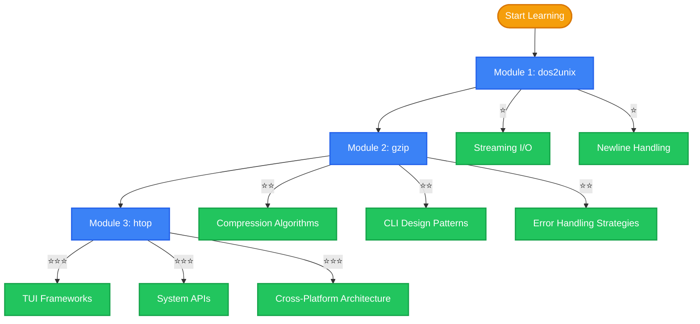

# Build Your Own Tools Academy

Welcome to the **BYOT Academy** — a progressive learning path to master systems programming by re-implementing real CLI tools.

## Learning Philosophy

We believe **learning by doing** is the best approach. This academy selects three representative command-line tools, from simple to complex, guiding you step by step through the core concepts of systems programming.

More importantly, each tool provides **dual implementations in both Rust and Go**, allowing you to directly compare the design philosophy differences between the two languages when solving the same problem.

## Learning Path

## Module Overview

| Module | Tool | Core Concepts | Complexity | Rust | Go |
|--------|------|---------------|------------|------|-----|
| 1 | dos2unix | Streaming I/O, newline handling, basic error handling | ⭐ | ✅ | — |
| 2 | gzip | DEFLATE algorithm, CLI design, dual-language comparison | ⭐⭐ | ✅ | ✅ |
| 3 | htop | TUI development, system APIs, cross-platform architecture | ⭐⭐⭐ | ✅ | ✅ |

## Prerequisites

- **Required**: Basic knowledge of at least one programming language
- **Recommended**: Basic command-line experience
- **Bonus**: Familiarity with Rust or Go syntax

## Study Tips

1. **Follow the order**: Modules increase in difficulty, complete them in sequence
2. **Compare implementations**: Focus on the differences between Rust and Go
3. **Hands-on practice**: Try implementing or modifying features yourself
4. **Reference specs**: Use the [Specifications](/en/specs/) to understand requirement-driven development

## Recommended Reading

- [Whitepaper: System Architecture](/en/whitepaper/architecture) — Understand the overall design
- [Comparison: Memory Model](/en/comparison/memory) — Rust vs Go memory management
- [References](/en/reference/) — Related papers and projects
