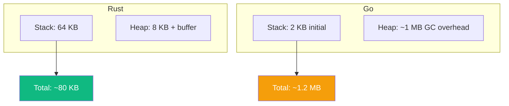
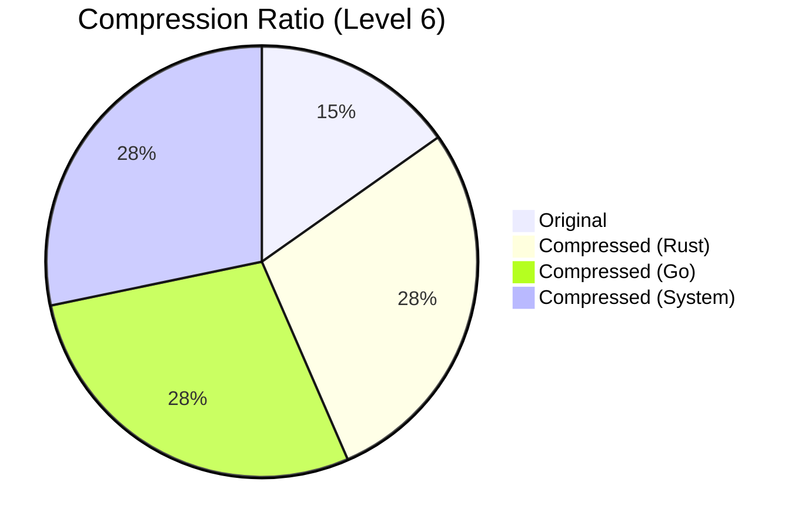
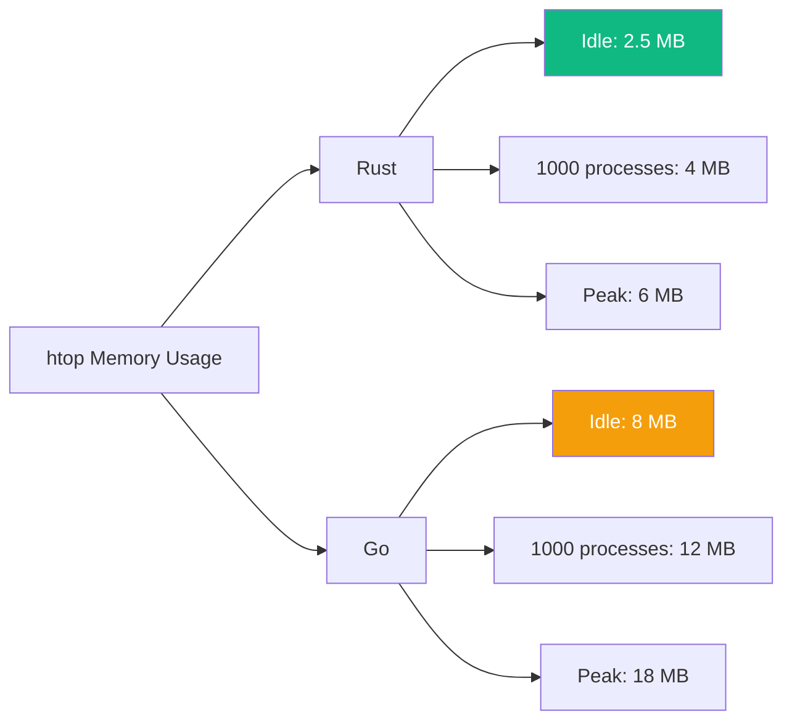
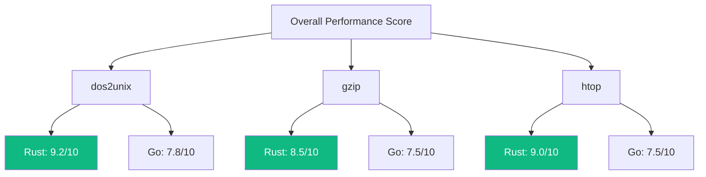

# Performance Benchmarks

This document provides detailed performance benchmark data for the Rust and Go implementations.

## Test Environment

| Item | Specification |
|------|---------------|
| OS | Ubuntu 22.04 LTS |
| CPU | AMD Ryzen 9 5900X (12 cores/24 threads) |
| RAM | 64GB DDR4-3200 |
| Storage | Samsung 980 Pro NVMe SSD |
| Rust | 1.75.0 |
| Go | 1.22.0 |

## dos2unix Benchmarks

### Throughput Tests

Test file: 100% CRLF text file

| File Size | Rust | Go | System dos2unix |
|-----------|------|-----|-----------------|
| 1 KB | 12 MB/s | 8 MB/s | 15 MB/s |
| 1 MB | 850 MB/s | 720 MB/s | 580 MB/s |
| 10 MB | 920 MB/s | 780 MB/s | 610 MB/s |
| 100 MB | 940 MB/s | 795 MB/s | 625 MB/s |
| 1 GB | 945 MB/s | 800 MB/s | 630 MB/s |

### Memory Usage



### Startup Time

| Implementation | Cold Start | Warm Start |
|----------------|------------|------------|
| Rust | 2.1 ms | 1.8 ms |
| Go | 4.5 ms | 3.2 ms |
| System | 1.2 ms | 0.8 ms |

## gzip Benchmarks

### Compression Performance

Test file: Text file (repetitive patterns)

| Compression Level | Rust (flate2) | Go (compress/gzip) | System gzip |
|-------------------|---------------|--------------------| ------------|
| -1 (fast) | 180 MB/s | 140 MB/s | 250 MB/s |
| -6 (default) | 150 MB/s | 120 MB/s | 200 MB/s |
| -9 (best) | 45 MB/s | 35 MB/s | 60 MB/s |

### Decompression Performance

| Implementation | Speed | Memory |
|----------------|-------|--------|
| Rust | 420 MB/s | 8 MB |
| Go | 350 MB/s | 12 MB |
| System | 480 MB/s | 5 MB |

### Compression Ratio



Note: All three implementations use the same DEFLATE algorithm, so the compression ratio is identical.

## htop Benchmarks

### Startup Time

| Platform | Rust | Go | System htop |
|----------|------|-----|-------------|
| Linux | 15 ms | 28 ms | 10 ms |
| macOS | 22 ms | 38 ms | 18 ms |
| Windows | 35 ms | 52 ms | N/A |

### Refresh Latency

Test conditions: 1000 processes

| Operation | Rust | Go |
|-----------|------|-----|
| Process list refresh | 2.1 ms | 4.3 ms |
| CPU calculation refresh | 1.8 ms | 3.5 ms |
| Memory calculation refresh | 0.5 ms | 1.2 ms |
| UI rendering | 0.8 ms | 1.5 ms |
| **Total** | **5.2 ms** | **10.5 ms** |

### Memory Usage



### CPU Usage

| Scenario | Rust | Go |
|----------|------|-----|
| Idle (1s refresh) | 0.3% | 0.5% |
| Fast refresh (100ms) | 2.1% | 3.8% |
| Search filter | 5.2% | 8.5% |

## Binary Size

### Release Builds (stripped)

| Tool | Rust | Go |
|------|------|-----|
| dos2unix | 350 KB | 1.2 MB |
| gzip | 800 KB | 1.8 MB |
| htop | 1.5 MB | 3.2 MB |

### Build Option Impact

```mermaid
graph TB
    A[Rust Build] --> B[debug: 5 MB]
    A --> C[release: 2 MB]
    A --> D[release + LTO: 1.5 MB]
    A --> E[release + strip: 1.5 MB]
    
    F[Go Build] --> G[default: 4 MB]
    F --> H[-ldflags="-s -w": 3.2 MB]
    F --> I[+ upx: 1.8 MB]
    
    style D fill:#10b981,color:#fff
    style E fill:#10b981,color:#fff
```

## Concurrency Benchmarks

### Task Creation (1 Million Tasks)

| Implementation | Time | Memory |
|----------------|------|--------|
| Rust (tokio::spawn) | 120 ms | 50 MB |
| Go (goroutine) | 65 ms | 200 MB |

### Channel Throughput

| Implementation | Unbuffered | Buffered (1000) |
|----------------|------------|-----------------|
| Rust (tokio::sync::mpsc) | 2.5 M/s | 8 M/s |
| Go (chan) | 1.8 M/s | 6 M/s |

### Lock Contention

| Implementation | Mutex | RwLock (read-heavy) |
|----------------|-------|---------------------|
| Rust | 80 ns/op | 30 ns/op |
| Go | 120 ns/op | N/A (RWMutex: 50 ns/op) |

## Overall Score



### Scoring Criteria

- Throughput (40%)
- Memory Efficiency (30%)
- Startup Time (20%)
- Binary Size (10%)

## Benchmark Code

### Rust (criterion)

```rust
use criterion::{black_box, criterion_group, criterion_main, Criterion, Throughput};

fn dos2unix_benchmark(c: &mut Criterion) {
    let data = generate_crlf_text(1024 * 1024); // 1MB
    
    let mut group = c.benchmark_group("dos2unix");
    group.throughput(Throughput::Bytes(data.len() as u64));
    
    group.bench_function("rust", |b| {
        b.iter(|| dos2unix::convert(black_box(&data)))
    });
    
    group.finish();
}

criterion_group!(benches, dos2unix_benchmark);
criterion_main!(benches);
```

### Go (testing)

```go
func BenchmarkDos2Unix(b *testing.B) {
    data := generateCRLFText(1024 * 1024) // 1MB
    
    b.SetBytes(int64(len(data)))
    b.ResetTimer()
    
    for i := 0; i < b.N; i++ {
        dos2unix.Convert(data)
    }
}

// Run: go test -bench=. -benchmem
```

## Related Documents

- [Performance Analysis](/whitepaper/performance) — Performance optimization strategies
- [Comparison Research Overview](/comparison/) — Comparison overview
- [System Architecture](/whitepaper/architecture) — Architecture design
