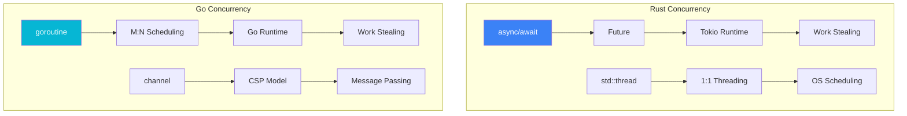
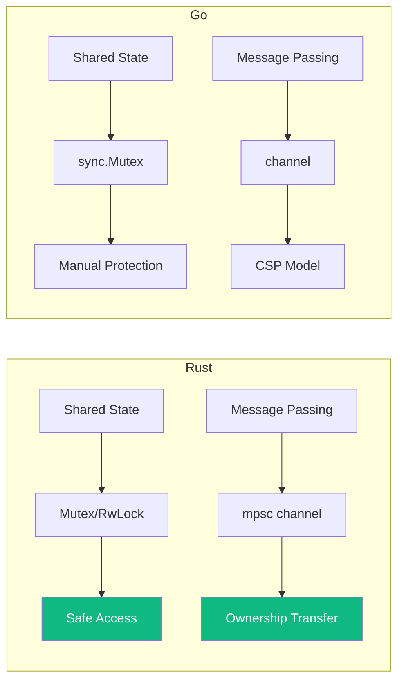
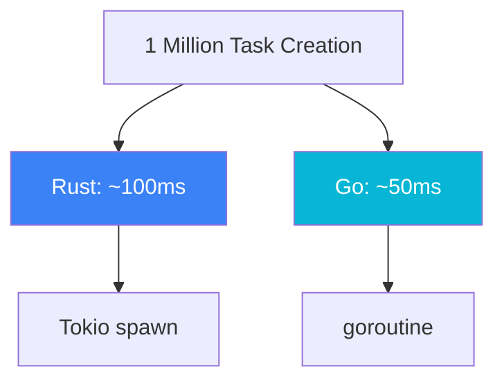

# Concurrency Model Comparison

This document compares the concurrent programming models of Rust and Go.

## Core Philosophy



## Rust: async/await

### Basic Usage

```rust
use tokio;

#[tokio::main]
async fn main() {
    // Execute multiple tasks concurrently
    let task1 = tokio::spawn(async {
        println!("Task 1");
        1
    });
    
    let task2 = tokio::spawn(async {
        println!("Task 2");
        2
    });
    
    // Wait for results
    let (r1, r2) = tokio::join!(task1, task2);
    println!("Results: {:?}, {:?}", r1, r2);
}
```

### Future and Async Functions

```rust
use std::future::Future;
use std::pin::Pin;
use std::task::{Context, Poll};

// Manually implement Future
struct Delay {
    duration: Duration,
}

impl Future for Delay {
    type Output = ();
    
    fn poll(self: Pin<&mut Self>, cx: &mut Context<'_>) -> Poll<Self::Output> {
        // Implement polling logic
        Poll::Ready(())
    }
}

// Using async fn
async fn fetch_data(url: &str) -> Result<String, Error> {
    let response = reqwest::get(url).await?;
    let body = response.text().await?;
    Ok(body)
}
```

### Concurrency Primitives

```rust
use tokio::sync::{mpsc, Mutex, RwLock, Semaphore};

// Channel
let (tx, mut rx) = mpsc::channel(100);

tokio::spawn(async move {
    tx.send("hello".to_string()).await.unwrap();
});

while let Some(msg) = rx.recv().await {
    println!("Received: {}", msg);
}

// Mutex
let data = Mutex::new(vec![1, 2, 3]);
{
    let mut locked = data.lock().await;
    locked.push(4);
}

// Semaphore
let semaphore = Semaphore::new(3);
let permit = semaphore.acquire().await.unwrap();
// Limit concurrency count
```

## Go: goroutine + channel

### goroutine

```go
// Start a goroutine
go func() {
    fmt.Println("Hello from goroutine")
}()

// Goroutine with parameters
func process(id int) {
    fmt.Printf("Processing %d\n", id)
}

for i := 0; i < 10; i++ {
    go process(i)
}
```

### Channel

```go
// Unbuffered channel
ch := make(chan string)

// Send and receive
go func() {
    ch <- "hello"  // Send
}()

msg := <-ch  // Receive
fmt.Println(msg)

// Buffered channel
buffered := make(chan int, 10)

// Close channel
close(ch)

// Range iteration
for msg := range ch {
    fmt.Println(msg)
}
```

### Select

```go
// Multiplexing
select {
case msg := <-ch1:
    fmt.Println("From ch1:", msg)
case msg := <-ch2:
    fmt.Println("From ch2:", msg)
case <-time.After(time.Second):
    fmt.Println("Timeout")
default:
    fmt.Println("No data")
}
```

### Context

```go
import "context"

// Timeout control
ctx, cancel := context.WithTimeout(context.Background(), 5*time.Second)
defer cancel()

select {
case <-ctx.Done():
    fmt.Println("Context cancelled:", ctx.Err())
case result := <-doWork(ctx):
    fmt.Println("Result:", result)
}

func doWork(ctx context.Context) <-chan string {
    out := make(chan string)
    go func() {
        defer close(out)
        for {
            select {
            case <-ctx.Done():
                return
            default:
                // Do work
                out <- "result"
            }
        }
    }()
    return out
}
```

## Comparison Analysis

### Scheduling Model

| Aspect | Rust (Tokio) | Go |
|--------|--------------|-----|
| Scheduling Model | M:N (work stealing) | M:N (work stealing) |
| Stack Size | Dynamic (default 2MB) | Initial 2KB, growable |
| Preemptive | Yes (since 1.39+) | Yes |
| Creation Cost | Low | Very low |

### Data Sharing



### Error Handling

```rust
// Rust - Result propagation
async fn handle_request() -> Result<Response, Error> {
    let data = fetch_data().await?;  // Error propagates
    let processed = process(data).await?;
    Ok(Response::new(processed))
}

// Handle multiple results with join!
let (r1, r2) = tokio::join!(task1, task2);
if r1.is_err() || r2.is_err() {
    // Handle errors
}
```

```go
// Go - explicit error checking
func handleRequest() (*Response, error) {
    data, err := fetchData()
    if err != nil {
        return nil, err
    }
    
    processed, err := process(data)
    if err != nil {
        return nil, err
    }
    
    return &Response{Data: processed}, nil
}
```

## Performance Comparison

### Task Creation



### Context Switching

| Scenario | Rust | Go |
|----------|------|-----|
| async switch | ~50ns | - |
| goroutine switch | - | ~200ns |
| Thread switch | ~1μs | ~1μs |

## Real-World Examples

### htop Concurrency Design

```rust
// Rust - async data collection
async fn collect_system_info() -> SystemInfo {
    let cpu = tokio::spawn(get_cpu_info());
    let mem = tokio::spawn(get_memory_info());
    let processes = tokio::spawn(get_process_list());
    
    let (cpu, mem, processes) = tokio::join!(cpu, mem, processes);
    
    SystemInfo {
        cpu: cpu.unwrap(),
        memory: mem.unwrap(),
        processes: processes.unwrap(),
    }
}
```

```go
// Go - goroutine data collection
func collectSystemInfo() SystemInfo {
    var info SystemInfo
    var wg sync.WaitGroup
    
    wg.Add(3)
    go func() {
        defer wg.Done()
        info.CPU = getCPUInfo()
    }()
    go func() {
        defer wg.Done()
        info.Memory = getMemoryInfo()
    }()
    go func() {
        defer wg.Done()
        info.Processes = getProcessList()
    }()
    
    wg.Wait()
    return info
}
```

## Best Practices

### Rust

```rust
// 1. Use spawn_blocking for blocking operations
let result = tokio::task::spawn_blocking(|| {
    // Blocking operation
    heavy_computation()
}).await?;

// 2. Limit concurrency
let semaphore = Arc::new(Semaphore::new(10));
let mut tasks = vec![];

for url in urls {
    let permit = semaphore.clone().acquire_owned().await.unwrap();
    tasks.push(tokio::spawn(async move {
        let result = fetch(url).await;
        drop(permit);
        result
    }));
}

// 3. Graceful shutdown
tokio::select! {
    result = work() => result,
    _ = shutdown_signal() => {
        println!("Shutting down");
        Ok(())
    }
}
```

### Go

```go
// 1. Use worker pool
func workerPool(ctx context.Context, jobs <-chan Job, results chan<- Result) {
    for i := 0; i < 10; i++ {
        go func() {
            for job := range jobs {
                select {
                case results <- process(job):
                case <-ctx.Done():
                    return
                }
            }
        }()
    }
}

// 2. Use errgroup
g, ctx := errgroup.WithContext(ctx)

g.Go(func() error {
    return task1(ctx)
})
g.Go(func() error {
    return task2(ctx)
})

if err := g.Wait(); err != nil {
    // Handle error
}

// 3. Graceful shutdown
server.Shutdown(ctx)
```

## Related Documents

- [Comparison Research Overview](/comparison/) — Comparison overview
- [Memory Model Comparison](/comparison/memory) — Memory management
- [Error Handling Comparison](/comparison/errors) — Error handling
