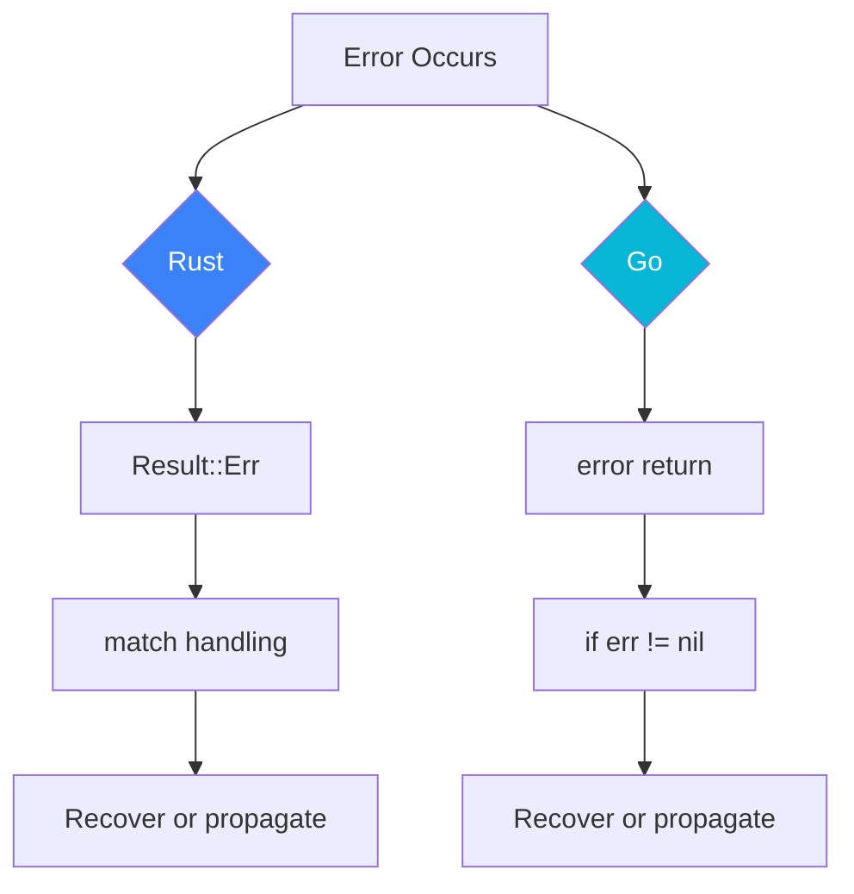

# Error Handling Comparison

This document compares the error handling philosophy and practices of Rust and Go.

## Design Philosophy


## Rust: Result<T, E>

### Basic Usage

```rust
use std::fs::File;
use std::io::Read;

fn read_file(path: &str) -> Result<String, std::io::Error> {
    let mut file = File::open(path)?;  // ? operator automatically propagates errors
    let mut content = String::new();
    file.read_to_string(&mut content)?;
    Ok(content)
}

// Usage
match read_file("config.txt") {
    Ok(content) => println!("Content: {}", content),
    Err(e) => eprintln!("Error: {}", e),
}
```

### ? Operator

```rust
// Automatic error type conversion
fn process() -> Result<Data, AppError> {
    let config = read_config()?;     // io::Error -> AppError
    let data = fetch_data(&config)?; // NetworkError -> AppError
    let result = parse(data)?;       // ParseError -> AppError
    Ok(result)
}

// Usage in async functions
async fn handle_request() -> Result<Response, Error> {
    let body = req.body().await?;
    let data = parse_json(&body)?;
    Ok(process(data)?)
}
```

### Custom Error Types

```rust
use thiserror::Error;

#[derive(Debug, Error)]
pub enum AppError {
    #[error("IO error: {0}")]
    Io(#[from] std::io::Error),
    
    #[error("Parse error: {0}")]
    Parse(#[from] serde_json::Error),
    
    #[error("Network error: {0}")]
    Network(String),
    
    #[error("Not found: {0}")]
    NotFound(String),
}

// Implement From for automatic conversion
impl From<reqwest::Error> for AppError {
    fn from(e: reqwest::Error) -> Self {
        AppError::Network(e.to_string())
    }
}
```

### Error Context

```rust
use anyhow::{Context, Result};

fn read_config() -> Result<Config> {
    let content = std::fs::read_to_string("config.toml")
        .context("Failed to read config file")?;
    
    let config: Config = toml::from_str(&content)
        .context("Failed to parse config")?;
    
    Ok(config)
}

// Error chain displays full context
// Error: Failed to parse config
// Caused by: missing field `database`
```

## Go: error interface

### Basic Usage

```go
import (
    "errors"
    "fmt"
    "os"
)

func readFile(path string) (string, error) {
    data, err := os.ReadFile(path)
    if err != nil {
        return "", err
    }
    return string(data), nil
}

// Usage
content, err := readFile("config.txt")
if err != nil {
    fmt.Fprintf(os.Stderr, "Error: %v\n", err)
    return
}
fmt.Println(content)
```

### Custom Errors

```go
// Simple error
var ErrNotFound = errors.New("not found")

// Custom error type
type ValidationError struct {
    Field   string
    Message string
}

func (e *ValidationError) Error() string {
    return fmt.Sprintf("validation error: %s - %s", e.Field, e.Message)
}

// Usage
func validate(data Data) error {
    if data.Name == "" {
        return &ValidationError{Field: "name", Message: "required"}
    }
    return nil
}
```

### Error Wrapping

```go
import "fmt"

// fmt.Errorf wrapping
func process() error {
    data, err := readFile("config.txt")
    if err != nil {
        return fmt.Errorf("failed to process: %w", err)
    }
    // ...
    return nil
}

// errors.Is and errors.As
import "errors"

var ErrNotFound = errors.New("not found")

func handleError(err error) {
    // Check for specific error
    if errors.Is(err, ErrNotFound) {
        // Handle not found
    }
    
    // Check error type
    var validationErr *ValidationError
    if errors.As(err, &validationErr) {
        fmt.Println(validationErr.Field)
    }
}
```

## Comparison Analysis

### Type Safety

| Aspect | Rust | Go |
|--------|------|-----|
| Compile-time Check | ✅ Must handle errors | ❌ Can ignore errors |
| Error Type | Strongly typed | Interface type |
| Error Propagation | ? operator | Explicit return |
| Error Chain | Typed | Stringified |

### Code Example Comparison

```rust
// Rust - sequential operations
fn process_file(path: &str) -> Result<Output, AppError> {
    let content = fs::read_to_string(path)?;  // io::Error -> AppError
    let parsed = parse(&content)?;            // ParseError -> AppError
    let validated = validate(parsed)?;        // ValidationError -> AppError
    let processed = transform(validated)?;    // TransformError -> AppError
    Ok(processed)
}
```

```go
// Go - sequential operations
func processFile(path string) (*Output, error) {
    content, err := os.ReadFile(path)
    if err != nil {
        return nil, fmt.Errorf("read file: %w", err)
    }
    
    parsed, err := parse(content)
    if err != nil {
        return nil, fmt.Errorf("parse: %w", err)
    }
    
    validated, err := validate(parsed)
    if err != nil {
        return nil, fmt.Errorf("validate: %w", err)
    }
    
    processed, err := transform(validated)
    if err != nil {
        return nil, fmt.Errorf("transform: %w", err)
    }
    
    return processed, nil
}
```

### Error Recovery



## Real-World Examples

### dos2unix Error Handling

```rust
// Rust
#[derive(Debug, Error)]
pub enum Dos2UnixError {
    #[error("File not found: {0}")]
    FileNotFound(PathBuf),
    
    #[error("Permission denied: {0}")]
    PermissionDenied(PathBuf),
    
    #[error("Invalid encoding: {0}")]
    InvalidEncoding(String),
}

pub fn convert(input: &Path, output: Option<&Path>) -> Result<(), Dos2UnixError> {
    let mut reader = File::open(input)
        .map_err(|e| match e.kind() {
            std::io::ErrorKind::NotFound => Dos2UnixError::FileNotFound(input.to_owned()),
            std::io::ErrorKind::PermissionDenied => Dos2UnixError::PermissionDenied(input.to_owned()),
            _ => Dos2UnixError::from(e),
        })?;
    
    // Process...
    Ok(())
}
```

```go
// Go
type Dos2UnixError struct {
    Op   string
    Path string
    Err  error
}

func (e *Dos2UnixError) Error() string {
    return fmt.Sprintf("dos2unix %s %s: %v", e.Op, e.Path, e.Err)
}

func (e *Dos2UnixError) Unwrap() error {
    return e.Err
}

func convert(input, output string) error {
    file, err := os.Open(input)
    if err != nil {
        if os.IsNotExist(err) {
            return &Dos2UnixError{Op: "open", Path: input, Err: err}
        }
        if os.IsPermission(err) {
            return &Dos2UnixError{Op: "open", Path: input, Err: err}
        }
        return err
    }
    defer file.Close()
    
    // Process...
    return nil
}
```

## Best Practices

### Rust

```rust
// 1. Use thiserror to define errors
#[derive(Debug, Error)]
pub enum Error {
    #[error("Configuration error: {0}")]
    Config(String),
    
    #[error(transparent)]
    Io(#[from] std::io::Error),
}

// 2. Use anyhow for rapid prototyping
use anyhow::Result;

fn quick_prototype() -> Result<()> {
    // ...
}

// 3. Provide context
.context(format!("Processing file {}", path))?
```

### Go

```go
// 1. Use errors.New to create sentinel errors
var (
    ErrNotFound   = errors.New("not found")
    ErrPermission = errors.New("permission denied")
)

// 2. Use %w to wrap errors
return fmt.Errorf("process %s: %w", filename, err)

// 3. Custom error types implement Unwrap
func (e *CustomError) Unwrap() error {
    return e.Cause
}
```

## Related Documents

- [Comparison Research Overview](/comparison/) — Comparison overview
- [Memory Model Comparison](/comparison/memory) — Memory management
- [Concurrency Model Comparison](/comparison/concurrency) — Concurrent programming
