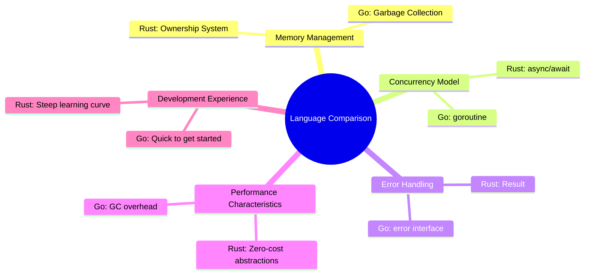
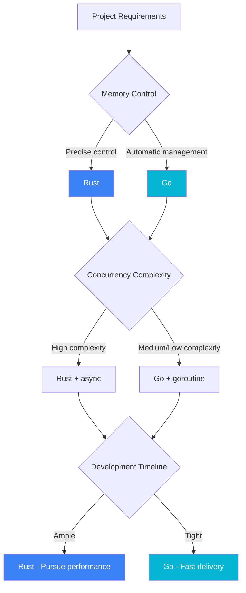

# Rust vs Go Comparison Research

This chapter provides an in-depth analysis of the differences between Rust and Go in systems programming.

## Comparison Dimensions



## Core Differences Overview

| Feature | Rust | Go |
|---------|------|-----|
| Memory Management | Compile-time ownership checks | Runtime GC |
| Concurrency Primitives | async/await + Tokio | goroutine + channel |
| Error Handling | Result<T, E> enum | error interface |
| Generics | Full generic system | Type parameters (1.18+) |
| Package Management | Cargo | go mod |
| Compilation Speed | Slower | Very fast |
| Binary Size | Smaller | Larger |
| Learning Curve | Steep | Gradual |

## Detailed Comparisons

### [Memory Model](/comparison/memory)

In-depth comparison of memory management strategies between the two languages:

- Rust's ownership system
- Go's garbage collection mechanism
- Memory safety guarantees
- Performance implications

### [Concurrency Model](/comparison/concurrency)

Comparison of concurrent programming paradigms between the two languages:

- Rust's async/await
- Go's goroutine + channel
- Data race handling
- Concurrency pattern examples

### [Error Handling](/comparison/errors)

Analysis of error handling philosophies between the two languages:

- Rust's Result type
- Go's error interface
- Error propagation mechanisms
- Best practices

### [Performance Benchmarks](/comparison/benchmarks)

View detailed performance test data:

- Startup time
- Memory usage
- Throughput
- Binary size

## Selection Guide



### Scenarios for Choosing Rust

- Need precise memory control
- Performance is the primary goal
- Embedded or resource-constrained environments
- Long-running services (no GC pauses)

### Scenarios for Choosing Go

- Rapid iterative development
- Limited team experience
- Network service development
- DevOps tool development

## Code Comparison Examples

### Hello World

```rust
// Rust
fn main() {
    println!("Hello, World!");
}
```

```go
// Go
package main

import "fmt"

func main() {
    fmt.Println("Hello, World!")
}
```

### Error Handling

```rust
// Rust
fn read_file(path: &str) -> Result<String, std::io::Error> {
    std::fs::read_to_string(path)
}

// Usage
match read_file("config.txt") {
    Ok(content) => println!("{}", content),
    Err(e) => eprintln!("Error: {}", e),
}
```

```go
// Go
func readFile(path string) (string, error) {
    return os.ReadFile(path)
}

// Usage
content, err := readFile("config.txt")
if err != nil {
    fmt.Fprintf(os.Stderr, "Error: %v\n", err)
    return
}
fmt.Println(string(content))
```

### Concurrency

```rust
// Rust - async
use tokio;

#[tokio::main]
async fn main() {
    let handle = tokio::spawn(async {
        println!("Hello from async task");
    });
    handle.await.unwrap();
}
```

```go
// Go - goroutine
func main() {
    go func() {
        fmt.Println("Hello from goroutine")
    }()
    time.Sleep(time.Second)
}
```

## Application in This Project

In the Build Your Own Tools project:

| Tool | Rust Implementation | Go Implementation | Rationale |
|------|--------------------|--------------------|-----------|
| dos2unix | ✅ | ❌ | Single language example is sufficient |
| gzip | ✅ | ✅ | Compare compression performance |
| htop | ✅ | ✅ | Compare TUI and concurrency |

## Next Steps

- 🧠 Read [Memory Model Comparison](/comparison/memory) to understand memory management differences
- ⚡ Read [Concurrency Model Comparison](/comparison/concurrency) to learn concurrent programming
- 🔧 Read [Error Handling Comparison](/comparison/errors) to master error handling patterns
- 📊 Read [Performance Benchmarks](/comparison/benchmarks) to view real-world test data
