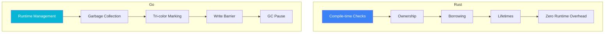
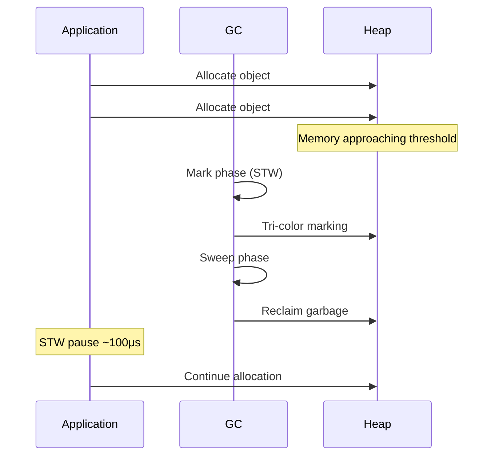
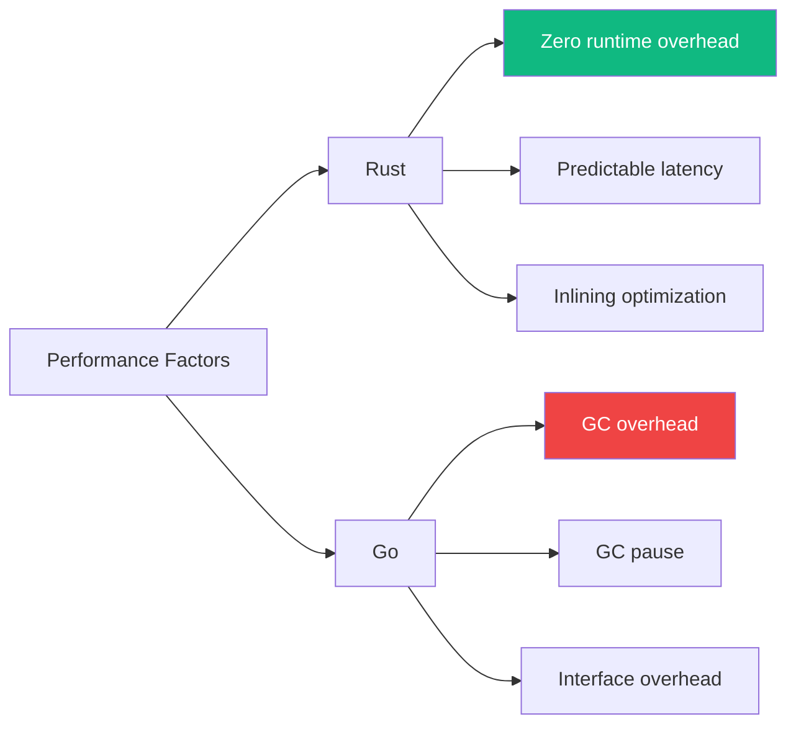

# Memory Model Comparison

This document provides an in-depth comparison of memory management strategies between Rust and Go.

## Core Differences



## Rust: Ownership System

### Ownership Rules

1. Each value has one and only one owner
2. A value is dropped when its owner goes out of scope
3. A value can be moved or borrowed

```rust
// Ownership transfer
let s1 = String::from("hello");
let s2 = s1;  // s1 is no longer valid
// println!("{}", s1);  // Compilation error

// Borrowing
let s3 = String::from("world");
let len = calculate_length(&s3);  // Borrowed, ownership not transferred
println!("{}", s3);  // Still valid

fn calculate_length(s: &String) -> usize {
    s.len()
}  // s goes out of scope, but String is not dropped because it's only borrowed
```

### Borrowing Rules

```rust
// Rule: either one mutable reference, or any number of immutable references
let mut s = String::from("hello");

// OK: one mutable reference
let r1 = &mut s;

// Compilation error: cannot have both mutable and immutable references
// let r2 = &s;  // Error
// let r3 = &mut s;  // Error

// OK: after reference scope ends
let r1 = &s;  // Immutable borrow
let r2 = &s;  // Immutable borrow
println!("{} {}", r1, r2);
// r1 and r2 are no longer used after this point

let r3 = &mut s;  // Mutable borrow
r3.push_str(" world");
```

### Lifetimes

```rust
// Explicit lifetime annotation
fn longest<'a>(x: &'a str, y: &'a str) -> &'a str {
    if x.len() > y.len() { x } else { y }
}

// Struct lifetime
struct Holder<'a> {
    value: &'a str,
}

impl<'a> Holder<'a> {
    fn get(&self) -> &'a str {
        self.value
    }
}
```

## Go: Garbage Collection

### Memory Allocation

```go
// Stack allocation (escape analysis)
func stackAlloc() int {
    x := 42  // Likely on stack
    return x
}

// Heap allocation (escape)
func heapAlloc() *int {
    x := 42  // Escapes to heap
    return &x
}

// Slice allocation
func sliceAlloc() []int {
    // Underlying array on heap
    s := make([]int, 1000)
    return s
}
```

### How GC Works



### Escape Analysis

```bash
# View escape analysis
go build -gcflags="-m" main.go

# Output example
./main.go:10:6: moved to heap: x
./main.go:15:6: does not escape
```

## Comparison Analysis

### Memory Safety

| Aspect | Rust | Go |
|--------|------|-----|
| Null Pointers | Prevented at compile time | Runtime panic |
| Data Races | Prevented at compile time | Runtime detection |
| Dangling Pointers | Prevented at compile time | GC prevents |
| Buffer Overflow | Compile-time check | Runtime check |

### Performance Impact



### Memory Usage

| Scenario | Rust | Go |
|----------|------|-----|
| Empty program | ~300 KB | ~2 MB |
| HTTP service | ~5 MB | ~15 MB |
| Long-running | Stable | Fluctuates with GC |

## Real-World Examples

### dos2unix Memory Usage

```rust
// Rust - fixed buffer
let mut buf = [0u8; 8192];  // Stack allocated
loop {
    let n = reader.read(&mut buf)?;
    if n == 0 { break; }
    // Process buf
}
```

```go
// Go - dynamic allocation
buf := make([]byte, 8192)  // Heap allocated
for {
    n, err := reader.Read(buf)
    if err == io.EOF {
        break
    }
    // Process buf
}
```

### htop Process List

```rust
// Rust - avoid allocation
struct ProcessInfo<'a> {
    pid: u32,
    name: &'a str,  // Borrowed, not copied
}

fn get_processes() -> Vec<ProcessInfo<'static>> {
    // ...
}
```

```go
// Go - relies on GC
type ProcessInfo struct {
    PID  uint32
    Name string  // Copied
}

func getProcesses() []ProcessInfo {
    // ...
}
```

## Best Practices

### Rust

```rust
// 1. Prefer borrowing
fn process(data: &str) -> usize {
    data.len()
}

// 2. Use Cow to avoid unnecessary copies
use std::borrow::Cow;
fn transform(input: &str) -> Cow<str> {
    if input.contains("special") {
        Cow::Owned(input.replace("special", "normal"))
    } else {
        Cow::Borrowed(input)
    }
}

// 3. Use Arc for shared ownership
use std::sync::Arc;
let shared = Arc::new(large_data);
let cloned = Arc::clone(&shared);
```

### Go

```go
// 1. Reduce escapes
func process(data string) int {
    return len(data)  // Does not escape
}

// 2. Object pool
var bufPool = sync.Pool{
    New: func() interface{} {
        return make([]byte, 1024)
    },
}

func useBuffer() {
    buf := bufPool.Get().([]byte)
    defer bufPool.Put(buf)
    // Use buf
}

// 3. Pre-allocation
func preallocate() {
    // Known size, pre-allocate
    items := make([]Item, 0, expectedSize)
    // ...
}
```

## Related Documents

- [Comparison Research Overview](/comparison/) — Comparison overview
- [Concurrency Model Comparison](/comparison/concurrency) — Concurrency differences
- [Performance Benchmarks](/comparison/benchmarks) — Real-world test data
