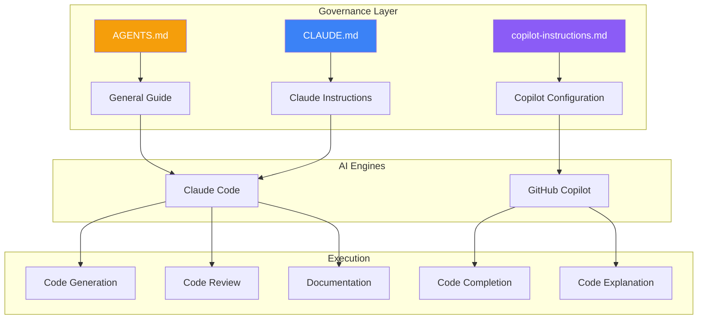
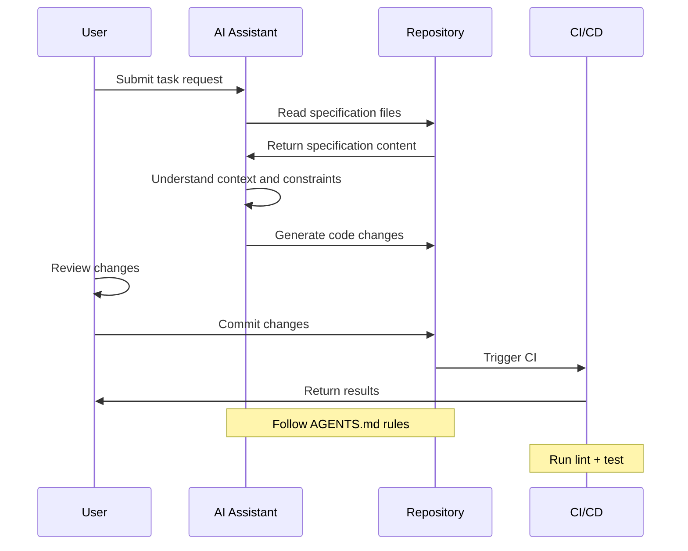

# AI Collaboration Guide

This document describes how to collaborate efficiently with AI assistants in the Build Your Own Tools project.

## Governance Layer Design



## AGENTS.md

General AI collaboration guide that defines the project's basic rules.

### Structure Example

```markdown
# AGENTS.md

## Working Principles

1. **Read specs first** - Read relevant OpenSpec specifications before starting work
2. **Stay consistent** - Follow existing code style and patterns
3. **Incremental changes** - Small commits, atomic changes
4. **Test first** - New features must have test coverage

## Code Standards

- Rust: Follow rustfmt and clippy suggestions
- Go: Follow gofmt and golangci-lint suggestions

## Commit Convention

Use Conventional Commits:
- feat: New feature
- fix: Bug fix
- docs: Documentation update
- refactor: Refactoring
```

### Key Content

| Section | Content |
|---------|---------|
| Working Principles | Basic rules AI should follow |
| Code Standards | Language-specific coding style |
| Commit Convention | Git commit message format |
| Prohibited Actions | Things AI should not do |

## CLAUDE.md

Claude-specific instructions, placed in the project root directory.

### Project Positioning

```markdown
# CLAUDE.md

## Project Positioning

This repository is a **learning repository**, with goals to:
- Teach system programming concepts
- Compare Rust and Go languages
- Demonstrate engineering best practices

## Current Phase

The project is in the **archive phase**, with priorities:
1. Stability > New features
2. Documentation > Code additions
3. Clean up technical debt

## Working Method

1. First run `openspec list` to check the active phase
2. Read relevant specification files
3. Work within the phase scope
4. Run validation commands to confirm changes are effective
```

### Effective Instruction Patterns

```markdown
## Effective Instruction Patterns

### Starting Work
1. Check the current phase in `openspec/changes/active/`
2. Read `proposal.md`, `design.md`, `tasks.md`
3. Execute tasks within the phase scope

### Code Changes
- Only modify necessary files
- Maintain consistency with existing code style
- Add necessary tests

### Validation
Run the following commands to validate changes:
\`\`\`bash
make lint-all
make test-all
npm run docs:build
\`\`\`
```

## GitHub Copilot

`.github/copilot-instructions.md` configures Copilot behavior.

### Example Configuration

```markdown
# GitHub Copilot Instructions

## Project Overview

This is a system programming learning repository containing Rust and Go implementations of three CLI tools.

## Code Style

### Rust
- Use `thiserror` for error type definitions
- Prefer `Result<T, E>` over panic
- Add documentation comments (`///`)

### Go
- Use the standard library's `error` interface
- Follow Go's idiomatic error handling patterns
- Add package-level comments

## Prohibited Actions

- Do not modify OpenSpec specification files
- Do not add new dependencies (unless necessary)
- Do not modify CI configuration files
```

## Best Practices

### 1. Clear Context

```markdown
<!-- Good instruction -->
Add UTF-16 BOM detection to the dos2unix tool.
Refer to the specification in openspec/specs/dos2unix/spec.md.
Ensure corresponding unit tests are added.

<!-- Bad instruction -->
Add BOM detection.
```

### 2. Specify Validation

```markdown
<!-- Good instruction -->
Implement streaming decompression for gzip.
After completion, run `cargo test --all` and `go test ./...` to verify.

<!-- Bad instruction -->
Implement decompression.
```

### 3. Limit Scope

```markdown
<!-- Good instruction -->
Only modify the compress function in src/lib.rs.
Do not modify other files.

<!-- Bad instruction -->
Modify whatever files are needed.
```

## Workflow



## Debugging AI Output

When AI output does not meet expectations:

1. **Check context** - Ensure AI read the correct specification files
2. **Clarify constraints** - Add more constraints to the instructions
3. **Step-by-step execution** - Break large tasks into smaller steps
4. **Provide examples** - Give examples of expected output

## Related Documents

- [OpenSpec Workflow](/specs/openspec-workflow) — Change Management
- [CI/CD Design](/engineering/cicd) — Automated Verification
- [Documentation Strategy](/engineering/documentation) — Documentation Maintenance
