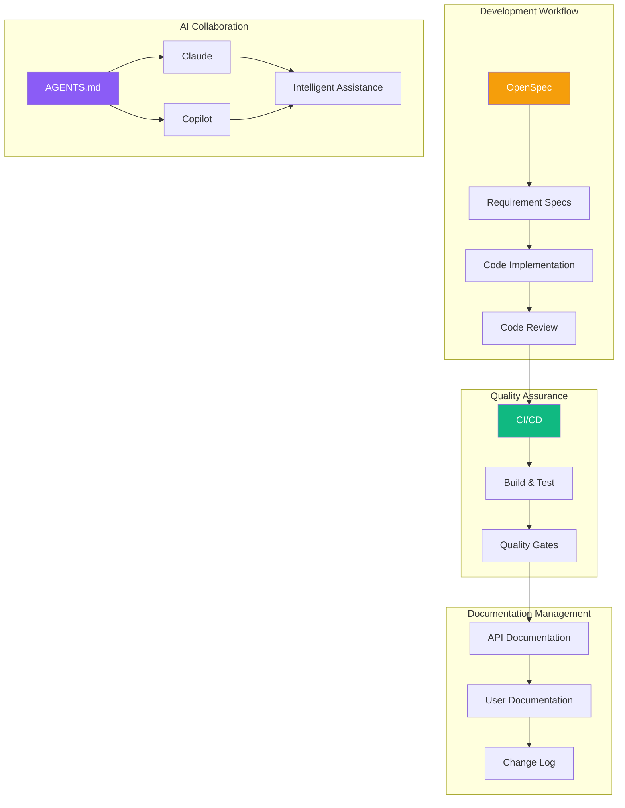
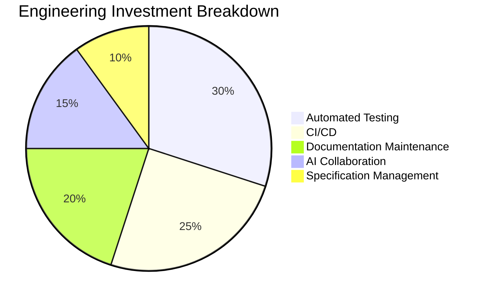

# Engineering Practices Overview

This chapter introduces the engineering practices of the Build Your Own Tools project.

## Engineering Architecture

## Chapter Contents

### [AI Collaboration Guide](/engineering/ai-collaboration)

How to collaborate efficiently with AI assistants:

- AGENTS.md configuration
- CLAUDE.md instructions
- Copilot integration
- Best practices

### [CI/CD Design](/engineering/cicd)

Continuous integration and deployment workflow:

- GitHub Actions workflows
- Build matrix
- Quality gates
- Release process

### [Documentation Strategy](/engineering/documentation)

Documentation maintenance strategy:

- Documentation structure
- API documentation generation
- Change log management
- Versioning strategy

## Key Files

| File | Purpose |
|------|---------|
| `AGENTS.md` | General AI collaboration guide |
| `CLAUDE.md` | Claude-specific instructions |
| `.github/copilot-instructions.md` | GitHub Copilot configuration |
| `.github/workflows/*.yml` | CI/CD workflows |
| `CHANGELOG.md` | Change log |

## Engineering Benefits

### Efficiency Improvement

| Area | Improvement |
|------|-------------|
| Issue Detection | 70% earlier |
| Release Cycle | 50% shorter |
| Documentation Sync | 90% automated |
| Code Review | 40% more efficient |

## Next Steps

- Read the [AI Collaboration Guide](/engineering/ai-collaboration) to learn about AI-assisted development
- Read the [CI/CD Design](/engineering/cicd) to learn about automated workflows
- Read the [Documentation Strategy](/engineering/documentation) to master documentation maintenance
