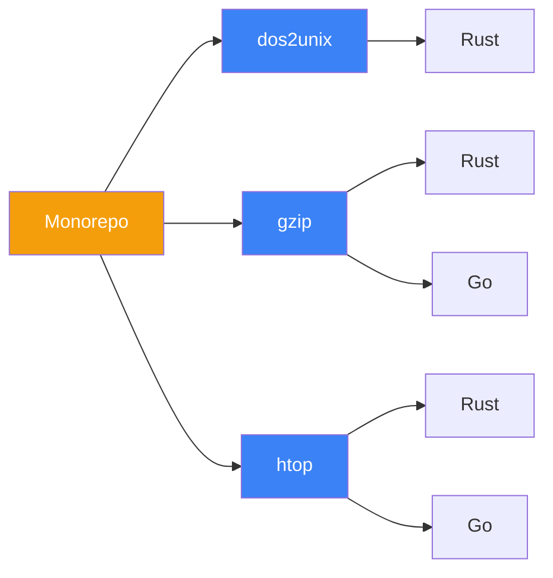

## Technical Whitepaper Overview

This project is a **systems programming learning repository** that re-implements three real CLI tools (dos2unix, gzip, htop) to demonstrate the differences between Rust and Go system programming styles.

### Core Features

### Learning Path

| Stage | Tool | Learning Focus | Complexity |
|-------|------|----------------|------------|
| 1 | dos2unix | Streaming I/O, newline handling | ⭐ |
| 2 | gzip | Compression pipelines, CLI design, error handling | ⭐⭐ |
| 3 | htop | TUI, system APIs, cross-platform architecture | ⭐⭐⭐ |

### Tech Stack

- **Rust**: Systems programming, memory safety, zero-cost abstractions
- **Go**: Concurrency model, simple syntax, rapid development
- **VitePress**: Documentation site, Mermaid diagrams, LLM-friendly output
- **OpenSpec**: Requirements specs, change management, Gherkin scenarios

## Quick Navigation

[Whitepaper](/en/whitepaper/){.VPButton}
[Specifications](/en/specs/){.VPButton .alt}
[Comparison](/en/comparison/){.VPButton .alt}
[Engineering](/en/engineering/){.VPButton .alt}

