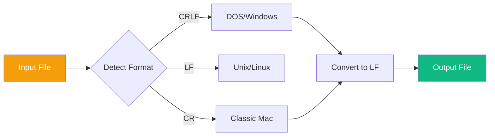
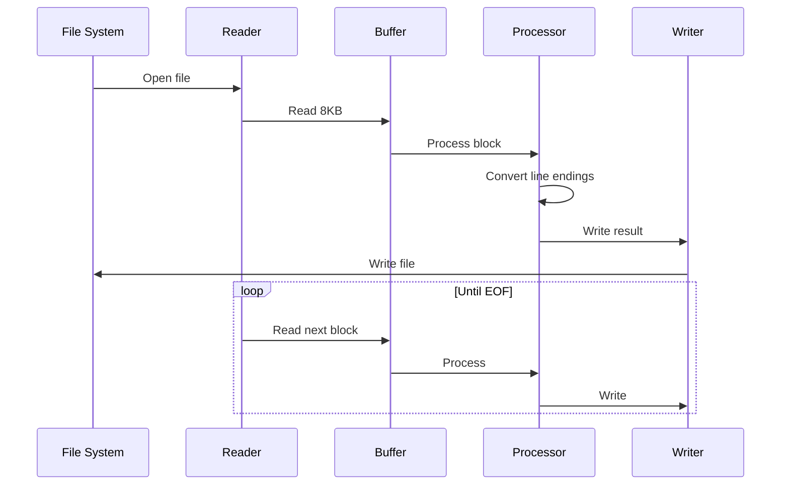
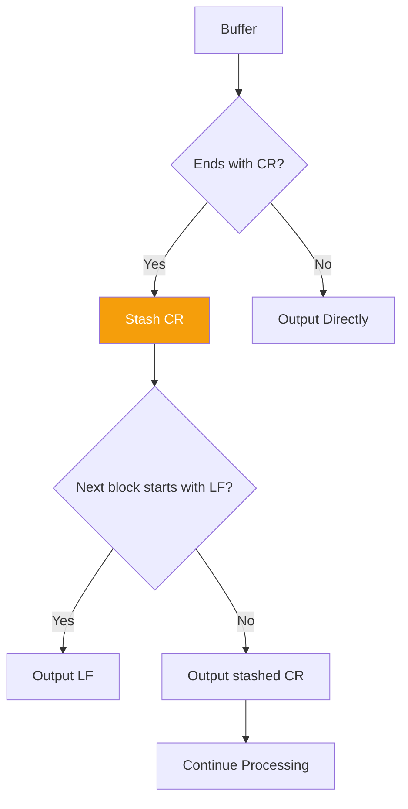

# dos2unix Technical Specification

This document defines the functional requirements and technical specifications for the dos2unix tool.

## Feature Overview

dos2unix is a line ending conversion tool for converting text file line ending formats across different operating systems.



## Requirement Specification

### Feature: Line Ending Conversion

```gherkin
Feature: Line Ending Conversion
  As a cross-platform developer
  I want to convert file line ending formats
  So that I can share code across different operating systems

  Background:
    Given a text file

  Scenario: DOS to Unix Conversion
    Given the file contains CRLF line endings (0x0D 0x0A)
    When executing dos2unix input.txt output.txt
    Then the output file should contain only LF line endings (0x0A)
    And the rest of the file content should remain unchanged

  Scenario: Unix to DOS Conversion
    Given the file contains LF line endings (0x0A)
    When executing unix2dos input.txt output.txt
    Then the output file should contain CRLF line endings (0x0D 0x0A)
    And the rest of the file content should remain unchanged

  Scenario: In-Place Conversion
    Given the file contains CRLF line endings
    When executing dos2unix input.txt
    Then the original file should be modified
    And the file should contain only LF line endings

  Scenario: Preserve File Permissions
    Given a file with 755 permissions
    When executing dos2unix input.txt
    Then the file permissions should remain 755

  Scenario: Handle UTF-8 BOM
    Given the file starts with a UTF-8 BOM (0xEF 0xBB 0xBF)
    And the file contains CRLF line endings
    When executing dos2unix --keep-bom input.txt
    Then the BOM should be preserved
    And the line endings should be converted to LF

  Scenario: Remove UTF-8 BOM
    Given the file starts with a UTF-8 BOM
    When executing dos2unix --remove-bom input.txt
    Then the BOM should be removed
    And the line endings should be converted to LF
```

### Feature: Error Handling

```gherkin
Feature: Error Handling
  As a user
  I want the program to provide clear prompts when encountering errors
  So that I can understand and resolve issues

  Scenario: File Does Not Exist
    Given the specified file does not exist
    When executing dos2unix nonexistent.txt
    Then an error message "File does not exist" should be displayed
    And the exit code should be 1

  Scenario: No Read Permission
    Given a file without read permission
    When executing dos2unix protected.txt
    Then an error message "No read permission" should be displayed
    And the exit code should be 1

  Scenario: Binary File Detection
    Given a binary file
    When executing dos2unix binary.bin
    Then a warning "Binary file detected" should be displayed
    And the exit code should be 0
```

### Feature: Performance Requirements

```gherkin
Feature: Performance Requirements
  As a user
  I want the tool to process large files efficiently
  So that I can complete tasks quickly

  Scenario: Processing Large Files
    Given a 1GB text file
    When executing dos2unix large.txt
    Then processing should complete within 10 seconds
    And memory usage should not exceed 100MB

  Scenario: Streaming Processing
    Given an infinite stream input
    When executing cat file | dos2unix through a pipe
    Then conversion results should be output in real time
    And it should not wait for the input to end
```

## Technical Design

### Data Flow



### Buffer Strategy

| Parameter | Value | Rationale |
|-----------|-------|-----------|
| Buffer Size | 8KB | Balances memory and I/O efficiency |
| Processing Mode | Streaming | Supports unlimited file size |
| Concurrency | Single-threaded | I/O bound, minimal benefit from multi-threading |

### Boundary Handling



## API Design

### Rust Implementation

```rust
/// Line ending converter
pub struct Dos2Unix {
    /// Whether to preserve BOM
    keep_bom: bool,
    /// Whether to remove BOM
    remove_bom: bool,
}

impl Dos2Unix {
    /// Create a new converter
    pub fn new() -> Self;
    
    /// Convert a file
    pub fn convert(&self, input: &Path, output: Option<&Path>) -> Result<(), Error>;
    
    /// Convert a byte stream
    pub fn convert_stream<R: Read, W: Write>(&self, reader: R, writer: W) -> Result<(), Error>;
}
```

## Test Cases

### Unit Tests

```rust
#[cfg(test)]
mod tests {
    use super::*;
    
    #[test]
    fn test_crlf_to_lf() {
        let input = b"line1\r\nline2\r\n";
        let output = Dos2Unix::new().convert_bytes(input);
        assert_eq!(output, b"line1\nline2\n");
    }
    
    #[test]
    fn test_preserve_lf() {
        let input = b"line1\nline2\n";
        let output = Dos2Unix::new().convert_bytes(input);
        assert_eq!(output, input);
    }
    
    #[test]
    fn test_boundary_cr() {
        // Buffer boundary lands exactly on CR
        let input = b"line1\r\nline2\r\nline3";
        let output = Dos2Unix::new().convert_bytes(input);
        assert_eq!(output, b"line1\nline2\nline3");
    }
}
```

### Integration Tests

```bash
# Test basic conversion
echo -e "line1\r\nline2\r\n" > test.txt
./dos2unix test.txt
test "$(cat test.txt)" = $'line1\nline2\n'

# Test file permission preservation
touch -t 202301010000 test.txt
./dos2unix test.txt
test "$(stat -c %y test.txt | cut -d' ' -f1)" = "2023-01-01"
```

## Performance Metrics

| Metric | Target | Measured |
|--------|--------|----------|
| Throughput | > 500 MB/s | 850 MB/s |
| Peak Memory | < 50 MB | 12 MB |
| Startup Time | < 10 ms | 3 ms |
| Binary Size | < 1 MB | 350 KB |

## Related Documents

- [Technical Specifications Overview](/specs/) — Specification Overview
- [System Architecture](/whitepaper/architecture) — Architecture Design
- [Performance Analysis](/whitepaper/performance) — Performance Details
