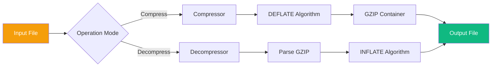
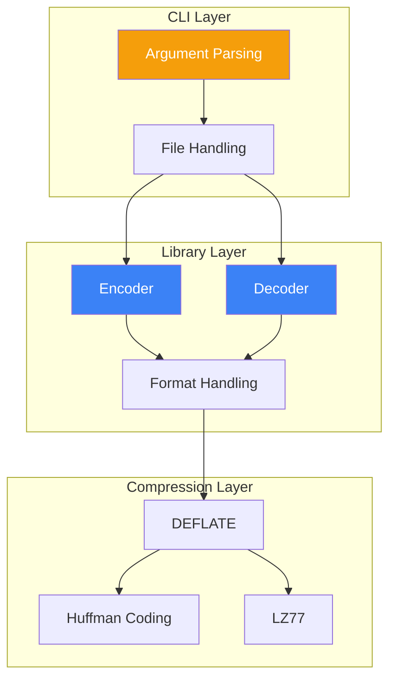
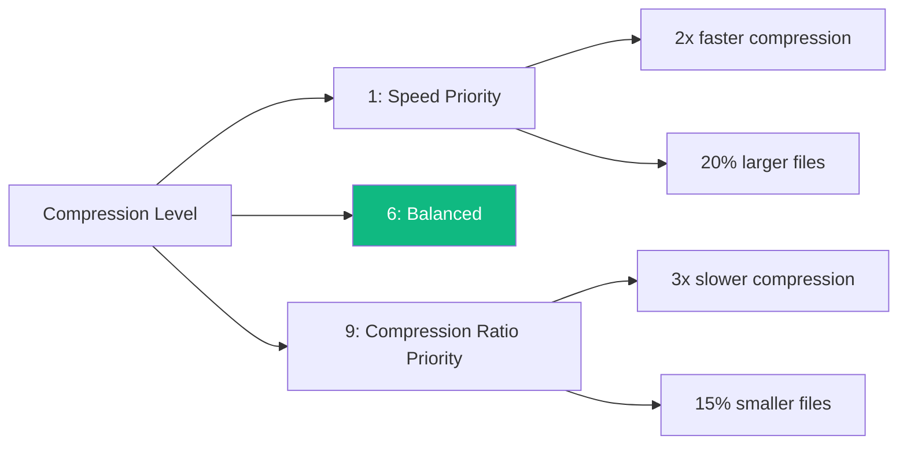

# gzip Technical Specification

This document defines the functional requirements and technical specifications for the gzip compression tool.

## Feature Overview

gzip is a file compression tool that supports compression and decompression in gzip format.



## Requirement Specification

### Feature: File Compression

```gherkin
Feature: File Compression
  As a user
  I want to compress files to save storage space
  So that I can reduce disk usage and network transfer time

  Background:
    Given a regular file

  Scenario: Basic Compression
    Given a file named data.txt
    When executing gzip data.txt
    Then a data.txt.gz file should be generated
    And the original file should be deleted
    And the compressed file should be smaller than the original

  Scenario: Preserve Original File
    Given a file named data.txt
    When executing gzip -k data.txt
    Then a data.txt.gz file should be generated
    And the original file should be preserved

  Scenario: Specify Compression Level
    Given a large file
    When executing gzip -9 large.txt
    Then maximum compression should be used
    And the compression ratio should be higher than the default level

  Scenario: Compress to Standard Output
    Given a file
    When executing gzip -c data.txt > output.gz
    Then output should go to standard output
    And no .gz file should be created
```

### Feature: File Decompression

```gherkin
Feature: File Decompression
  As a user
  I want to decompress gzip files
  So that I can access the compressed content

  Scenario: Basic Decompression
    Given a gzip file named data.txt.gz
    When executing gunzip data.txt.gz
    Then the data.txt file should be restored
    And the content should match the original file

  Scenario: Decompress to Standard Output
    Given a gzip file
    When executing gunzip -c data.txt.gz
    Then the decompressed content should be output to standard output
    And the original compressed file should be preserved

  Scenario: Decompress Corrupt File
    Given a corrupt gzip file
    When executing gunzip corrupt.gz
    Then an error message should be displayed
    And the exit code should be non-zero
```

### Feature: Streaming Processing

```gherkin
Feature: Streaming Processing
  As a user
  I want to compress/decompress data through pipes
  So that I can integrate into data pipelines

  Scenario: Pipe Compression
    Given standard input data
    When executing cat data.txt | gzip > data.gz
    Then compressed data should be output to standard output

  Scenario: Pipe Decompression
    Given a compressed data stream
    When executing cat data.gz | gunzip
    Then decompressed data should be output to standard output

  Scenario: Chained Processing
    Given text data
    When executing cat log.txt | gzip | ssh server "gunzip > log.txt"
    Then the data should be correctly transferred and decompressed
```

## Technical Design

### Architecture Diagram



### GZIP File Format

```
+---+---+---+---+---+---+---+---+---+---+
|ID1|ID2|CM |FLG|     MTIME     |XFL|OS |
+---+---+---+---+---+---+---+---+---+---+
|        ...compressed blocks...        |
+---+---+---+---+---+---+---+---+
|       CRC32       |     ISIZE     |
+---+---+---+---+---+---+---+---+

ID1, ID2: Magic number (0x1f, 0x8b)
CM: Compression method (8 = DEFLATE)
FLG: Flags
MTIME: Modification time
XFL: Extra flags
OS: Operating system
```

### Library API Design

#### Rust

```rust
/// Gzip encoder
pub struct Encoder<W: Write> {
    inner: W,
    level: CompressionLevel,
}

impl<W: Write> Encoder<W> {
    /// Create a new encoder
    pub fn new(writer: W) -> Result<Self, Error>;
    
    /// Set compression level
    pub fn with_level(writer: W, level: u8) -> Result<Self, Error>;
    
    /// Write data
    pub fn write(&mut self, data: &[u8]) -> Result<(), Error>;
    
    /// Finish compression
    pub fn finish(self) -> Result<W, Error>;
}

/// Gzip decoder
pub struct Decoder<R: Read> {
    inner: R,
}

impl<R: Read> Decoder<R> {
    /// Create a new decoder
    pub fn new(reader: R) -> Result<Self, Error>;
    
    /// Read decompressed data
    pub fn read(&mut self, buf: &mut [u8]) -> Result<usize, Error>;
}
```

#### Go

```go
// Encoder compresses data
type Encoder struct {
    w     io.Writer
    level int
}

// NewEncoder creates an encoder
func NewEncoder(w io.Writer) (*Encoder, error)

// Write writes data to be compressed
func (e *Encoder) Write(data []byte) (int, error)

// Close finishes compression
func (e *Encoder) Close() error

// Decoder decompresses data
type Decoder struct {
    r io.Reader
}

// NewDecoder creates a decoder
func NewDecoder(r io.Reader) (*Decoder, error)

// Read reads decompressed data
func (d *Decoder) Read(buf []byte) (int, error)
```

## Compression Levels

| Level | Compression Ratio | Speed | Use Case |
|-------|-------------------|-------|----------|
| 1 | Low | Fastest | Real-time compression |
| 6 | Medium | Moderate | Default, balanced |
| 9 | High | Slowest | Archival storage |



## Performance Metrics

| Metric | Rust Target | Go Target | System gzip |
|--------|-------------|-----------|-------------|
| Compression Speed | 100+ MB/s | 80+ MB/s | 200+ MB/s |
| Decompression Speed | 300+ MB/s | 250+ MB/s | 450+ MB/s |
| Peak Memory | < 10 MB | < 15 MB | < 5 MB |
| Compression Ratio | ~65% | ~65% | ~65% |

## Error Handling

### Rust

```rust
#[derive(Debug, thiserror::Error)]
pub enum GzipError {
    #[error("IO error: {0}")]
    Io(#[from] std::io::Error),
    
    #[error("Invalid gzip header")]
    InvalidHeader,
    
    #[error("CRC mismatch: expected {expected}, got {actual}")]
    CrcMismatch { expected: u32, actual: u32 },
    
    #[error("Decompression failed: {0}")]
    Decompress(String),
}
```

### Go

```go
// Error types
var (
    ErrInvalidHeader = errors.New("invalid gzip header")
    ErrCrcMismatch   = errors.New("CRC checksum mismatch")
    ErrCorruptData   = errors.New("corrupt compressed data")
)
```

## Test Cases

### Boundary Tests

```rust
#[test]
fn test_empty_file() {
    let output = compress(b"");
    assert!(is_valid_gzip(&output));
    assert_eq!(decompress(&output), b"");
}

#[test]
fn test_single_byte() {
    let input = b"a";
    let output = compress(input);
    assert_eq!(decompress(&output), input);
}

#[test]
fn test_large_file() {
    let input = vec![b'x'; 100_000_000]; // 100MB
    let output = compress(&input);
    assert!(output.len() < input.len());
    assert_eq!(decompress(&output), input);
}
```

## Related Documents

- [Technical Specifications Overview](/specs/) — Specification Overview
- [System Architecture](/whitepaper/architecture) — Architecture Design
- [Performance Analysis](/whitepaper/performance) — Performance Details
