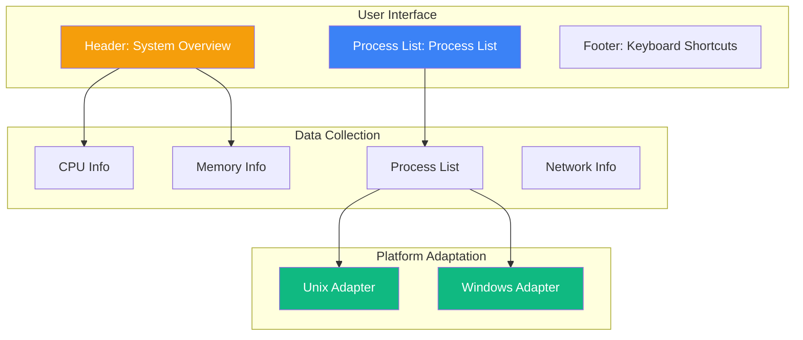
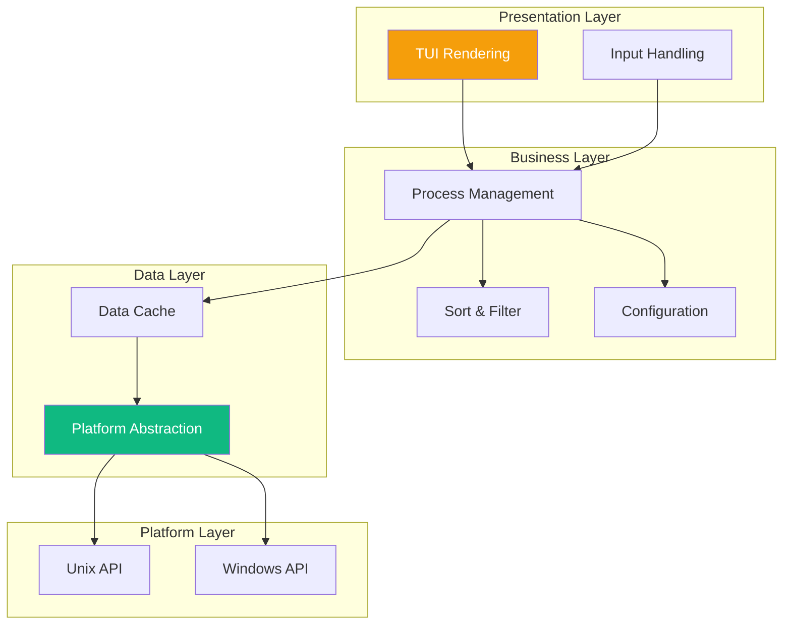
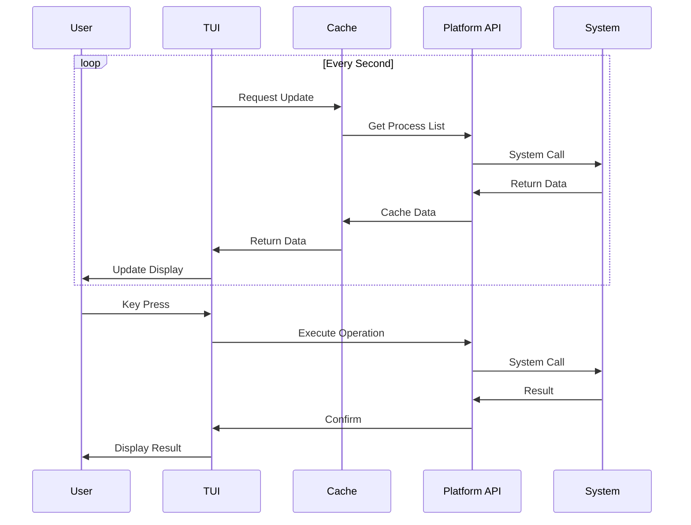

# htop Technical Specification

This document defines the functional requirements and technical specifications for the htop process monitoring tool.

## Feature Overview

htop is an interactive process viewer that provides a more user-friendly interface and more features than top.



## Requirement Specification

### Feature: System Overview

```gherkin
Feature: System Overview
  As a system administrator
  I want to quickly view system resource usage
  So that I can understand the overall system status

  Scenario: Display CPU Usage
    Given the system is running
    When launching htop
    Then the usage of each CPU core should be displayed
    And a CPU usage history chart should be shown

  Scenario: Display Memory Info
    Given the system is running
    When launching htop
    Then total memory should be displayed
    And used memory should be displayed
    And cached memory should be displayed
    And progress bars should be used for visualization

  Scenario: Display Swap Space
    Given the system has swap space configured
    When launching htop
    Then swap space usage should be displayed
```

### Feature: Process List

```gherkin
Feature: Process List
  As a user
  I want to view and manage running processes
  So that I can monitor system activity and manage resources

  Scenario: Display Process List
    Given the system has running processes
    When launching htop
    Then a process list should be displayed
    And it should include columns such as PID, USER, CPU%, MEM%, COMMAND

  Scenario: Process Sorting
    Given the process list is displayed
    When pressing F6 to select sorting
    Then sorting options should be displayed
    And after selecting an option, the list should be sorted by that column

  Scenario: Process Filtering
    Given the process list is displayed
    When pressing F3 and entering a filter condition
    Then only matching processes should be displayed

  Scenario: Process Search
    Given the process list is displayed
    When pressing F3 and entering a search term
    Then matching processes should be highlighted
```

### Feature: Process Management

```gherkin
Feature: Process Management
  As a system administrator
  I want to perform operations on processes
  So that I can manage system resources

  Scenario: Terminate Process
    Given a selected process
    When pressing F9 to select a signal
    And selecting SIGTERM
    Then the signal should be sent to the process
    And the process list should be updated

  Scenario: Change Priority
    Given a selected process
    When pressing F7 or F8
    Then the nice value should be decreased or increased

  Scenario: Process Tree View
    Given the process list is displayed
    When pressing F5 to toggle tree view
    Then parent-child relationships of processes should be displayed
```

### Feature: Cross-Platform Support

```gherkin
Feature: Cross-Platform Support
  As a user
  I want to use the same interface on different operating systems
  So that I can maintain a consistent workflow

  Scenario: Running on Unix Platform
    Given a Unix system (Linux/macOS)
    When launching htop
    Then process information should be displayed normally
    And all standard features should be supported

  Scenario: Running on Windows Platform
    Given a Windows system
    When launching htop
    Then process information should be displayed normally
    And basic features should be supported

  Scenario: Platform-Specific Features
    Given a specific platform
    When viewing the feature list
    Then platform-specific features should be marked or hidden
```

## Technical Design

### Architecture Layers



### Platform Abstraction Interface

#### Rust

```rust
/// Process information interface
pub trait ProcessInfo {
    /// Process ID
    fn pid(&self) -> u32;
    
    /// Parent process ID
    fn ppid(&self) -> u32;
    
    /// Process name
    fn name(&self) -> &str;
    
    /// Command line
    fn command(&self) -> &str;
    
    /// Username
    fn user(&self) -> &str;
    
    /// CPU usage (0.0 - 100.0)
    fn cpu_usage(&self) -> f32;
    
    /// Memory usage (bytes)
    fn memory(&self) -> u64;
    
    /// Process state
    fn state(&self) -> ProcessState;
}

/// System information interface
pub trait SystemInfo {
    /// Get process list
    fn processes(&self) -> Vec<Box<dyn ProcessInfo>>;
    
    /// Get CPU info
    fn cpu_info(&self) -> CpuInfo;
    
    /// Get memory info
    fn memory_info(&self) -> MemoryInfo;
    
    /// Send signal
    fn send_signal(&self, pid: u32, signal: Signal) -> Result<(), Error>;
}

#[cfg(unix)]
mod unix;
#[cfg(windows)]
mod windows;
```

### Platform Differences

| Feature | Unix (Linux/macOS) | Windows |
|---------|-------------------|---------|
| Process List | `/proc` filesystem | CreateToolhelp32Snapshot |
| CPU Usage | `/proc/stat` | GetSystemTimes |
| Memory Info | `/proc/meminfo` | GlobalMemoryStatusEx |
| Process Memory | `/proc/[pid]/statm` | GetProcessMemoryInfo |
| Terminal Size | ioctl TIOCGWINSZ | GetConsoleScreenBufferInfo |
| Signal Sending | kill syscall | TerminateProcess |

### Data Flow



### TUI Framework

#### Rust (ratatui)

```rust
use ratatui::{
    layout::{Constraint, Direction, Layout},
    style::{Color, Style},
    widgets::{Block, Borders, Gauge, List, ListItem},
    Frame,
};

fn draw(frame: &mut Frame, app: &App) {
    let chunks = Layout::default()
        .direction(Direction::Vertical)
        .constraints([
            Constraint::Length(4),  // Header
            Constraint::Min(10),    // Process list
            Constraint::Length(2),  // Footer
        ])
        .split(frame.size());
    
    // Draw header
    draw_header(frame, chunks[0], app);
    
    // Draw process list
    draw_processes(frame, chunks[1], app);
    
    // Draw footer
    draw_footer(frame, chunks[2]);
}
```

#### Go (tview)

```go
import "github.com/rivo/tview"

func main() {
    app := tview.NewApplication()
    
    header := tview.NewTextView()
    processList := tview.NewList()
    footer := tview.NewTextView()
    
    flex := tview.NewFlex().
        SetDirection(tview.FlexRow).
        AddItem(header, 4, 0, false).
        AddItem(processList, 0, 1, true).
        AddItem(footer, 2, 0, false)
    
    app.SetRoot(flex, true).Run()
}
```

## Performance Metrics

| Metric | Target | Description |
|--------|--------|-------------|
| Startup Time | < 50ms | Acceptable user experience |
| Refresh Latency | < 100ms | Interactive response |
| Memory Usage | < 20MB | Long-running operation |
| CPU Usage | < 1% | When idle |

## Configuration File

```toml
# ~/.config/htop/config.toml

[display]
# Display columns
columns = ["PID", "USER", "CPU%", "MEM%", "COMMAND"]

# Sort order
sort_by = "CPU%"
sort_order = "descending"

# Update interval (ms)
update_interval = 1000

[colors]
# Color theme
cpu_normal = "green"
cpu_high = "red"
memory = "blue"
swap = "yellow"
```

## Keyboard Shortcuts

| Key | Function |
|-----|----------|
| F1 | Help |
| F3 | Search |
| F4 | Filter |
| F5 | Tree View |
| F6 | Sort |
| F7 | Decrease Priority |
| F8 | Increase Priority |
| F9 | Send Signal |
| F10 | Quit |
| q | Quit |
| h | Help |

## Related Documents

- [Technical Specifications Overview](/specs/) — Specification Overview
- [System Architecture](/whitepaper/architecture) — Cross-Platform Design
- [Design Decisions](/whitepaper/decisions) — ADR-005 Platform Abstraction Layer
