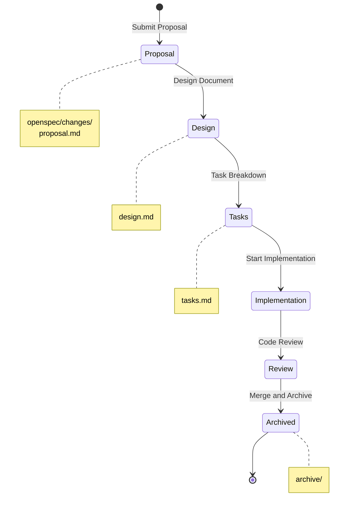

# Technical Specifications Overview

This chapter presents the **OpenSpec specifications** for the Build Your Own Tools project, using Gherkin-style requirement descriptions.

## OpenSpec Workflow



## Specification Structure

```
openspec/
├── specs/           # Functional Specifications
│   ├── project/     # Project-level Specifications
│   │   └── spec.md  # Overall Specification
│   ├── dos2unix/    # Tool Specifications
│   │   └── spec.md
│   ├── gzip/
│   │   └── spec.md
│   └── htop/
│       └── spec.md
├── changes/         # Change Management
│   ├── archive/     # Completed Changes
│   └── active/      # Current Changes
└── schemas/         # Specification Templates
```

## Gherkin Style

Uses Behavior-Driven Development (BDD) style requirement descriptions:

```gherkin
Feature: Line Ending Conversion
  As a cross-platform developer
  I want to convert file line ending formats
  So that I can share code across different operating systems

  Background:
    Given a text file

  Scenario: DOS to Unix Conversion
    Given the file contains CRLF line endings (0x0D 0x0A)
    When executing dos2unix input.txt output.txt
    Then the output file should contain only LF line endings (0x0A)
    And the rest of the file content should remain unchanged

  Scenario: Unix to DOS Conversion
    Given the file contains LF line endings (0x0A)
    When executing unix2dos input.txt output.txt
    Then the output file should contain CRLF line endings (0x0D 0x0A)
```

## Tool Specifications

| Tool | Specification | Complexity | Status |
|------|--------------|------------|--------|
| [dos2unix](/specs/dos2unix) | Line Ending Conversion Specification | ⭐ | Complete |
| [gzip](/specs/gzip) | Compression Tool Specification | ⭐⭐ | Complete |
| [htop](/specs/htop) | Process Monitoring Specification | ⭐⭐⭐ | In Progress |

## Specification Advantages

### 1. Testability

Each Scenario can be directly converted into test cases:

```rust
#[test]
fn test_dos_to_unix() {
    // Given
    let input = "line1\r\nline2\r\n";
    // When
    let output = dos2unix::convert(input);
    // Then
    assert_eq!(output, "line1\nline2\n");
}
```

### 2. Requirement Traceability


### 3. AI-Friendly

The Gherkin format is easy for AI to understand and generate code:

- Structured descriptions
- Clear input and output
- Unambiguous language

## Next Steps

- View the [OpenSpec Workflow](/specs/openspec-workflow) to learn about change management
- Read the [dos2unix Specification](/specs/dos2unix) to learn about line ending handling
- Read the [gzip Specification](/specs/gzip) to learn about compression tool design
- Read the [htop Specification](/specs/htop) to learn about process monitoring implementation
