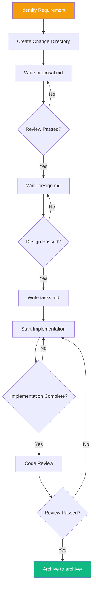
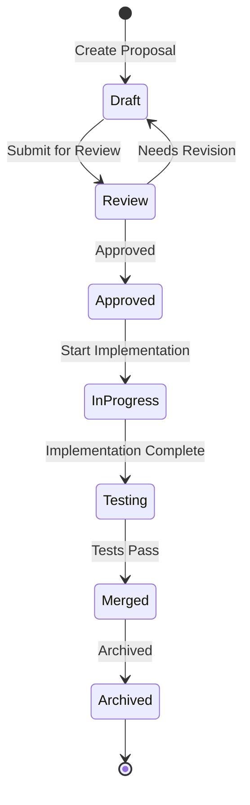
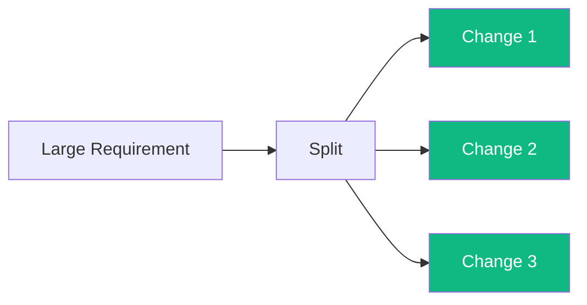

# OpenSpec Workflow

This document describes the workflow and best practices of the OpenSpec specification framework.

## Workflow Overview



## Directory Structure

```
openspec/changes/
├── archive/                    # Completed Changes
│   ├── phase-1-init/
│   │   ├── proposal.md
│   │   ├── design.md
│   │   └── tasks.md
│   └── phase-2-features/
│       └── ...
└── active/                     # Currently Active Changes
    └── phase-3-optimization/
        ├── proposal.md
        ├── design.md
        └── tasks.md
```

## Document Templates

### proposal.md

```markdown
# Proposal Title

## Background
Describe why this change is needed.

## Goals
- Goal 1
- Goal 2

## Scope
Describe the boundaries of the change.

## Non-Goals
Clearly state what is out of scope.

## Impact Assessment
- Performance Impact: ?
- Compatibility Impact: ?
- Documentation Impact: ?
```

### design.md

```markdown
# Design Document

## Overview
General description of the design approach.

## Architecture Changes
Describe the impact on the existing architecture.

## API Design
```rust
// New API example
pub fn new_function() -> Result<(), Error>;
```

## Data Structures
```rust
struct NewStruct {
    field: String,
}
```

## Implementation Plan
1. Step one
2. Step two
3. Step three
```

### tasks.md

```markdown
# Task List

## Must Complete
- [ ] Task one
- [ ] Task two

## Optional Optimizations
- [ ] Optimization one

## Acceptance Criteria
- [ ] All tests pass
- [ ] Documentation updated
```

## Change Lifecycle



## Best Practices

### 1. Single Responsibility

Each change should address only one problem:



### 2. Atomic Commits

Each commit should be a complete logical unit:

```bash
# Good commit
git commit -m "feat(dos2unix): add UTF-16 BOM detection"

# Bad commit
git commit -m "fix some bugs and add features"
```

### 3. Testable Requirements

Each requirement should be verifiable:

```gherkin
# Good: testable
Then the output file size should be less than 50% of the input file size

# Bad: not testable
Then performance should improve
```

## Tool Support

### OpenSpec CLI

```bash
# Create a new change
openspec new phase-4-new-feature

# Check specification completeness
openspec validate

# Archive completed changes
openspec archive phase-4-new-feature
```

### Git Hooks

```bash
# pre-commit hook
#!/bin/bash
openspec validate || exit 1
```

## Related Documents

- [Technical Specifications Overview](/specs/) — Specification Overview
- [CI/CD Design](/engineering/cicd) — Workflow Integration
- [Documentation Strategy](/engineering/documentation) — Documentation Maintenance
