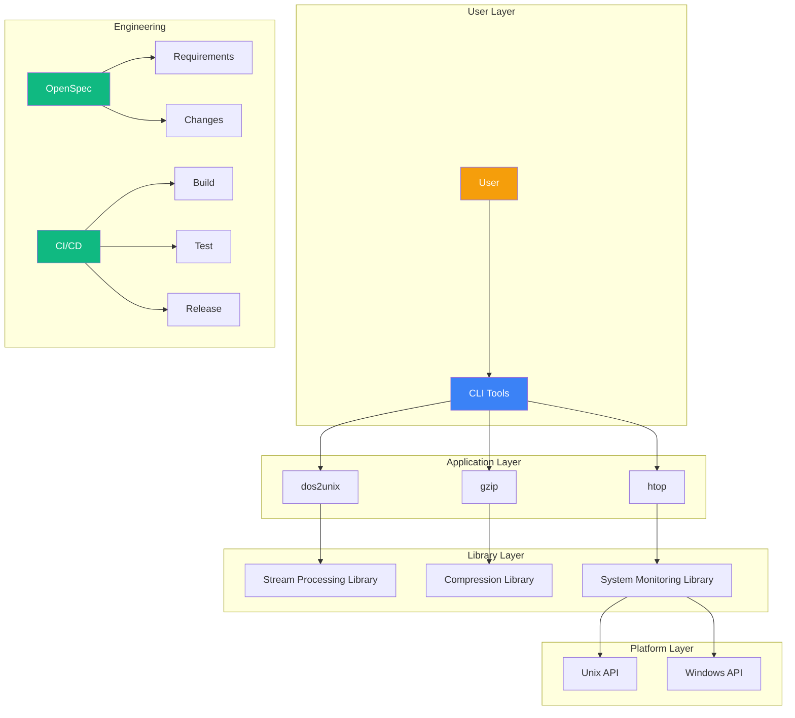
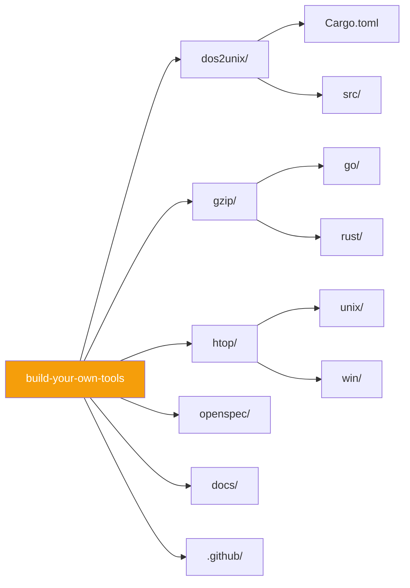
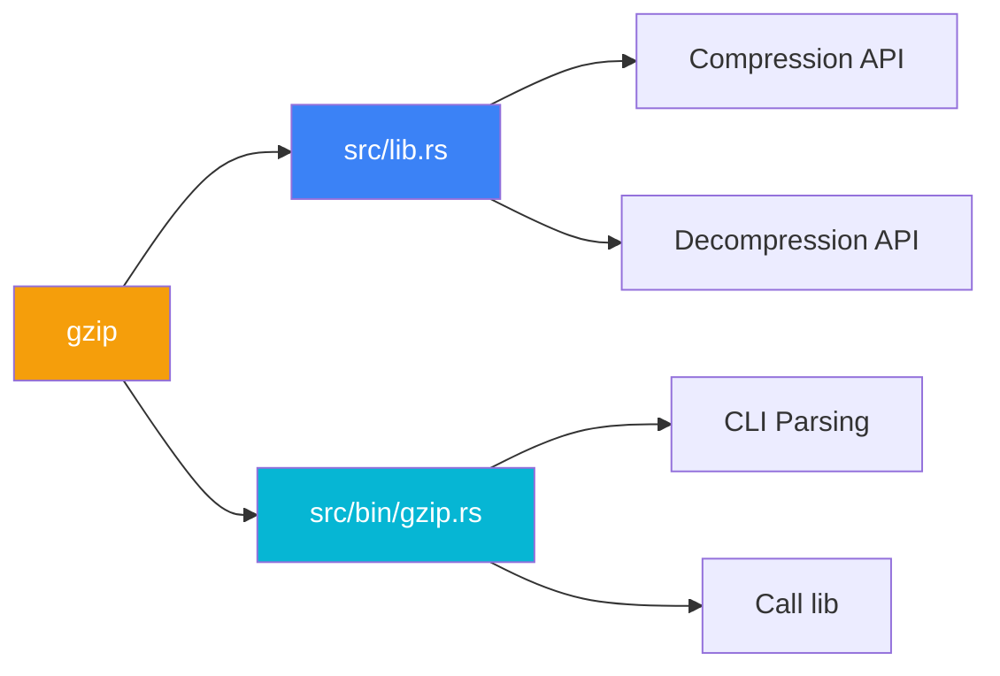
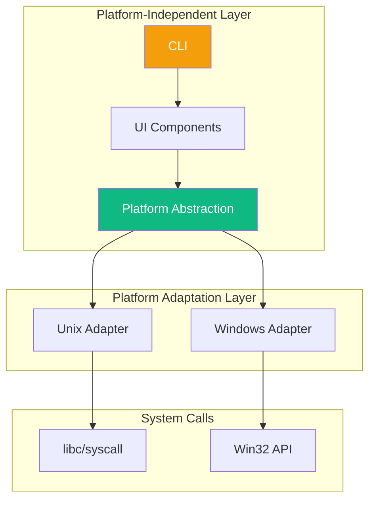
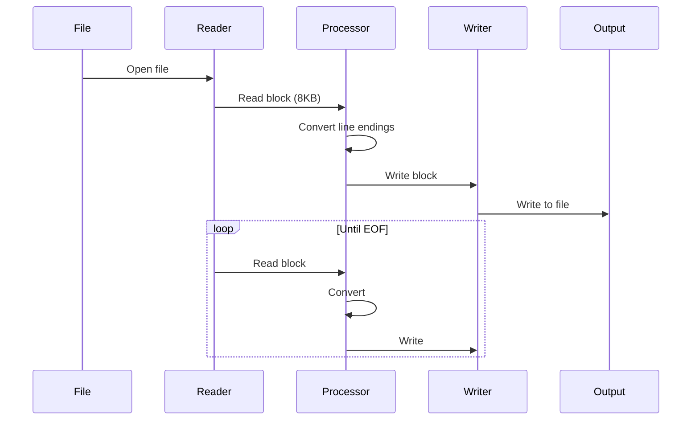
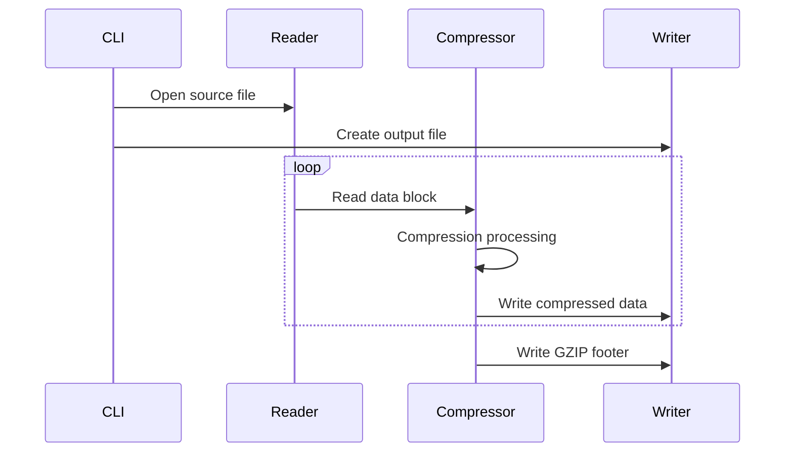
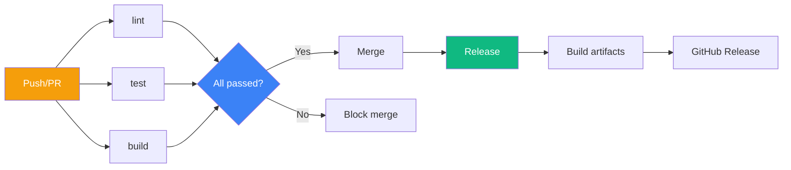
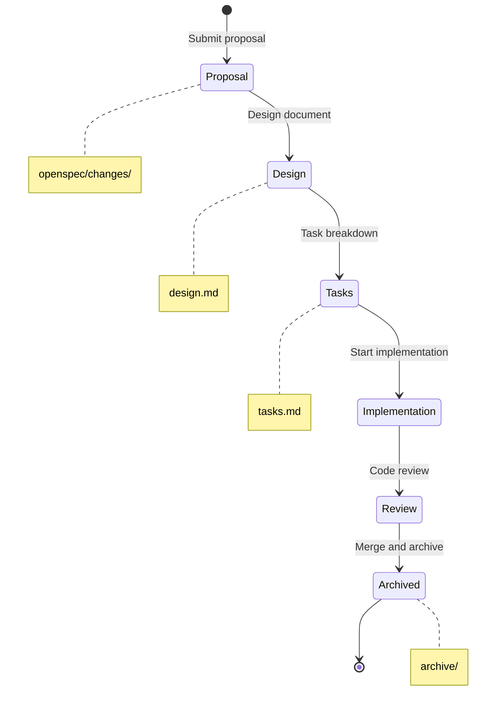

# System Architecture

This document describes the overall architecture design of the Build Your Own Tools project.

## Architecture Overview



## Repository Structure Design

### Monorepo Architecture

The project uses a **Monorepo** architecture, placing all tools in a single repository:



**Advantages**:
- Unified version management
- Shared CI/CD
- Atomic commits
- Simplified dependencies

**Disadvantages**:
- Large repository size
- Long build times
- Coarse permission granularity

### Rust Workspace

`gzip/rust/` and `htop/unix/rust/` use Rust workspace:

```toml
# gzip/rust/Cargo.toml
[workspace]
members = ["."]

[package]
name = "gzip"
version = "0.1.0"
```

### Go Workspace

`gzip/go/` and `htop/` use Go workspace:

```text
# go.work
go 1.22

use ./gzip/go
use ./htop/unix/go
use ./htop/win/go
```

## Module Design

### Library + Binary Pattern

Using `gzip/rust/` as an example:



**Benefits**:
- The library can be referenced by other projects
- The binary focuses on CLI
- Easy to test

### Source Code Structure

```
gzip/rust/
├── Cargo.toml
├── src/
│   ├── lib.rs          # Library entry point
│   ├── compress.rs     # Compression logic
│   ├── decompress.rs   # Decompression logic
│   └── bin/
│       └── gzip.rs     # CLI entry point
└── tests/
    └── integration.rs
```

## Cross-Platform Strategy

### htop Architecture

htop needs to support both Unix and Windows platforms, using a layered design:



### Conditional Compilation

Rust uses `cfg` attributes:

```rust
#[cfg(unix)]
mod unix;

#[cfg(windows)]
mod windows;
```

Go uses build tags:

```go
//go:build unix
package main

//go:build windows
package main
```

### Difference Handling

| Feature | Unix | Windows |
|---------|------|---------|
| Process List | `/proc` filesystem | CreateToolhelp32Snapshot |
| CPU Usage | `/proc/stat` | GetSystemTimes |
| Memory Info | `/proc/meminfo` | GlobalMemoryStatusEx |
| Terminal Size | ioctl TIOCGWINSZ | GetConsoleScreenBufferInfo |

## Data Flow Design

### dos2unix Stream Processing



### gzip Compression Pipeline



## Engineering Architecture

### CI/CD Pipeline



### OpenSpec Workflow



## Technical Debt

### Known Issues

| Issue | Impact | Priority |
|-------|--------|----------|
| htop Windows version has incomplete features | Missing functionality | High |
| Lack of benchmark coverage | Performance not measurable | Medium |
| Incomplete documentation internationalization | User experience | Low |

### Improvement Directions

1. **Performance Benchmarks** — Add criterion integration
2. **Fuzz Testing** — Add cargo-fuzz testing
3. **API Documentation** — Generate rustdoc and godoc

## Related Documents

- [Design Decisions](/whitepaper/decisions) — ADR-style decision records
- [Performance Analysis](/whitepaper/performance) — Benchmarks and optimization
- [CI/CD Design](/engineering/cicd) — Workflow details
