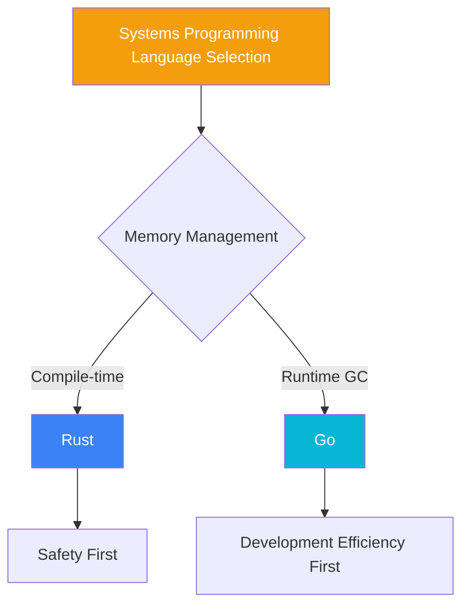
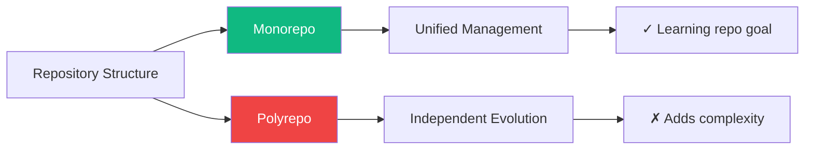
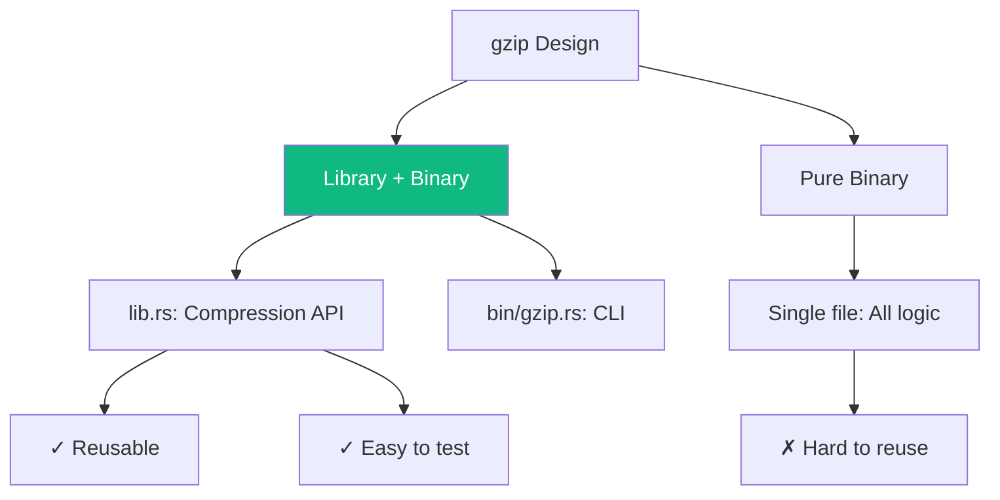
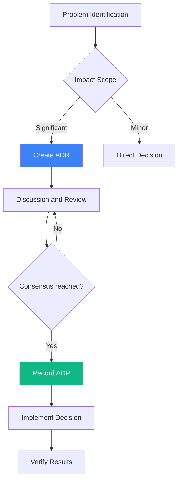

# Design Decisions

This document uses the **Architecture Decision Records (ADR)** style to record key technical decisions.

## ADR Index

| Number | Title | Status | Date |
|--------|-------|--------|------|
| ADR-001 | Choose Rust and Go as implementation languages | Accepted | 2025-01 |
| ADR-002 | Adopt Monorepo architecture | Accepted | 2025-01 |
| ADR-003 | Use OpenSpec for requirements management | Accepted | 2025-02 |
| ADR-004 | gzip uses library + binary pattern | Accepted | 2025-02 |
| ADR-005 | htop uses platform abstraction layer | Accepted | 2025-03 |

---

## ADR-001: Choose Rust and Go as Implementation Languages

### Status

Accepted (2025-01)

### Background

This project needs to select programming languages suitable for systems programming education, requiring:
- Ability to directly operate system resources
- Good error handling mechanisms
- Suitable for CLI tool development
- Active community and rich ecosystem

### Decision

Choose **Rust** and **Go** as implementation languages, using a "same problem, dual implementation" approach.

### Rationale



**Rust Advantages**:
- Compile-time memory safety, no GC pauses
- Zero-cost abstractions, predictable performance
- Strong type system, reduces runtime errors
- Suitable for systems-level programming education

**Go Advantages**:
- Concise syntax, gentle learning curve
- Built-in concurrency primitives (goroutine, channel)
- Fast compilation, rapid development iteration
- Rich standard library, fewer dependencies

**Why Not C/C++**:
- C: Significant memory safety issues, not suitable for teaching safe practices
- C++: Excessive complexity, steep learning curve

### Consequences

- Positive: Comparative learning of two languages, deepens understanding
- Positive: Covers different development scenarios and preferences
- Negative: Maintaining two codebases, doubled workload
- Negative: Need to be familiar with both toolchains simultaneously

---

## ADR-002: Adopt Monorepo Architecture

### Status

Accepted (2025-01)

### Background

Need to organize the code repository structure for three tools (dos2unix, gzip, htop).

### Decision

Adopt **Monorepo** architecture, placing all tools in the same repository.

### Rationale



**Reasons for Choosing Monorepo**:
- A learning repository needs a unified perspective
- Shared CI/CD configuration
- Shared documentation site
- Atomic commits, easy to track
- Simplified cloning and setup

**Reasons for Not Choosing Polyrepo**:
- Increases management complexity
- Few inter-tool dependencies
- Not suitable for learning scenarios

### Consequences

- Positive: Unified versioning and releases
- Positive: Simplified CI/CD
- Negative: Repository size growth
- Negative: Coarse permission granularity

---

## ADR-003: Use OpenSpec for Requirements Management

### Status

Accepted (2025-02)

### Background

Need a standardized way to manage requirements and changes, making the learning process more transparent.

### Decision

Create the **OpenSpec** specification framework, using Gherkin-style requirements descriptions.

### Rationale

**OpenSpec Structure**:

```
openspec/
├── specs/           # Feature specifications
│   ├── project/     # Project-level specs
│   ├── dos2unix/    # Tool specs
│   ├── gzip/
│   └── htop/
├── changes/         # Change management
│   ├── archive/     # Completed changes
│   └── active/      # Current changes
└── schemas/         # Specification templates
```

**Gherkin-style Example**:

```gherkin
Feature: Line Ending Conversion
  As a user
  I want to convert file line endings
  So that I can share files across different systems

  Scenario: DOS to Unix Conversion
    Given the input file contains CRLF line endings
    When executing dos2unix input.txt
    Then the output file should contain only LF line endings
    And the file content should remain unchanged
```

**Benefits**:
- Requirements are testable
- Changes are traceable
- Easy for AI to understand
- Documentation as code

### Consequences

- Positive: Clear and traceable requirements
- Positive: Supports automated testing
- Negative: Need to learn Gherkin syntax
- Negative: Maintaining specifications has overhead

---

## ADR-004: gzip Uses Library + Binary Pattern

### Status

Accepted (2025-02)

### Background

The gzip tool needs to decide on code organization: pure binary vs library + binary.

### Decision

Adopt the **library + binary** pattern, placing core logic in the library, with the CLI focusing on argument parsing and invocation.

### Rationale



**Benefits**:
- The library can be referenced by other projects
- Core logic is easy to unit test
- Clear separation of concerns
- Follows Rust community conventions

### Consequences

- Positive: Clear code structure
- Positive: Easier testing
- Negative: Increased number of files

---

## ADR-005: htop Uses Platform Abstraction Layer

### Status

Accepted (2025-03)

### Background

htop needs to support both Unix and Windows platforms, where system APIs differ significantly.

### Decision

Adopt the **platform abstraction layer** pattern, defining unified interfaces through trait/interface, with platform-specific implementations in separate modules.

### Rationale

```mermaid
graph TB
    subgraph "Platform-Independent Layer"
        A[ProcessInfo Trait]
        B[UI Components]
    end
    
    subgraph "Unix Implementation"
        C[UnixProcessInfo]
        D[/proc Filesystem]
    end
    
    subgraph "Windows Implementation"
        E[WindowsProcessInfo]
        F[Win32 API]
    end
    
    A --> C
    A --> E
    C --> D
    E --> F
    B --> A
    
    style A fill:#f59e0b,color:#fff
```

**Rust Implementation**:

```rust
// Platform-independent trait
pub trait ProcessInfo {
    fn pid(&self) -> u32;
    fn name(&self) -> &str;
    fn cpu_usage(&self) -> f32;
    fn memory_usage(&self) -> u64;
}

#[cfg(unix)]
mod unix;
#[cfg(windows)]
mod windows;
```

**Go Implementation**:

```go
// Platform-independent interface
type ProcessInfo interface {
    PID() uint32
    Name() string
    CPUUsage() float32
    MemoryUsage() uint64
}

//go:build unix
package process // Unix implementation

//go:build windows
package process // Windows implementation
```

### Consequences

- Positive: Unified core logic
- Positive: Easy to add new platforms
- Negative: Need to maintain multiple implementations
- Negative: Abstraction layer has performance overhead

---

## Decision Process



## Related Documents

- [System Architecture](/whitepaper/architecture) — Architecture design details
- [OpenSpec Workflow](/specs/openspec-workflow) — Requirements management
- [CI/CD Design](/engineering/cicd) — Workflow design
