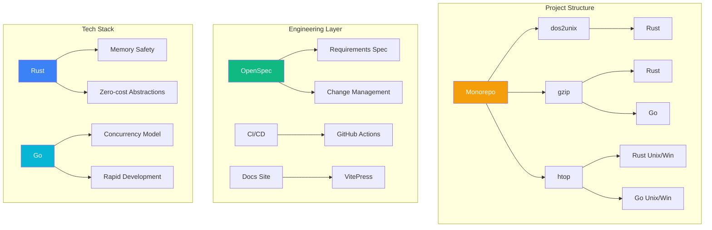

# Whitepaper Overview

Welcome to the **Build Your Own Tools** technical whitepaper. This document provides an in-depth analysis of this systems programming learning repository from three dimensions: architecture, design decisions, and performance.

## Architecture Panorama



## Document Structure

| Chapter | Content | Target Audience |
|---------|---------|-----------------|
| [Project Overview](/whitepaper/overview) | Project positioning, technology selection, learning paths | Everyone |
| [System Architecture](/whitepaper/architecture) | Repository structure, cross-platform strategy, module design | Architects |
| [Design Decisions](/whitepaper/decisions) | ADR-style design decision records | Technical Decision Makers |
| [Performance Analysis](/whitepaper/performance) | Benchmarks, performance comparison, optimization strategies | Performance Engineers |

## Core Values

### 1. Dual-Language Comparison

The same problem is implemented in both Rust and Go, providing an intuitive comparison of:

- Memory management strategy differences
- Error handling philosophy comparison
- Concurrency model choices
- API design styles

### 2. Complete Engineering Practice

Not toy projects, but complete engineering practices:

- OpenSpec requirements specification
- GitHub Actions CI/CD
- Cross-platform builds
- Automated releases

### 3. Progressive Learning

A learning path from simple to complex:

```
dos2unix (⭐) → gzip (⭐⭐) → htop (⭐⭐⭐)
    ↓              ↓              ↓
 Stream Proc    Compression     TUI + Systems
                 Pipeline        Programming
```

## Next Steps

- 📖 Read [Project Overview](/whitepaper/overview) to understand the project positioning
- 🏗️ Check [System Architecture](/whitepaper/architecture) to understand the overall design
- 📋 Browse [Technical Specs](/specs/) to learn about requirements specifications
- 🔬 Study [Comparison Research](/comparison/) to dive into language differences
