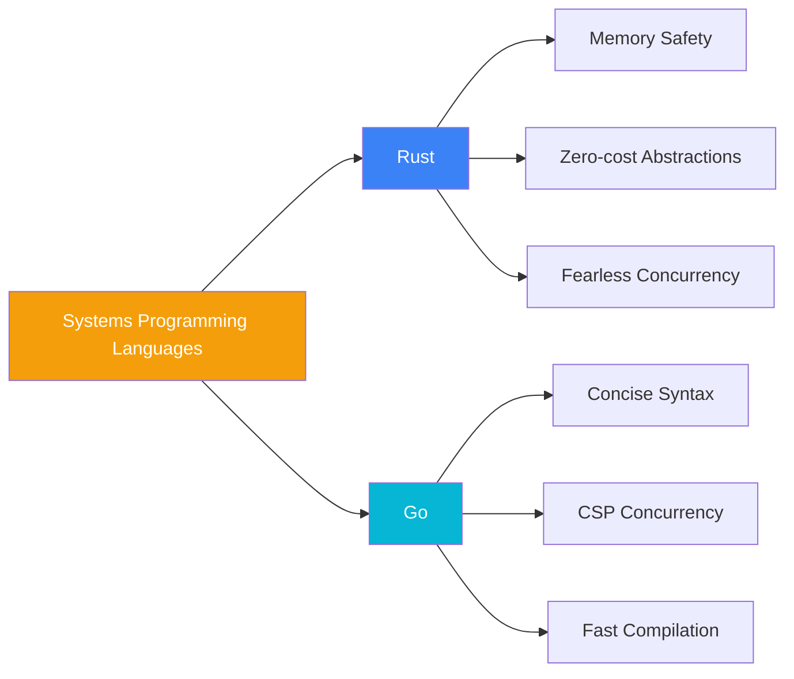

# Project Overview

## Positioning

**Build Your Own Tools (BYOT)** is a systems programming learning repository with the core philosophy:

> **"One idea, two implementations"** — the same problem, implemented in two languages, for comparative learning.

### What It Is Not

- ❌ A syntax tutorial — does not teach Rust/Go basic syntax
- ❌ A toy project — not simplified demos
- ❌ A production replacement — does not replace real dos2unix/gzip/htop

### What It Is

- ✅ **Systems programming case study** — complete implementation of real CLI tools
- ✅ **Language comparison laboratory** — dual-language implementation of the same problem
- ✅ **Engineering practice** — OpenSpec, CI/CD, cross-platform builds

## Technology Selection

### Why Rust and Go?



| Feature | Rust | Go |
|---------|------|-----|
| Memory Safety | Compile-time ownership checks | GC runtime |
| Error Handling | Result<T, E> enum | error interface |
| Concurrency Model | async/await + Tokio | goroutine + channel |
| Generics | Full generic system | Type parameters (1.18+) |
| Learning Curve | Steep | Gradual |
| Compilation Speed | Slower | Very fast |

### Why These Three Tools?

| Tool | Learning Value | Complexity |
|------|---------------|------------|
| **dos2unix** | Stream I/O, buffer boundaries, line ending handling | ⭐ |
| **gzip** | Compression pipeline, CLI design, error handling patterns | ⭐⭐ |
| **htop** | TUI architecture, process metrics, cross-platform system APIs | ⭐⭐⭐ |

## Project Structure

```
build-your-own-tools/
├── dos2unix/           # Line ending conversion tool
│   ├── src/           # Rust source code
│   └── Cargo.toml
│
├── gzip/              # Compression tool
│   ├── go/            # Go implementation
│   │   ├── cmd/       # CLI entry point
│   │   └── pkg/       # Library code
│   └── rust/          # Rust implementation
│       ├── src/bin/   # CLI entry point
│       └── src/lib.rs # Library code
│
├── htop/              # Process monitoring tool
│   ├── unix/          # Unix platform
│   │   ├── go/        # Go implementation
│   │   └── rust/      # Rust implementation
│   └── win/           # Windows platform
│       ├── go/
│       └── rust/
│
├── openspec/          # Requirements specification
│   ├── specs/         # Feature specs
│   └── changes/       # Change management
│
├── docs/              # Technical documentation
├── .vitepress/        # Documentation site
└── .github/           # CI/CD workflows
```

## Recommended Learning Paths

### Beginner Path

1. **dos2unix (Rust)** — Understand stream processing basics
2. **gzip (Rust)** — Learn pipeline design
3. **gzip (Go)** — Compare implementation approaches between two languages
4. **htop (Rust)** — Challenge TUI + systems programming

### Intermediate Path

1. Read the **Comparison Research** chapters directly
2. Analyze **Design Decisions** to understand technology choices
3. Study **OpenSpec specifications** to learn requirements engineering
4. Contribute new tool implementations

### Architect Path

1. Read **System Architecture** to understand the overall design
2. Analyze **Engineering Practices** to learn CI/CD design
3. Study **Cross-platform Strategy** to learn platform adaptation
4. Evaluate **Technical Debt** and evolution direction

## Core Assets

### OpenSpec Specification

Uses Gherkin-style requirements specification, example:

```gherkin
Feature: Line Ending Conversion
  Scenario: DOS to Unix Conversion
    Given the input file contains CRLF line endings
    When dos2unix is executed
    Then the output file should contain only LF line endings
```

### Governance Layer Design

- **AGENTS.md** — AI collaboration guidelines
- **CLAUDE.md** — Claude-specific instructions
- **copilot-instructions.md** — GitHub Copilot configuration

This is a best practice example of AI-assisted development.

## Next Steps

- 🏗️ [System Architecture](/whitepaper/architecture) — Deep dive into the design
- 📋 [Technical Specs](/specs/) — View requirements specifications
- 🔬 [Comparison Research](/comparison/) — Rust vs Go analysis
