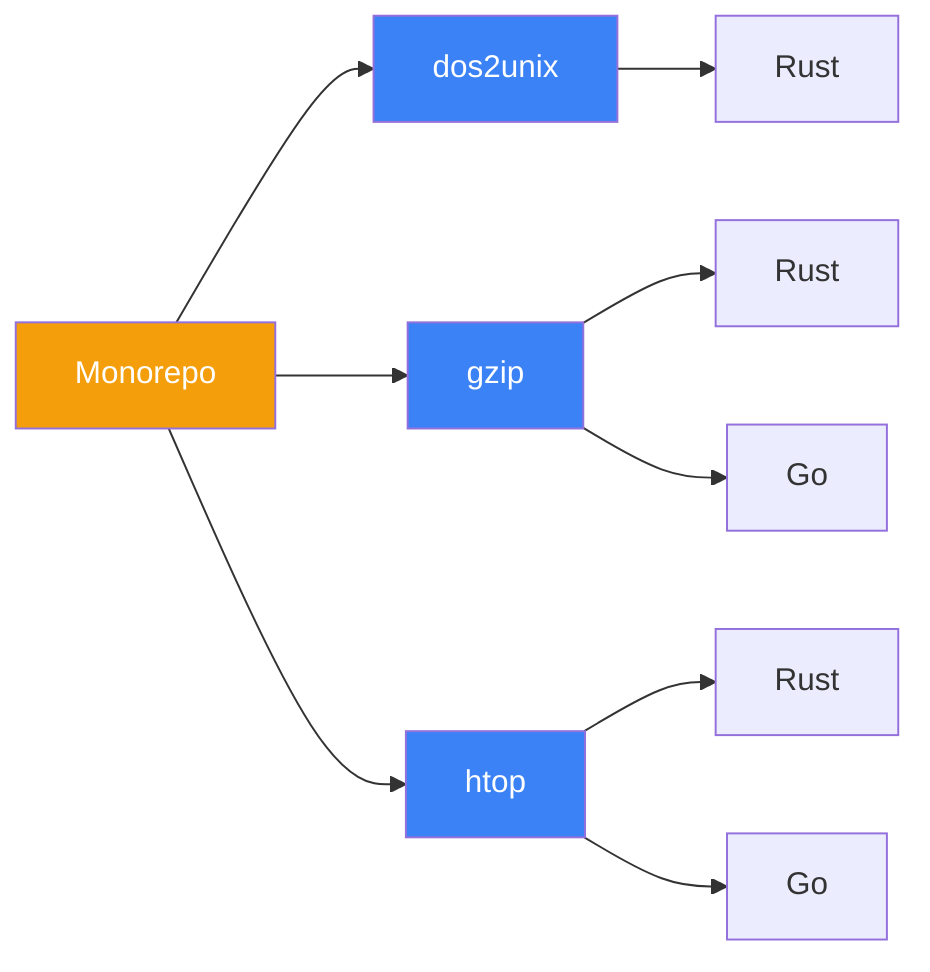

## 技术白皮书概览

本项目是一个**系统编程学习仓库**，通过重新实现三个真实的 CLI 工具（dos2unix、gzip、htop）来展示 Rust 和 Go 两种语言的系统编程风格差异。

### 核心特性

### 学习路径

| 阶段 | 工具 | 学习重点 | 复杂度 |
|------|------|----------|--------|
| 1 | dos2unix | 流式 I/O、换行符处理 | ⭐ |
| 2 | gzip | 压缩流程、CLI 设计、错误处理 | ⭐⭐ |
| 3 | htop | TUI、系统 API、跨平台架构 | ⭐⭐⭐ |

### 技术栈

- **Rust**: 系统编程、内存安全、零成本抽象
- **Go**: 并发模型、简洁语法、快速开发
- **VitePress**: 文档站点、Mermaid 图表、LLM 友好输出
- **OpenSpec**: 需求规范、变更管理、Gherkin 场景

## 快速导航

[白皮书](/whitepaper/){.VPButton}
[技术规范](/specs/){.VPButton .alt}
[对比研究](/comparison/){.VPButton .alt}
[工程实践](/engineering/){.VPButton .alt}

